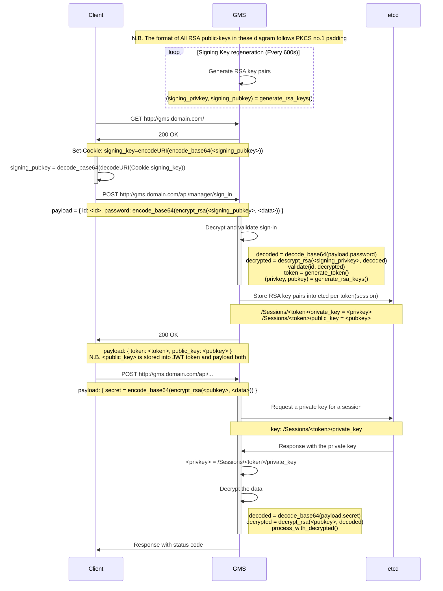

# API Encryption

## Architectural Overview

## Used libraries for this feature

* Web UI
  * [jsencrypt v2.3](https://github.com/travist/jsencrypt/)
    * For now, jsencrypt does not support OAEP padding so we should use PKCS #1
    * https://github.com/travist/jsencrypt/issues/84
  * [jwt-decode v2.2.0](https://github.com/auth0/jwt-decode)
* GMS
  * [MIME::Base64](https://metacpan.org/pod/MIME::Base64)
  * [Crypt::OpenSSL::RSA](https://metacpan.org/pod/Crypt::OpenSSL::RSA)
  * [Crypt::OpenSSL::Bignum](https://metacpan.org/pod/Crypt::OpenSSL::Bignum)
