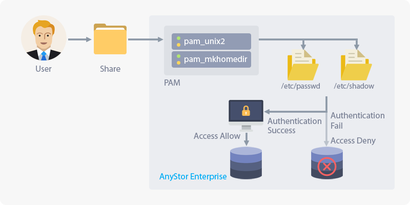
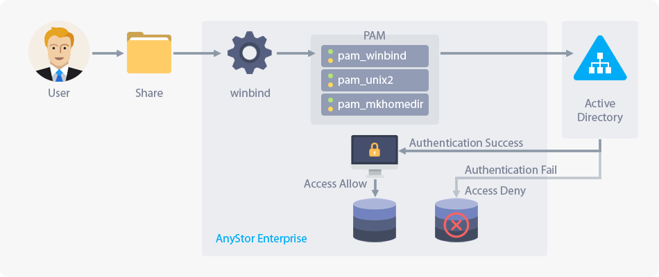

## 3.4 External Authentication

### 3.4.1 About External Authentication

This feature is to delegate user/group management to another server on the network to access cluster volume.
AnyStor-E supports **LDAP** server, Microsoft's **Active Directory**, and Apple's **Open Directory** service.

### 3.4.2 Definition

A fair number of organizations these days use centralized organization management services, such as directory services, to flexibly administer the members of the organization.
AnyStor-E utilizes user/group information that is managed in these management services through the network and this information are occasionally used for providing the interlock, which is specified on organization management such as restricting the access permission to the storage resources of the individual user or group.
These functionalities benefit the administrators not to have the same user/group management task repetitively and perseveres high level of security on the resources on whether it implements organization management service through upgraded authentication.

### 3.4.3 Description and Configuration
Currently, AnyStor-E supports external authentication only for SMB, AFP, and FTP filing protocols.
Therefore, if you want to use the NFS filing protocol, you have to use the credentials of the local system.
External authentication for AFP, FTP filing protocols can also be done through the assistance of technical support team.

#### 3.4.3.1 Local Authentication

**Local Authentication** carries out user/group authentication through account information managed by AnyStor-E local system and PAM subsystem without using external authentication service.

| **Local Authentication of AnyStor-E** |
| :------: |
|  |

In this case, the previous external authentication will not be applied and might cancel all user/group access control on each share.

#### 3.4.3.2 LDAP/Open Directory

The information on the local authentication will still be valid even after activating the external authentication through LDAP or Open directory.

AnyStor-E performs user/group authentication from the LDAP server through the PAM subsystem and the Open Directory setting is also same.

| **LDAP/OD Authentication of AnyStor-E** |
| :------: |
|  |

Go to **Account >> External Authentication** page and select **LDAP** option. Then the configuration menu will be displayed with the following items.

| **Item**   | **Description** |
| :--------: | :--- |
| URI        | Enter the URI of the LDAP server according to the standard. (ldap://192.168.0.1, ldaps://192.168.0.1) |
| BaseDN     | Enter a distinguished name which is the lookup base for the LDAP server. |
| BindDN     | Enter the user's distinguished name who has permission to view the LDAP server. |
| BindPw     | Enter user's password who has permission to view the LDAP server. |
| RootBindDN | Enter the user's distinguished name who has permission to modify the LDAP server. |
| RootBindPw | Enter the user's password who has permission to modify the LDAP server. |
| PasswdDN   | Enter distinguished name that contains user information. |
| ShadowDN   | Enter distinguished name that contains user's security information. |
| GroupDN    | Enter distinguished name that contains group information. |
| SSL        | Select how you want to enable secure communication over SSL. |

Select **Enable Active Directory** checkbox and save the progress to enable the external authentication.

Please note that the SMB filing protocol over LDAP can cause security problems.

#### 3.4.3.3 Active Directory

The information on the local authentication will still be valid even after activating the external authentication through active directory.

**Active Directory** is a classic Windows system-based organization/authentication management service presented by Microsoft. Through this, AnyStor-E performs user/group authentication from ADS through Windbind and PAM subsystem.

| **Active Directory Authentication of AnyStor-E** |
| :------: |
|  |

Go to Account >> External Authentication page, select **Active Directory** option and click save to enable external authentication.

### 3.4.4 Confirming External Authentication

#### 3.4.4.1 Create User
Please refer to [3.2.2 Creating User](#account.xhtml#3.2.2 Creating User) to add a new user.

#### 3.4.4.2 Create Volume

Please refer to [2.3.3.2 Creating Cluster Volume](#clusterVolume.xhtml#2.3.3.2 Creating Cluster Volume) to create a new volume.

#### 3.4.4.3 Create and configure share

1. Please refer to [4.3.3.2 Creating Share](#share.xhtml#4.3.3.2 Creating Shared Object) to create a new share.

2. When the share is created, refer to [4.3.4.2.2 For Users Accessing Through CIFS](#share.xhtml#4.3.4.2.2 Users Accessing CIFS Share) and configure the access permission of the added users that were created in [3.4.4.1 Create User](#account.xhtml#3.4.4.1 Create User).

#### 3.4.4.4 Verify the authentication

+ The current version of AnyStor-E supprots external authentication only through the SMB file sharing protocol.

1. **Windows**
  * If you are using external authentication via LDAP, you need to set the security level down before proceeding with connection as below.
      1. Go to __Start >> Run(R)__ or press __Windows key + R__ to open the **Run** window.
      2. Enter `gpedit.msc` and click OK buton to launch the Group Policy editor.
      3. From left cascade menu, select __Computer Configuration >> Windows Settings >> Security Settings >> Local Policies >> Security Options__.
      4. Double-click __Microsoft Network Client: Send unencrypted password to third-party SMB servers__ to open the setting window..
      5. Select __Enabled(E)__ and click OK to apply the change.
      6. Go to __Start >> Run(R)__ or press __Windows key + R__ to open the **Run** window, Type `gpupdate` and press OK to reflect the Group Policy.
  * Go to __Start >> Run(R)__ or press __Windows key + R__ to open the **Run** window.
  * Enter `\\<AnyStor-E Service IP>\<Share Name>` and press **OK** to access the share that was created through [3.4.4.3 Creating and Configuring Share](#account.xhtml#3.4.4.3 Create and configure share).
  * As the pop-up screen requires the user's name and password, enter the information you have acquired to access the share.
  * When Windows explorer opens, you are authenticated, please make sure that you have access to desired directory/files you are allowed to.
   
  * If you can't access SMB share according to above method you need to enable Server Message Block (SMB) SMB version 2 (SMBv2) on the SMB client and server components. 
      1. Go to __Start >> Programs >> Windows PowerShell__ or press __Windows key__ and type **WindowsPowerShell**.
      2. Right click on __Windows PowerShell__ and select __Run as administraton__.
      3. When Windows PowerShell will appear execute `Get-ItemProperty HKLM:\SYSTEM\CurrentControlSet\Services\LanmanServer\Parameters | ForEach-Object {Get-ItemProperty $_.pspath}`.
      4. Check if the value of **SMB2** is **0**. If so, then execute `Set-ItemProperty -Path "HKLM:\SYSTEM\CurrentControlSet\Services\LanmanServer\Parameters" SMB2 -Type DWORD -Value 1 –Force` to enable SMB2
      5. You have to restart the computer after you make these changes.
   
1. **Linux**
  * Install SMB Client
      * **Arch** : `pacman -Sy cifs-utils`
      * **CentOS** : `yum install -y cifs-utils`
      * **OpenSuse** : `zypper -n install samba-client`
      * **Ubuntu/Mint** : `sudo apt-get install -y cifs-utils`

  * If you are using external authentication via LDAP, first you have to set the security level down through the following command before connecting:
      * `echo "0x30" > /proc/fs/cifs/SecurityFlags`
  * Execute the mount command as follows:
      * `mount -t cifs //<AnyStor-E service IP/<share Name> <mount path> -ouser=<user name>,password=<password>,uid=<user name>,gid=<group name>,iocharset=utf8`

+ The option of this command might differ depending on the Linux distributions or the package versions. If it is the case, please refer to `man mount.cifs`. Also, depending on the client's environment, you must check whether you use incompatible security protocol or protocol version. For more details, check the `sec=` option and `vers=` option that is described in `man mount.cifs`.

> If the command is executed without error, verify whether the mount path is viewed from the output of the mount command. If it is displayed, it means that the authentication was successful. Then navigate to the path (cd <Mount Path>) and check whether the file/directory is accessible.

3. **Mac OS X**
  * Refer to [3.4.5 Reference](#account.xhtml#3.4.5 Reference) and learn how to connect using the file share in Mac and try to access.

### 3.4.5 Reference

* [OpenLDAP](https://www.openldap.org)
* [389 Directory Server](https://directory.fedoraproject.org/)
* [Active Directory Architecture - Microsoft Docs](https://docs.microsoft.com/en-us/previous-versions/windows/it-pro/windows-2000-server/bb727030(v=technet.10))
* [How to connect with File Sharing on your Mac - Apple Support](https://support.apple.com/en-us/HT204445)
* [mount.cifs - mount using the Common Internet File System (CIFS)](https://www.samba.org/samba/docs/3.5/man-html/mount.cifs.8.html)
* [How to enable SMB in Windows](https://support.microsoft.com/en-us/help/2696547/how-to-detect-enable-and-disable-smbv1-smbv2-and-smbv3-in-windows-and)