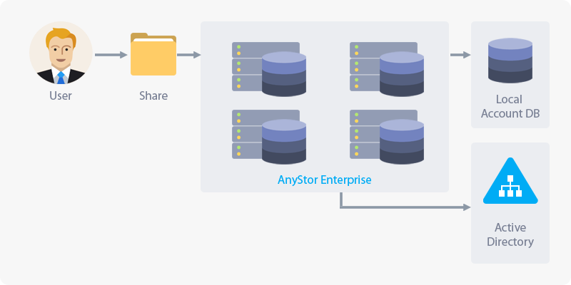

# 3 Account and Authentication

## 3.1 About Account and Authentication

> AnyStor-E provides local and AD (Active Directory) authentication system for the security on your cluster.  
> It provides Unix/Linux-style access controls and Extended ACLs along with Windows-style access controls when using the AD authentication.  
> Through the local authentication, all cluster nodes can share the identical user UID and share access controls.

| **Authentication for AnyStor-E** |
| :------: |
|  |

* **Security Layer for the Access**
 * Administrator: Access to AnyStor-E cluster manager to manage the cluster.
 * User: As it is mostly accessed by Windows user, CIFS protocol can also be used.
 * Security Zone: The IP range that can access to the volume used when accessing through NFS/CIFS. Please refer to [1.5.4 Security Settings](#cluster.xhtml#1.5.4 Security Settings).  
   
* **Contents**
    
    | Menu                        | Description                                                              |
    | :------------:              | :----------------                                                 |
    | **User**                  | View the list of user accounts which can be created, modified, deleted, and added to groups.          |
    | **Group**                    | View the list of groups which can be created, modified, and deleted.                       |
    | **External Authentication**               | Provides configuration of directory services.                       |
    | **Administrator**                  | Provides modifiable information on the cluster administrator such as changing passwords.                      |

---

+ **Access Control on Data**
    
    Supports user and group ACL, which the maximum number of entry is 64.    
    Compatible with the standard Unix file permission tools such as ls, chmod, and chown.    
    However, you will not be able to use Unix and Windows style permission in the same volume, and the same file locking on different clients is not supported.
 
