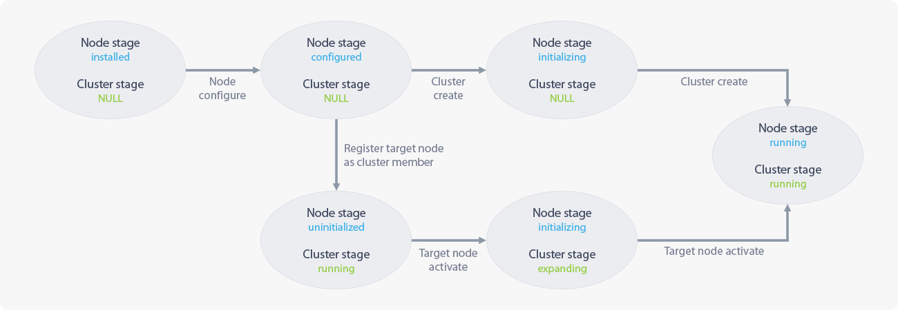

## 1.3 Cluster Node Management

### 1.3.1 About Cluster Node Management

> **Cluster Node Management** page gathers and displays the information for the management of the cluster node and modifies stages.   
> A stage is a value that shows the status of your cluster and node designated by its needs from the cluster management software or the user.  
> When the stage of a cluster or node is set as **Support**, its state will be **Read Only** (unable to create, modify, or delete).  

### 1.3.2 Contents of Cluster Node Management Page

#### 1.3.2.1 Cluster Management
* Located at the top of the **Cluster Node Management** page.
* Provides information on cluster management.
* The column name of the header rows are Cluster Name, Stage, Status Report, Total Size, Usage, and Action.

#### 1.3.2.2 Node Management
* Located at the bottom of the **Cluster Node Management** page.
* Gathers information on each node and shows in a single row.
* The column name of the header row are Node Name, Stage, Status, Version, Management IP, Service IP, and Action.

### 1.3.3 Cluster Management

#### 1.3.3.1 About Cluster Management
> The information on the cluster management will be described in a single row.
> Information such as cluster name, cluster stage, cluster status, overall volume size, and volume usage will be presented. Also, there will be an action menu at the end where you can get a remote technical support.

| Category            | Description |
| :---:           | :---  |
| **Cluster Name** | Shows the name of a cluster which is managed by the cluster management software.|
| **Stage**    | The designated value by the cluster management software or the user. (For more details, refer to "[1.3.5.1 Cluster Stage](#cluster.xhtml#1.3.5.1 Cluster Stage)".)|
| **Status Report** | Shows the status of a cluster.|
| **Total Size**   | Shows the total amount of volume which the cluster can use.|
| **Usage**      | Shows the amount of volume which the cluster is using.|
| **Action**        | Shows the list of commands for the cluster management.  The types of command vary on the stage of a cluster. For more information, refer to "[1.3.5.1 Cluster Stage](#cluster.xhtml#1.3.5.1 Cluster Stage)".|

### 1.3.4 Node Management

#### 1.3.4.1 About Node Management
> The information on the node management will be described in a single row.
> Information such as a name, stage, status, version, management IP, and service IP of a node will be presented. Also, there will be an action menu at the end where you can get a remote technical support.

| Category          | Description                                                                     |                                                            
| :---:         | :-----                                                                    |
| **Node Name**        |Shows the name of a node in a form of "{Cluster Name}-{Number}". |
| **Stage**  |The designated value by the cluster management software or the user. (For more details, refer to "[1.3.5.2 Node Stage](#cluster.xhtml#1.3.5.2 Node Stage)".) |
| **Status**      |Shows the status of a node. |
| **Version**      |Shows the version of the cluster management software of a node. |
| **Management IP**   |Shows management IP that is statically allocated on each node. |
| **Service IP** |Shows service IP that is allocated to each node. Service IP is allocated from one of the IPs listed on the Service IP Settings tab on Cluster Management > Network Settings page and will be dynamically allocated depending on the status of a node. Therefore, when a service node is no longer available, a client will be automatically connected to another node in the cluster as long as the client is connected to the service IP. There can be more than one IP per node or none. |
| **Action**      |Shows the list of commands for the node management.  The types of command vary on the stage of a node. For more information, refer to "[1.3.5.2 Node Stage](#cluster.xhtml#1.3.5.2 Node Stage)". |

### 1.3.5 Staging

#### 1.3.5.1 Cluster Stage
* Cluster Stage List

    |Stage             |Condition                                          |Cluster Status |Available Control        |Changeable Stage|
    | :---:            | :---                                              | :---          | :---                    | :---           |
    | **running**      |When the stage of every node is currently running  |OK             |No restriction           |support         |
    | **support**      |When the stage of one or more node is on support   |WARN           |Read only                |running         |
    | **upgrading**    |When the stage of one or more node is in upgrade   |WARN           |View message: 'upgrading'|None            |
    | **booting**      |When the stage of one or more node is booting      |ERR            |View message: 'booting'  |None            |
    | **initializing** |When the cluster is on initialization              |WARN           |View creation progress   |None            |
    | **expanding**    |When the cluster is expanding                      |WARN           |View expansion progress  |None            |

* **[Read only]**: The API can be accessed, but not writable.
* **[View creation progress]**: Shows the progress bar for cluster creation.
* **[support]**: Change the stage value of a cluster as 'support'.
* **[running]**: Change the stage value of a cluster as 'running'.

#### 1.3.5.2 Node Stage
* Node Stage List

    |Stage              |Condition                                                          |Node Status|Available Control            |Changeable Stage|
    | :---:             | :---                                                              | :---      | :---                        | :---           |
    | **running**       |When every services need for cluster management are normal.        |OK         |No restriction               |support         |
    | **support**       |When it is changed to technical support mode                       |WARN       |View message: 'support'      |running         |
    | **upgrading**     |When a node is upgrading                                           |WARN       |View message: 'upgrading'    |None            |
    | **booting**       |When the cluster management software is in preparation             |ERR        |View message: 'booting'      |None            |
    | **initializing**  |When the node is in initialization process                         |WARN       |View initialization progress |None            |
    | **installed**     |When the cluster management software is installed to a node.       |           |View message: 'node_config'  |None            |
    | **configured**    |When the node system setting is completed                          |           |View message: 'init/join'    |None            |
    | **uninitialized** |When the node is registered to the cluster but not ready to operate|           |View message: 'uninitialized'|activate        |

* **[Read only]**: The API can be accessed, but not writable.
* **[View initialization progress]**: Shows the progress bar for node initialization.
* **[support]**: Change the stage value of a node as 'support'.
* **[running]**: Change the stage value of a node as 'running'.
* **[activate]**: It activates a node which is not ready to fully operate, but is only operating in the cluster.

### 1.3.5.3 Stage Changes After Cluster Initialization
| Stage Changes of Cluster and Node |
| :-------------------------- |
|  |

#### 1.3.5.3.1 After installing the cluster management software
* Cluster management software and its related packages are already installed in the cluster node.
* No stage for the cluster, but the node stage will be set as 'installed'.

#### 1.3.5.3.2 Cluster node system settings
* This is a process to adjust the system settings on a cluster node to use the cluster management software.
* From the system settings, you will be configuring the service/storage/management interface, disk for the cluster volume, and management/storage IP of the node.
* When the system setting is over, there will be no stage for the cluster but the node stage will be set as 'configured'.
* Then, the process will be divided into "[1.3.5.3.3 Creating Cluster](#cluster.xhtml#1.3.5.3.3 Creating Cluster)" and "[1.3.5.3.4 Expanding Cluster](#cluster.xhtml#1.3.5.3.4 Expanding Cluster)".

#### 1.3.5.3.3 Creating Cluster
* This is a process to create a new cluster including the node you have configured.
* Select the range of service IP pool for the client to access the cluster.
* There is no stage for the cluster, but the node stage will be set as 'initializing' when creating a cluster.
* After creating the cluster, the cluster stage and node stage will be set as 'running'.
* When the cluster creation is done, there will be a single-node cluster with the node you have configured.

#### 1.3.5.3.4 Expanding Cluster
* This is a process to add an additional node to the cluster you have built.
* Cluster expansion will have "Registering a Node to the Cluster" and "Activating the Node" process.
* **Registering a Node to the Cluster**
   * It informs the cluster that the new node will be added.
   * When the process is finished, the cluster will recognize the stage of the added node as "uninitialized".
 * **Activating the Node**
   * Initialize the node to make it available for the cluster.
   * The cluster stage will be set as 'expanding' and the node stage as 'initializing'.
   * When it is finished, the node will be available for the cluster with the stage set as 'running'.
