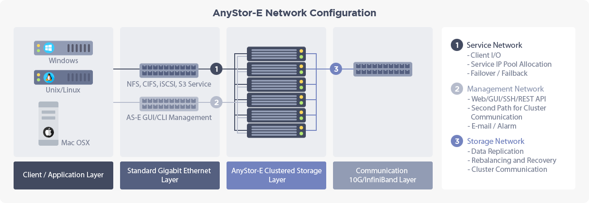

## 1.5 Network Settings

> This menu is for the configuration on the network that is applied all across the cluster.  
> It will allow users to configure and search for the features such as service address pool,  
> routing and DNS that are applied across all cluster node, and access controls on the service.  

  

+ **Storage Network**

    A network between cluster nodes for data replication and heartbeat.    
    It is recommended to cluster the nodes for the availability and use 10G or InfiniBand for high performance.   

---

+ **Service Network**

    A network used for client services. Network addresses from the service IP pool will bound to each node.    
    When a node fails, IP failover will activate the normal node and it will take 5 ~ 30 seconds depending on the failure.

---

+ **Management Network**

    A network to configure and monitor the cluster which can be used with the service network.   
    Management network address will be statically allocated to each cluster nodes.

---

* **Contents**

    | Name        | Location      |  Description        |
    | :---          | ---       | ---          |
    | Service IP Settings | First tab    | For configurations on the service IP pool. Needs at least one configuration to use service IP. |
    | Routing   | Second tab    | For configurations on routing. |
    | DNS      | Third tab    | For DNS server settings. |
    | Security     | Fourth tab    | For configurations on IP-based access controls for share services. Please refer to "[4.3 Share Settings](#share.xhtml#4.3 Share Settings)"|

### 1.5.1 Service IP Settings

* About Service IP Settings
 * Service IP List displays the information on service IPs in a single row.
 * The column names on the header row are First IP, Last IP, Netmask, and Interface.
 * A service IP pool includes every IP addresses between first IP and last IP.

    |  Category  |  Description  |
    |  :---:  |  :---  |
    | **First IP**   | The first IP address of the service IP pool. |
    | **Last IP** | The last IP address of the service IP pool. |
    | **Netmask** | Subnet mask for all addresses in service IP pool. |
    | **Interface** | Shows the network interface of a node which the service IP is allocated. Due to the current policy, the value will be fixed as bond1 and every node should have a bond1 device to fully operate. |

#### 1.5.1.1 Creating Service IP Pool

+ **Note**

    By creating a service IP pool, the client will be able to access a wide range of network band.   
    An IP pool is a range of IP addresses that are automatically allocated to each node.   
    If the addresses in an IP pool exceeds the number of nodes in the cluster, extra IP addresses will be automatically distributed to the nodes.   
    Service to the clients will not be provided unless the service IP pool is allocated.  

 ---  

 * **[Interface]**
  * The interface refers to the network device which has the IP address from the service IP pool.
  * It will be fixed as bond1 based on the policy by cluster management software.
 * **[VLAN Tag]**
  * VLAN tag for network interface should be a number between 1 to 4094.
  * VLAN tag is to distinguish the virtual LAN from the interface.
  * The field is not for mandatory and if it is left blank, there will be no VLAN tag on the interface.
  * If the field is entered, the VLAN tag of the field will be attached to the interface.
 * **[IP Address Range]**
  * Enter the service IP pool range as "xx.xx.xx.xx ~ yy".
  * As for the previous form, xx should have same or smaller value than yy, and both xx and yy should be in the number between 0 to 255.
 * **[Netmask]**
  * Enter the subnet mask where it will be used from the entire address in service IP pool.

#### 1.5.1.2 Modifying Service IP Pool

- **Caution**

    If you modify currently using service IP pool, the client might experience temporary disconnection from the service.

 ---  

* **[Interface]**
  * The interface refers to the network device which has the IP address from the service IP pool.
  * It will be fixed as bond1 based on the policy by cluster management software.
* **[VLAN Tag]**
  * VLAN tag for network interface should be a number between 1 to 4094.
  * VLAN tag is to distinguish the virtual LAN from the interface.
  * If you delete the tag, it will be completely removed if the tag is not used from other service IP pool.
  * If the field is filled in, the VLAN tag of the field will be attached to the interface.
* **[IP Address Range]**
  * Enter the IP pool range as "xx.xx.xx.xx ~ yy".
  * xx should have same or smaller value than yy, and both xx and yy should be having the number between 0 to 255.
* **[Netmask]**
  * Enter the subnet mask where it will be used from the entire address in service IP pool.

#### 1.5.1.3 Deleting Service IP Pool

> You can delete the existing service IP pool by pressing **Delete** button from
> **Service IP Settings** tab in **Network Settings** page.  
> You can also delete multiple service IP pools at once  
> by selecting multiple service IP pools before pressing **Delete** button.  

- **Caution**

    If you delete currently using service IP pool, it will disconnect every client from the service.    
    Every client connection to the mount point will be blocked.

### 1.5.2 Routing Settings

+ **Target device of the routing entries are identical across all nodes**

    Created target device of the routing entry should have the same name across all nodes.    
    For instance, if the network device of the routing entry is eth1, every node in the cluster should have an eth1 device.

---

+ **Only one default gateway for the routing entry**

    The default gateway for the routing entry will be limited to 1.

*  About Routing List
 * The information on the route will be described in a single row.
 * If there are an incoming packet and its destination to the cluster node, it will compare with the information that is configured from the list and will send the packet to the destination if there is a matched routing entry.
 * If there is an information on the gateway when sending packets referring to the routing information, it will also send the packet to the gateway.
 * If there is no routing information on the received packet, it will transmit the packet to the default gateway.
 * The information on the route includes the destination, subnet mask, gateway, properties, and the name of the device.

    |  Category  |  Description  |
    |  :---:  |  :---  |
    | **Destination**   | View the address of the destination for the packet to accomplish the routing entry. If the routing entry is default gateway, it will show the text 'Default GW'. |
    | **Subnet Mask** | View the subnet mask for the checking packets that need to apply routing entries. |
    | **Gateway** | View the network address to send packets that match the condition. |
    | **Properties** | U(When the path is available), G(When the path is to the gateway), H(When the path is to the host) |
    | **Device** | View the name of the network device which transmits packets that are fit to the condition. |

#### 1.5.2.1 Creating Routing Entries
> Go to **Network Settings > Routing** and click **Create** button  
> to create a new routing entry.  

* **[Routing Destination]**
  * The network address for the comparison with the destination of the incoming packet.
  * Enter a notation of "xx.xx.xx.xx", and each subset should be having the number between 0 to 255.
* **[Default Gateway]**
  * Select whether the routing entry is the default gateway or not.
  * If you select the box, the [Routing Destination] and [Subnet Mask] will be fixed to '0.0.0.0'.
  * Only one routing entry can be set as the default gateway.
* **[Network Device]**
  * Select a network device to send packets that fit the condition.
  * The list will only show the device which is not included in the network bond.
  * l/O device will be excluded from the list.
* **[Subnet Mask]**
  * The subnet mask for the comparison with the destination of the incoming packet and [Routing Destination].
  * Enter a notation of "xx.xx.xx.xx", and each subset should be having the number between 0 to 255.
* **[Gateway]**
  * Enter the IP address of a node for receiving the packet that fits the condition.
  * If you do not set the gateway, it will send the packet to every node that is connected to the [Network Device].
  * It must be filled if [Default Gateway] is selected.

#### 1.5.2.2 Modifying Routing Entries
> Go to **Network Settings > Routing** and click **Modify** button  
> to modify the routing entry.  

* **[Routing Destination]**
  * The network address for the comparison with the destination of the incoming packet.
  * Enter a notation of "xx.xx.xx.xx", and each subset should be having the number between 0 to 255.
* **[Default Gateway]**
  * Select whether the routing entry is the default gateway or not.
  * If you select the box, the [Routing Destination] and [Subnet Mask] will be fixed to '0.0.0.0'.
  * Only one routing entry can be set as a default gateway.
* **[Network Device]**
  * Select a network device to send packets that fit the condition.
  * The list will only show the device which is not included in the network bond.
  * l/O device will be excluded from the list.
* **[Subnet Mask]**
  * The subnet mask for the comparison with the destination of the incoming packet and [Routing Destination].
  * Enter a notation of "xx.xx.xx.xx", and each subset should be having the number between 0 to 255.
* **[Gateway]**
  * Enter the IP address of a node for receiving the packet that fits the condition.
  * If you do not set the gateway, it will send the packet to every node that is connected to the [Network Device].
  * It must be filled if [Default Gateway] is selected.

#### 1.5.2.3 Deleting Routing Entries
> Go to **Network Settings > Routing** and click **Delete** button  
> to delete the routing entry.  
> Select more than one routing entries and click **Delete** button  
> to delete multiple routing entries.  

### 1.5.3 DNS Settings
> DNS tab shows Cluster Name, Primary DNS Address, and Secondary DNS Address.  

+ **Note**

    The cluster name will be displayed, however, cannot be modified.    
    If the DNS is not configured, the email notification will not be sent.    
    Go to **Network Settings > DNS**, enter the information, and press **Apply** button to configure DNS.

|  Category             |  Description  |
| :---:             | :---   |
| **Cluster Name** | The name of the cluster that is managed by the cluster management software. |
| **Primary DNS Address** | The DNS address. |
| **Secondary DNS Address** | Additional DNS address apart from the primary DNS address. |

* **[Primary DNS Address]**
  * Enter DNS address.
  * Enter in the notation of "xx.xx.xx.xx".
  * When no values are entered, DNS will be disabled.
* **[Secondary DNS Address]**
  * Refers to the additional DNS address apart from [Primary DNS Address].
  * When [Primary DNS Address] cannot be accessed, [Secondary DNS Address] will be used as the DNS.
  * Enter in the notation of "xx.xx.xx.xx".
  * When no values are entered, secondary DNS will be disabled.

### 1.5.4 Security Settings
+ **Caution**

    It is recommended to configure this option to **fortify the security** of your NAS.    
    It can control the accessing hosts per share by designating the host IP range to access the share.    
    It can be applied to CIFS and NFS share.   
    Security information of the share cannot be deleted.  
    
 ---

* **Security Information List**
 * The list is located on the top and provides security information in a single row.
 * Security zone indicates an access path where the security policy is applied.
 * Access controls on each security zone can be configured from "[4.3 Share Settings](#share.xhtml#4.3 Share Settings)".
 * Information on the security zone includes zone name, description, type, and network address.

    |  Category  |  Description  |
    |  :---:  |  :---  |
    | **Zone Name** | A zone name designated by the administrator. |
    | **Description** | Description of the zone written by the administrator. |
    | **Type** | View types of zone. There are "IP Address", "IP Address Range", "Subnet Mask", and "Domain". |
    | **Zone Address** | View the range of the security zone. It is displayed in a way the zone is formed. |

* **Share Information List**
 * The list is located on the bottom and provides information on security zone used by share.
 * Information on the share includes zone name and address, usage information, item, and permission.

    | Category | Description |
    | :---: | :--- |
    | **Zone Name** | Displays the name of the zone used in share. |
    | **Zone Address** | View the zone range used by the shared service. |
    | **Usage Information** | Shows which share the zone is used. |
    | **Item** | It is the one which uses the security zone. It will only display 'share'. |
    | **Permission** | Shows access permission of the share from the zone. |

#### 1.5.4.1 Creating Security Zone
> Go to **Network Settings > Security** tab and click **Create** to create a new security zone.  

* **[Zone Name]**
  * Enter the name for the new security zone.
* **[Description]**
  * Enter the description for the new security zone.
* **[IP Address]**
  * If [IP Address] is selected, only a single IP address will be set as the security zone.
  * Enter a notation of "xx.xx.xx.xx", and each subset should be having the number between 0 to 255.
* **[IP Address Range]**
  * If [IP Address Range] is selected, a range of IP addresses will be set as the security zone.
  * Enter the IP pool range as "xx.xx.xx.xx ~ yy".
  * xx should have same or smaller value than yy, and both xx and yy should be having the number between 0 to 255.
* **[Subnet Mask]**
  * If [Subnet Mask] is selected, every IP band from the combination of subnet mask and IP address will be set as the security zone.
  * Enter a notation of "xx.xx.xx.xx", and each subset should be having the number between 0 to 255.
  * Every IP address will be set as security zone when "0.0.0.0/0.0.0.0" is entered.
* **[Domain]**
  * If [Domain] is selected, the selected domain name will be set as the security zone.
  * It will be designated by the administrator.

#### 1.5.6.2 Deleting Security Zone
> Go to **Network Settings > Security** tab  
> and click **Delete** to delete the security zone.  
> Select more than one security zone and click **Delete** button to delete multiple security zones.  
> Security zones that are in use by the share cannot be deleted.  
