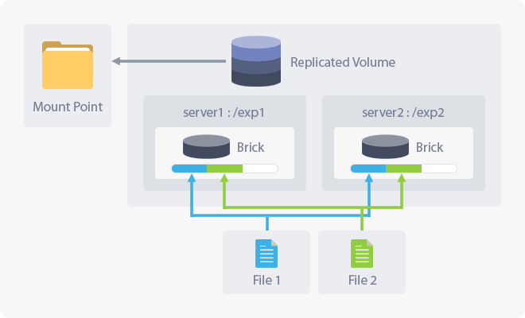
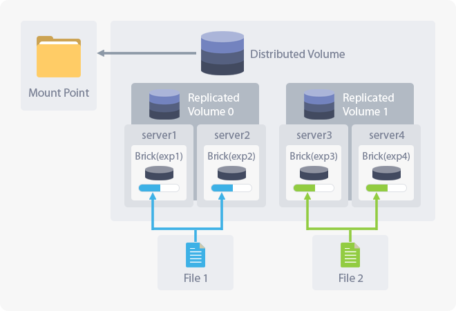
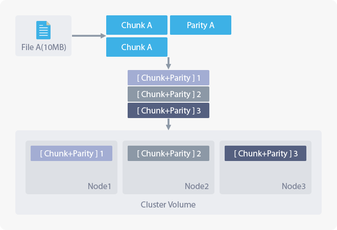
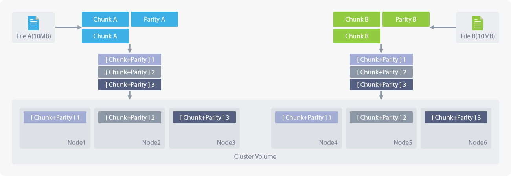
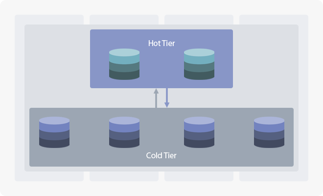
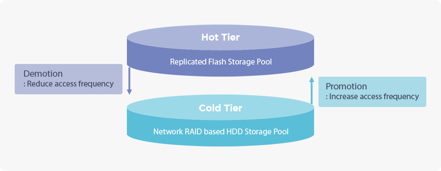

## 2.3 Volume Management

### 2.3.1 About Volume Management
> This page manages **creation/deletion/expansion, snapshot, and tiering** of the cluster volume.  
> The cluster volume is a distributed file system used as a storage space of the selected nodes.  
> To ensure the availability of the saved data, you can set the number of replications and the number of allowable node failures.  

+ **Note**

    When a cluster is created, distribution method and type will be defined due to the distribution policy which affects the stability and performance.      
    Use the snapshot to backup data from each volume without any downtime and tier the data to improve the performance through the accessibility.        
    The cluster volume that is set as share cannot be deleted. It can be deleted only after removing the share.    

### 2.3.2 Technical Factors

#### 2.3.2.1 Distributed Volume

> The distribution method between nodes based on file name hashing without centralized metadata server.
> You can improve the data availability by configuring the number of copies of original data.  
> The minimum number of a required node for the expansion is the same as the number of copies.  

**About Distributed Volume**   
> When there is a single replica, there will be a new volume distributing data across all node in the cluster.  
> It is used where the distributed file system is necessary and the data integrity is not required.  
> There are no copies between nodes and some data might be inaccessible when the node fails.   

   

**Replicated Volume**    
> When the number of replications and nodes are the same, there will be a volume replicating data to all selected nodes.  
> Distributed file system will not be needed and data integrity will be ensured.  
> As there will be a replica on each node, the data can be accessed even some node fails.    

   

**Distributed-Replicated Volume**  
> The composition will change into **Distributed-Replicated Volume** when the node expands through Scale-Out while having the **Replicated Volume**.  
> Otherwise, set more than two copies and select nodes, in a multiple of the number of copies you have set, to create a **Distributed-Replicated Volume**.  
> It is used in the environment where both distributed file system and data integrity is needed.  
> However, if the node including a replica fails, the data will be inaccessible.  

   

**Distributed-Replicated Chain Volume**  
> A configuration of replicating the data between neighboring nodes by creating two logical volumes to store the data to every selected node.  
> It can be composed of three nodes while initializing the system and has an advantage of saving the cost comparing to **Distributed-Replicated Volume** composition.  
> It is used in the environment where both distributed file system and data integrity is needed.  
> However, if the node including a replica fails, the data will be inaccessible.  
> **Distributed-Replicated Chain Volume** does not support Scale-Out node expansion and only supports Scale-Up expansion.

   

**Distributed-Replicated Arbiter Volume**  
	> A composition which can minimize the chance of data loss when the number of replica is 2.
	> It will be composed of 2 data replicas and additionally 1 replica will be added.
	> This additional replica will be composed only with metadata and other 2 replicas will lower the possibility of data loss.   
	> It is possible to make the arbiter composition by adding 2 replicas while making **Distributed-Replicated Volume** or **Distributed-Replicated Chain Volume**.

   

#### 2.3.2.2 Shard Volume
> A **Distributed-Replicated** method, which the original data is divided and distributed into a certain size (shard block size), it is a useful composition when using a data which has a huge single file size.  
> It is used with iSCSI and VMStore volumes, and I/O will be processed across several nodes.
> It also can improve the data availability by configuring the number of replica of original data as it was in **distributed volume**.  
> It should be composed more than three nodes and the minimum number of nodes required for the expansion are identical with the number of nodes configured from the system initialization.    

+ **Note**

    The node cannot scale out if the shard volume is created.

 

**Distributed-Shard Volume**
> A volume to distribute data into a certain size (shard block size) will be created to every selected node which requires a single replica.  
> It can be used in an environment which has huge file processing with multiple access and less data safety required.
> It is useful where a large amount of data (video, image, and VM) is used.
> However, if the node including a replica fails, the data will be unavailable.  

   

**Distributed-Shard-Replicated Volume**
> A **Shard-Replicated Volume** can be composed when there is more than 2 replicas.  
> Divides the data into a certain size (shared block size) and distributes the replica to some nodes.  
> It is useful where a large amount of data (video, image, and VM) is used.

   

#### 2.3.2.3 Network RAID / EC Volume
> The space will be used effectively by not creating a replica of the original data.  
> Capable of backup and archiving, the performance on re-write is relatively low, comparing to the **Distributed Volume**.  
> Minimum two nodes for data storage and a node for the parity are needed.

 

**About Network RAID**  
> The original data will be divided into chunks and will be saved with the number of erasure code nodes along with the parity.

+ **Note**

    There might be a performance loss due to the parity process when reading or recovering the data while in node failure (degrade).
    When the node fails which exceeds the number of erasure code node, the data will not be able to access.
    The minimum number of node required for node extension should be equal to the number of nodes you have selected while creating volume.

**Distributed-Network RAID Volume**  
> When a **Network RAID Volume** expands the node through scale-out, it will become the **Distributed-Network RAID Volume**.   

   

#### 2.3.2.4 Tiered Volume

> To boost the volume performance, you can tier the volume using the high-speed storage device such as SSD/NVMe.  
> The **Hot Tier**, which requires frequent and quick access, will be composed of flash media as the **Cold Tier** will be mainly composed of HDDs.  
> The files will automatically drift between the **Hot Tier** and **Cold Tier** by the frequency of its usage.   

+ **Standard Migration Policy**

    The file I/O will primarily operate from **Hot Tier** or else it will work in the **Cold Tier** if the file is not present in **Hot Tier**.    
    The files with frequent access will stay in **Hot Tier** and if not, it will be migrated (demoted) to **Cold Tier**.    
    On the contrary, if the file in the **Cold Tier** is frequently accessed, it will migrate (promote) to **Hot Tier**.    

+ **Creating Tiered Volume Pool**

    To create a tiered volume pool, refer to [2.2.1 Creating Volume Pool](#clusterVolume.xhtml#2.2.1 Creating Volume Pool).    
    When the volume type of the cluster volume is configured as dynamic allocation, you should also configure the tiered volume pool as dynamic allocation.    
    Refer to [2.2.1.2 Creating Dynamic Volume Pool](#clusterVolume.xhtml#2.2.1.2 Creating Dynamic Volume Pool) and create a dynamic volume pool.   

 ---

- **Limitations on Tiered Volumes**  

    It only supports NFSv3 share. CIFS service is not supported.    
    As it is optimized in **cache friendly** workload, the performance might fall when processing small files less than 10 KB such as emails.    
    Tiered volume cannot be expanded without downtime and it is only possible after removing the **Hot Tier** volume.

### 2.3.3 Cluster Volume List

#### 2.3.3.1 Volume List
> This list shows the status and condition of each generated cluster volume.  
> Use **Create** and **Action** button to proceed additional task on the volume.  

| Category 		| Description |
|-----		|------|
|Volume Pool Name  |View the name of Cluster Volume Pool.|
|Volume Name	|View the name of a cluster volume.|
|Node		|View the name of nodes forming the cluster.|
|Status		|View the volume's status on the service and operation. Please refer to [2.3.3.1.1 Volume Status](#clusterVolume.xhtml#2.3.3.1.1 Volume Status).|
|Volume Type	| View whether the cluster volume uses thin provisioning.  &nbsp;&nbsp;&nbsp;&nbsp; **Static Allocation** - A cluster volume not using thin provisioning.  &nbsp;&nbsp;&nbsp;&nbsp; **Dynamic Allocation** - A cluster volume using thin provisioning. Available to use snapshot.|
|Volume Size	|View the capacity of a cluster volume.|
|Usage		| View the usage of a cluster volume.|
|Volume Configuration	| Generates additional options for the cluster volume.  &nbsp;&nbsp;&nbsp;&nbsp; **Tiering**() - The icon will be activated if the tiering option is available.  &nbsp;&nbsp;&nbsp;&nbsp; **Chain Mode**() - The icon will be activated if the **Distributed-Replicated** chain method is available. &nbsp;&nbsp;&nbsp;&nbsp; **Arbiter**() - Able to check whether the arbiter is set by checking the icon|
|Distribution Policy	| View the **Distributed-Replicated** policy on a cluster volume. Please refer to [2.3.2 Technical Factors](#clusterVolume.xhtml#2.3.2 Technical Factors).|
|Distributed Node	|The node forming the cluster volume can be defined as a group of nodes replicating and saving the duplicate data. The number of a distributed node shows the maximum number of a node group, which replicates the data to one of the group if the client uses the data.|
|Number of Copy	|View the number of replica in the cluster volume which is used for the data availability.|
|Action		|View additional options for the cluster volume. Please refer to [2.3.3.1.2 Volume Options](#clusterVolume.xhtml#2.3.3.1.2 Volume Options).|

##### 2.3.3.1.1 Volume Status

> The status of the volumes shown in [2.3.3.1 Volume List](#clusterVolume.xhtml#2.3.3.1 Volume List) can be changed by API requests and background operations.

| Category		| Description |
|-----		|------|
|OK		|Shows the status is normal.|
|ERROR		|Shows the service is not available.|
|Creating	|View the volume is currently in creation.|
|Creation Failed	|When it fails to create a volume, proceed the volume deletion to remove the remaining resources.|
|Deleting	|View the volume is currently in deletion.|
|Deletion Failed	|When it fails to delete a volume, try again to remove the remaining resources.|
|Node Expanding	|View the node is currently expanding as Scale-Out.|
|Node Expansion Failed	|When it fails the Scale-Out expansion, retry the expansion or delete the volume.|
|Volume Expanding	|View the node is currently expanding as Scale-Up.|
|Volume Expansion Failed	|When it fails the Scale-Up expansion, retry the expansion or delete the volume.|
|Creating a Snapshot...	|Shows the status which creating a snapshot for the cluster volume is currently in progress. No other actions are possible.|

##### 2.3.3.1.2 Volume Options
> From the volumes in [2.3.3.1 Volume List](#clusterVolume.xhtml#2.3.3.1 Volume List), you can click **Action** button to list the options for the additional tasks on the volume.  

| Category 		| Description |
|-----		|------|
|View		|In case of Gluster volume pool, View the details on the node forming the cluster volume.|
|Delete		|In case of Gluster volume pool, Perform deletion on the cluster volume. Please refer to [2.3.3.3 Deleting Volume](#clusterVolume.xhtml#2.3.3.3 Deleting Volume).|
|Expand		|In case of Gluster volume pool, Adds a node for scaling-out and expand volume for scaling-up. Please refer to [2.3.3.4 Expanding Volume](#clusterVolume.xhtml#2.3.3.4 Expanding Volume).|
|Unmount    |Unmount is possible only for volumes created bywith an external volume.|

#### 2.3.3.2 Creating Cluster Volume
> Click **Create** button from top left of the page to create a cluster volume.    

+ If the system failed to create a cluster volume, proceed the deletion to remove the remaining resources.

##### 2.3.3.2.1 Volume Type
> Sets the volume type of the cluster volume to be created.

> Specify the volume pool and select volume type.

| Category     | Description |
|-----     |------|
|Volume Pool    |Select the volume pool list from volume pool management.|
|Volume Type |In case of Gluster volume pool, select volume type (static allocation, dynamic allocation)|

* **Static Allocation** - Cluster volume that does not use Thin provisioning. 
* **Dynamic Allocation** - Cluster volume that uses Thin provisioning. It supports Snapshot function.

##### 2.3.3.2.2 Transfer Type
> Enter a name and select a transfer type for the cluster volume.

> It can be set if the volume type is Gluster.

| Category | Description |
|-----|------|
|Volume Name|Enter a name for the cluster volume. Enter the name in alphanumeric between 4 to 20 characters. Allowed special characters are "-" and "_".|
|Transfer Type|Select the data transfer type between nodes in the cluster.|

| Category 		| Description |
|-----		|------|
|tcp		|Use TCP network between nodes to transfer data.|
|rdma		|Send data between nodes through Remote DMA. RDMA device driver takes over the data transfer process between nodes which will minimize the CPU load.|
|tcp,rdma	|Use two modules at once. |

##### 2.3.3.2.3 Selecting Volume Type
> Select how the cluster volume should distribute and replicate.

| Category 		| Description |
|-----		|------|
|Distribution Policy	| Determine how the cluster volume should distribute and replicate. Choose between **Distributed**, **Shard**, and **Network RAID**.  Please refer to [2.3.2 Technical Factors](#clusterVolume.xhtml#2.3.2 Technical Factors).|
|Number of Copy	| Set the number of duplicate data in the cluster volume for data availability. It can be selected only when the distribution policy is set as **Distributed** or **Shard**.|
|Chain Mode	|Create a cluster volume in **Distributed-Replicated Chain Mode**. It can be selected only when the distribution policy is set as **Distributed** and the number of replica will be fixed to 2.|
|No. of Code Node	| It can be selected when the distribution policy is set as **Network RAID**. If the node fails by exceeding the number of erasure codes, the data will be inaccessible.|
|Arbiter         |Adds the arbiter brick which only has the metadata. It can be selected when the number of replica is 2.  |
|Block Size for Sharding	|Able to select the data size which will be distributed to each node from the shard volume. |

##### 2.3.3.2.4 Configuring Volume Size
> Configures the type and size of node and volume that consists the cluster volume.

+ If the dynamic allocation is not configured on **vg_cluster** volume pool, you will not be able to select dynamic allocation as the volume type.     
    Please refer to [2.2.1.2 Creating Dynamic Volume Pool](#clusterVolume.xhtml#2.2.1.2 Creating Dynamic Volume Pool) to configure dynamic allocation on the volume pool.

| Category 		| Description |
|-----		|------|
|Volume Type| Select whether a cluster volume should use thin provisioning.  &nbsp;&nbsp;&nbsp;&nbsp; **Static Allocation** - A cluster volume will not use thin provisioning.  &nbsp;&nbsp;&nbsp;&nbsp; **Dynamic Allocation** - A cluster volume will use thin provisioning. Snapshot will be also available.|
|Volume Size	| Configure the total size of a cluster volume. Numbers can be entered up to second decimal places. If the volume type is set as static allocation, there will be a size limit for the volume when you create one.|
|Node List	| Select one or more node to form a cluster.|

**Node List**
> Select one or more nodes when [2.3.3.2.4 Configuring Volume Size](#clusterVolume.xhtml#2.3.3.2.4 Configuring Volume Size) for the cluster.  

| Category | Description |
|-----|------|
|Name|Hostname of a node.|
|Device Status|Displays the status of a node.|
|Service Status	|When the volume type is set as **static allocation**, it will show whether the service on **vg_cluster** is available. When the volume type is set as **dynamic allocation**, it will show whether the dynamic volume pool service on **vg_cluster** is available.|
|Pool Usage	|When the volume type is set as **static allocation**, it will show the usage of **vg_cluster**.   When the volume type is set as **dynamic allocation**, it will show the dynamic volume pool usage of **vg_cluster**.|
|Available Space	|When the volume type is set as **static allocation**, it will show the remaining space of **vg_cluster**.  When the volume type is set as **dynamic allocation**, it will show the remaining dynamic volume pool space of **vg_cluster**.|

#### 2.3.3.3 Deleting Volume
> Select a volume from [2.3.3.1 Volume List](#clusterVolume.xhtml#2.3.3.1 Volume List)and select **Delete** from the drop-down list on **Action** column to delete the volume.  
ceed the deletion to remove the remaining resources.  

+ The cluster volume that has a share cannot be deleted. Proceed the deletion after removing all share.

| Category 		| Description |
|-----		|------|
|Reason	| Enter the reason for the deletion.|
|Password	| Enter the password for the administrator's account.|

#### 2.3.3.4 Expanding Volume
> Select **Expand** from **Action** column in [2.3.3.1 Volume List](#clusterVolume.xhtml#2.3.3.1 Volume List) to expand the cluster volume.   
> There are two types of expansion, the Scale-Out, which adds an additional node to the cluster, and the Scale-Up, which extends the size of a volume.    

+ **Data Rebalancing**  

    After scaling out, the administrator can transfer data to the added node to evenly distribute the data and I/O.    
    The rebalancing will proceed in the background which will take time in proportion to the amount of data, and in some circumstances, the service performance might drop.   
    You can monitor the progress through **Task** section in **Event** menu.

| Category 		| Description |
|-----		|------|
|Volume Name	|The name of the cluster volume.|
|Status		|View the service status and active status of the volume. The status will be displayed such as **OK**, **Error**, and **Expansion Failed**.  Please refer to [2.3.3.1.1 Volume Status](#clusterVolume.xhtml#2.3.3.1.1 Volume Status).|
|Volume Type	| View whether it uses thin provisioning of the cluster volume.   &nbsp;&nbsp;&nbsp;&nbsp; **Static Allocation** - The cluster volume that does not use thin provisioning.   &nbsp;&nbsp;&nbsp;&nbsp; **Dynamic Allocation** - The cluster volume that uses thin provisioning. Snapshot is also available.|
|Distribution Policy	| View the distribution and replication policy of the cluster volume. Please refer to [2.3.2 Technical Factors](#clusterVolume.xhtml#2.3.2 Technical Factors).|
|Distributed Node	| The node that forms the cluster volume are distinguished into node groups which stores replication of the identical data. The number of distributed nodes will show the total number of node group and if a client uses the data, it will replicate and store the data to one of the group from the node group.|
|Number of Copy	| The number of identical data in the cluster volume for data availability.|
|Expansion Type	| Able to select the expansion type of the cluster volume. &nbsp;&nbsp;&nbsp;&nbsp; **Increase Size** - Proceeds scale-up volume expansion.   &nbsp;&nbsp;&nbsp;&nbsp; **Add Node** - Proceeds scale-out node expansion. A cluster volume which is tiered or created with chain mode only supports scale-in expansion. The distribution and replication policy of the cluster volume might be changed.|
|Current Volume Size	| View the total capacity of the cluster volume before the expansion.|
|Available Volume Size| View the total capacity of the cluster volume after the expansion. If the expansion type is configured as **Add Node**, the volume size will be automatically calculated after the expansion according to the selected nodes from the bottom list. If the expansion type is configured as **Increase Size**, you will be able to set the expanded cluster volume size.|
|Node List	| View the list of status and condition of the node that will be used for expanding the cluster volume. |

**Node List**
> You can verify the status and condition of the node forming the cluster.  
> If the expansion type is set to **Increase Size**, it will display the information on the node forming the cluster volume.  
> If the expansion type is set to **Add Node**, it will display the information on the node that can be added to the cluster volume.

| Category 		| Description |
|-----		|------|
|Name		|View the hostname of a node.|
|Brick Size	|If the expansion type is set as **Increase Size**, it will display the size of a logical volume forming the cluster volume.|
|Pool Usage	|When the volume type is set as **static allocation**, it will show the usage of the volume pool.|
|Device Status	|View the status of a node.|
|Service Status	|View whether the volume pool service of a node is available.|
|Available Space	|View the availability of the volume pool of a node.|

#### 2.3.3.5 UnMount
> Can unmount cluster volume by clicking **UnMount** button of **Action** menu.

> This is applicable if the volume pool type is External.

#### 2.3.3.6 Tiering Settings Management
> You can enable/disable cluster volume's tiering option by clicking  **TIERING** button from **Action** menu.  

+ In case of no volume pool dedicated for tearing, please refer to [2.2.1.1 Creating Tiered Volume Pool](#clusterVolume.xhtml#2.2.1.1 Creating Tiered Volume Pool) and create it in advance.  
 If the volume allocation type of the cluster volume is dynamic allocation,  it is required to create dynamic tiering volume pool.   
 Please refer to [2.2.1.2 Creating Dynamic Volume Pool ](#clusterVolume.xhtml#2.2.1.2 Creating Dynamic Volume Pool) to perform dynamic allocation setting.   

+ **Example of Tiering Configuration**

    HOT Tier : In case of SSD/NVMe disk or tiering volume pool configured with SAS 15K RPM, use distributed replication (no. 2) configuration.  
    COLD Tier : In case of using  large capacity SATA HDD, configure network raid volume.  

##### 2.3.3.6.1 Configuring Tier
> Select the space for the tier, number of replica, and the node to configure.
> The created tier will work as a distributed-replicated volume.

+ Select the node in multiples of the number of replica.  

| Category 		| Description |
|-----		|------|
|Volume Name	|A name for the cluster volume which will be tiered.|
|Number of Copy	|A configuration for the availability of the data which will be stored in the tier. Determines the number of identical data it will store.|
|Node List	|The list of node you can select for tiering.|

**Node List**  
>Select the node to apply tiering referring to [2.3.3.6.1 Configuring Tier](#clusterVolume.xhtml#2.3.3.6.1 Configuring Tier).

| Category 		| Description |
|-----		|------|
|Name		|View the hostname of a node.|
|Device Status	|View the status of a node.|
|Service Status	|View whether the node's volume pool service is available.|
|Pool Usage	|View the usage of a tiered volume pool.|
|Available Space|View the availability of the node's volume pool.|

#### 2.3.3.6.2 Tier Management
> Select **Tiering** from **Action** column to verify the tiering status of a cluster volume.

| Category 		| Description |
|-----		|------|
|Volume Name	|A name for the cluster volume which is tiered.|
|Number of Copy	|A number of identical data saved in the tiered volume.|
|Tier Size	|Total space of the tiered volume.|
|Tier Option	|Configuration option on the tier. Please refer to [2.3.3.6.3 Modifying Tiering Option](#clusterVolume.xhtml#2.3.3.6.3 Modifying Tiering Option). |
|Node List	|A list of node composing the tier.|

**Node List**
> You can verify the status and condition of the nodes composing the tier from  [2.3.3.6.2 Tier Management](#clusterVolume.xhtml#2.3.3.6.2 Tier Management).

| Category 		| Description |
|-----		|------|
|Name		|View the hostname of the node.|
|Device Status	|View the status of the node.|
|Service Status	|View whether the node's tiered volume pool service is available.|
|Tier Usage	|View the usage of the node's tiered logical volume.|  
|Tier Size	|View the total space of the node's tiered logical volume.|
|Available Space	|View the availability of the node's tiered volume pool.|

##### 2.3.3.6.3 Modifying Tiering Option
> The automated file transfer between the hot tier and cold tier is called the **Migration** and you will be able to configure the settings from this option.

| Category                                  | Description |
|-----                                  |------|
|Tiering Mode                            | **Cache** - Executes the migration according to the values that have been set on Watermark, I/O Threshold,and Migration Frequency. **Test** - Executes the migration according to the values that have been set on I/O Threshold and Migration Frequency, excluding the Watermark.|
|Available data capacity                  |Limit the total capacity of the file while migrating them.|
|Number of Available File                      |Limit the total number of files while migrating them.|
|Watermark/Promotion Frequency                  |Stop the promotion when the usage of hot tier exceeds the entered value.|
|Watermark/Demote Prevention Frequency                  |Stop the demotion when the usage of hot tier is below the entered value.|
|IO Threshold/Promotion Read Count|If the number of **read** on a file in the cold tier exceeds the entered value, it will be selected as a target to be promoted.|
|IO Threshold/Promotion Write Count|If the number of **write** on a file in the cold tier exceeds the entered value, it will be selected as a target to be promoted.|
|Migration Frequency/Promotion Cycle  |Set the cycle in seconds which will proceed the promotion.|
|Migration Frequency/Demotion Cycle   |Set the cycle in seconds which will proceed the demotion.|

**Glossary**  

| Term 			| Description |
|-----			|------|
|Promote		|The transfer of file from cold tier to hot tier.|
|Demote			|The transfer of file from hot tier to cold tier.|
|Migration		|The transfer such as promotion and demotion.|
|Watermark		|The promotion and demotion will be decided depending on the usage of the tier. There are low and high watermark which will be determined by the fullness of hot tier. If the usage on the tier exceeds high watermark, it will stop the promotion and will decrease the usage on the tier. Oppositely, if the usage on the tier falls behind the low watermark, it will stop the demotion and will increase the usage on the tier.|
|I/O Threshold		|Configure the access frequency on the file to determine it as a target to be promoted or demoted if the frequency exceeds the defined value.|
|Migration Frequency	|Configure how many times of promotion and demotion should be proceeded.|
