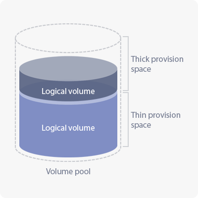
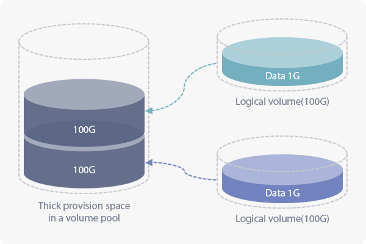
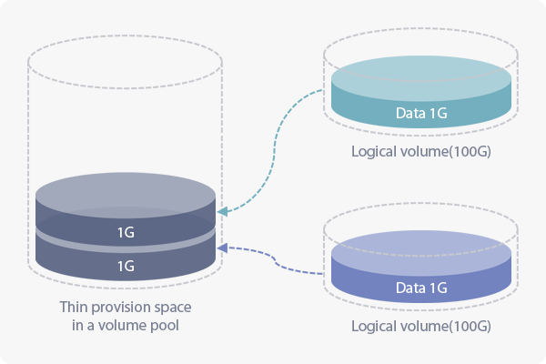

## 2.1 About Volume Pool Management
> **Volume Pool** menu manages LVM-based physical volume, volume group, and the logical volume of each node in the cluster.  
> Volume pool is a group of volumes consisted of the selected disks across nodes and can also configure the dynamic allocation.  
> The space for dynamic allocation is utilized for supplementing the available space on the cluster volume exclusive for dynamic allocation.  
> You can use tiering on the cluster volume by creating the additional volume pool exclusive for the tiering.  

### 2.1.1 About LVM

 

 

**Composition of Volume Manager**

| Name                         | Description |
|-----                         |------|
|Physical Volume|The physical block devices such as HDDs and SSDs should be registered as physical volume to be used in LVM. Disk devices that are registered as physical volumes can be combined as a volume group which can be a bigger block device.|
|Volume Group   |To use the space of a volume group, you should create a logical volume that allocates an amount of space from the volume group. A volume group can be divided into more than one logical volume.|
|Logical Volume |The actual volume which is the basic resource to form a cluster volume and that are used by users to read and write data. The data that are written in a logical volume will be written on physical volume that is mapped through a volume group. There are average logical volumes and thin provisioned logical volumes.|

**Types of Logical Volumes**  

| Type        | Description |
|-----        |------|
|LV           |The generally used logical volume which takes a static space of the volume group regardless of the data size that has been written in.|
|ThinPoolLV   |It occupies a static space of the volume group as it is with LV. ThinPoolLV should be organized prior to creating ThinLV and it provides a space as much as a written data of ThinLV.|
|ThinLV       |View the logical volume for thin provisioning and there are no limits on size when creating one. As the volume group allocates space to LV, ThinPoolLV allocates space to ThinLV. When the size of ThinLV is decreased or deleted, it will return the allocated space to ThinPoolLV.|

**Configuring a Volume Pool**  
> Volume pool has static allocation and dynamic allocation on the space.  
>  
> Static space (pool) allocation: A volume or space (pool) for the static allocation.  
> Dynamic space (pool) allocation: Able to create a **dynamic volume** for thin provisioning and snapshot volume.  

**Space for Static Allocation**  
> AnyStor-E can integrate all the volume group from each node to create a space (pool) for static allocation.
> Regardless of the internal data size, it will occupy the space through static allocation to the size of a logical volume.

+ **When do you use a static allocation?**  

    It is for the service when there should be a steady file transaction speed and where the snapshot is not needed.     
    Great for the service which occasionally deletes files with a small capacity.   

   
**Space for Dynamic Allocation**   
> A logical volume that is created in the space used for dynamic allocation will only occupy the size that had been written.    
> It will only occupy the size that is actually used which makes it more efficient than static allocation.  

+ **When do you use a dynamic allocation?**  

    It is recommended to use snapshot features to fortify the data integrity.    
    It will be appropriate to use thin provisioning when there is a great number of users or volumes.   

## 2.2 Volume Pool
> The **Volume Pool** page will show the overall status of the created volume pool.  

**Volume Pool Management List**

| Category         | Description |
|-----         |------|
|Volume Pool Name    |Name of a volume pool. **vg_cluster** is a volume pool to create volumes and **vg_tier** is a volume pool for tiering.|
|Type          |Volume pool type. (Gluster, External)|
|Purpose     |View the purpose of use of the volume pool. &nbsp;&nbsp;&nbsp;&nbsp; **Data Storage** - A volume pool for creating a volume. &nbsp;&nbsp;&nbsp;&nbsp; **Tiering** - A volume pool for the tiering of a volume.|
|Node          |List of node forming the volume pool.|
|Status          |The status value of a volume pool will be shown as **OK** and **WARN**. &nbsp;&nbsp;&nbsp;&nbsp; **OK** - Shows the status is normal. &nbsp;&nbsp;&nbsp;&nbsp; **Warn** - Warns which the volume group usage has reached 95%.|
|Volume Pool Size  |Shows the total volume group size per node forming the volume pool.|
|Volume Pool Usage|Shows the total volume group usage per node forming the volume pool.|
|No. of Volumes     |View the number of cluster volume which the volume pool is using.|
|Dynamic Allocation Size|Size of a dynamically allocated volume pool for thin provisioned volume.|
|Action          |Can apply additional process on the volume pool. &nbsp;&nbsp;&nbsp;&nbsp; **THIN\_PROVISION** - Configure or delete dynamic allocation on the volume pool. &nbsp;&nbsp;&nbsp;&nbsp; **Change** - Expand or reduce the space of a volume pool by choosing the disks for the node.|

### 2.2.1 Creating Volume Pool
>  Can create Gluster or External type volume pool.

#### 2.2.1.1 Creating Tiered Volume Pool
> Press **Create** button on the top left side of the page to create a tiered volume pool.  
> Select each disk per node to form a volume pool.

+ **About Tiered Volume Pool**  

    While creating a tiered volume pool, you may add SSDs or NVMes to enhance the performance.   
    Performance enhancement is optimized on workloads with a lot of random accesses and will show a relatively lower performance enhancement when creating or searching small files lower than 10K.    

**Contents**

| Category              | Description                                                      |
|-----                  |------                                                            |
|Volume Pool Name       |Name of a volume pool.                                            |
|Purpose                |It can only create the volume pool for the tiered cluster volume. |
|Volume Pool Size       |Volume pool size will be reflected by the disks you have selected.|
|Device(s) by Node      |Lists of unused disk devices to create volume pool.               |

**List of Device per Node**

| Category | Description |
|-----|------|
|Node Name|Hostname of a node.|
|Physical Disk|Name of a disk device.|
|Media Type|View the type of the disk. &nbsp;&nbsp;&nbsp;&nbsp; **HDD** - Hard Disk Drive. &nbsp;&nbsp;&nbsp;&nbsp; **SSD** - Solid State Drive.|
|Device Size|Total space of the device.|

#### 2.2.1.2 Creating Dynamic Volume Pool
> Select **THIN\_PROVISION** from the drop-down list of the **Action** column on the **Volume Pool Management** list.

- **When lacking space on your dynamic volume pool**  

    From this menu, it is possible to expand dynamic volume pool as much as the space that is available in static volume pool. Once it is expanded, it cannot be reduced.    
    When your dynamic volume pool hits the limit, the **performance may dramatically fall** and the **metadata allocation on the file system might fail**.    
    For these reasons, AnyStor-E will interfere the writing process and switch to **Read-Only** mode on the volume when the capacity reaches 95%.    
    It will switch back to **Read-Write** mode when the space in the volume is available due to the deleting or relocating the files.    

**Contents**

| Category | Description |
|-----|------|
|Available space per node for dynamic allocation|View the available space of the selected node to set as dynamic volume pool.|
|Size of dynamic volume pool per node|Enter the space for the dynamic volume pool you are about to create.|
|Node List|View the list of nodes that are available to create dynamic volume pool.|

**Node List**

| Category | Description |
|-----|------|
|Name|Hostname of a node.|
|Device Status|Displays the status of a node.|
|Service Status|Displays whether it can be used as a volume pool.|
|Pool Usage|Displays the usage of a volume pool in percentage.|
|Available Space|Displays the available space that can be used.|

#### 2.2.1.3 Create External Volume Pool 
> Mount the volume of external device

| Category           | Description |
|-----           |------|
|Name            |Set External volume pool name.|
|Type            |Set External volume pool type. (NFS, SNFS)|
|IP              |Set External device IP.|
|Node wise device list |Select the node on which to mount the volume of the external device.|

### 2.2.2 Volume Pool Settings
> This menu provides modification and deletion of the created volume pool.

#### 2.2.2.1 Static Volume Pool Settings
> The volume pool list and select **Change** from the drop-down list of the **Action** column to change the configuration on the volume pool.

##### 2.2.2.1.1 Gluster type Static Pool Allocation   
| Category | Description |
|-----|------|
|Volume Pool Name|Name of the volume pool.|
|Purpose|View the purpose of the volume pool. &nbsp;&nbsp;&nbsp;&nbsp; **Data Storage** - A volume pool that are used when the cluster volume is created. &nbsp;&nbsp;&nbsp;&nbsp; **Tiering** - A volume pool that is used exclusively for tiering.|
|Volume Pool Size|Estimated volume pool size after the configuration.|
|Device(s) by Node|Select disks to change the size of a volume pool.|

**Contents**

+ The disk including logical volumes cannot be deleted from the list.     
    Select disk devices to change the volume pool size. Only the disks that are included, or unused will be listed.  

| Category | Description |
|-----|------|
|Node Name|Hostname of a node.|
|Physical Device|Name of a physical disk device.|
|Media Type|View the type of the disk. &nbsp;&nbsp;&nbsp;&nbsp; **HDD** - Hard Disk Drive.  &nbsp;&nbsp;&nbsp;&nbsp; **SSD** - Solid State Drive. |
|Device Size|Total space of the device.|
|Status|View whether it is used in the current volume pool.|

##### 2.2.2.1.2 External type Static Pool Allocation
| Category           | Description |
|-----           |------|
|Name            |Name of the External volume pool.|
|Type            |Type of the External volume pool|
|IP              |IP of the External device.|
|Node wise device list |View the nodes on which to mount the volume of the external device.|

#### 2.2.2.2 Dynamic Volume Pool Settings
> This settings will be possible in case of Gluster volume pool type.

> If the dynamic allocation is applied on a volume pool, you can modify its configuration by selecting **Thin\_Provisioning** from the drop-down list on the **Action** column.

**Contents**

| Category | Description |
|-----|------|
|Available space per node for dynamic allocation|View the available space of the selected node to set as dynamic volume pool.|
|Size of dynamic volume pool per node|Enter the space for the dynamic volume pool you are about to create.|
|Node List|View the list of nodes that are available to create dynamic volume pool.|

**Node List**

| Category | Description |
|-----|------|
|Name|Hostname of a node.|
|Device Status|Displays the status of a node.|
|Service Status|Displays whether it can be used as a volume pool.|
|Pool Usage|Displays the usage of a volume pool in percentage.|
|Available Space|Displays the available space that can be used.|
|Status|View whether it is using the dynamic allocation.|

### 2.2.3 Deleting Volume Pool  
+ The volume pools which are dynamically allocated or includes logical volume cannot be deleted.     

#### 2.2.3.1 Deleting Tiered Volume Pool  
> Choose the volume pool from the list and select **Delete** from the drop-down list on the **Action** column to delete the volume pool.

#### 2.2.3.2 Removing Dynamic Allocation from the Volume Pool  
> Choose the volume pool from the list and select **Delete** from the drop-down list on the **Action** column to remove dynamic allocation.
