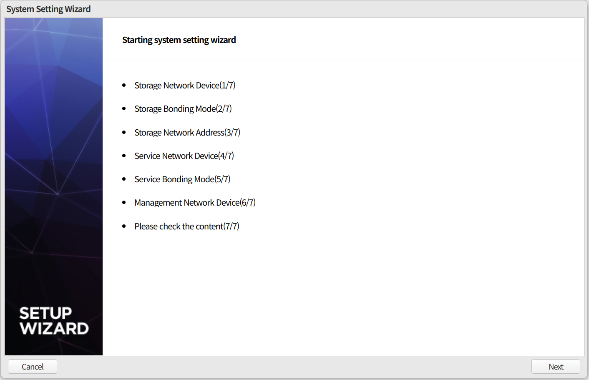
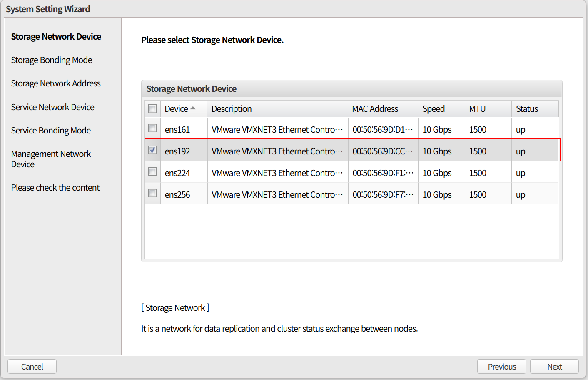
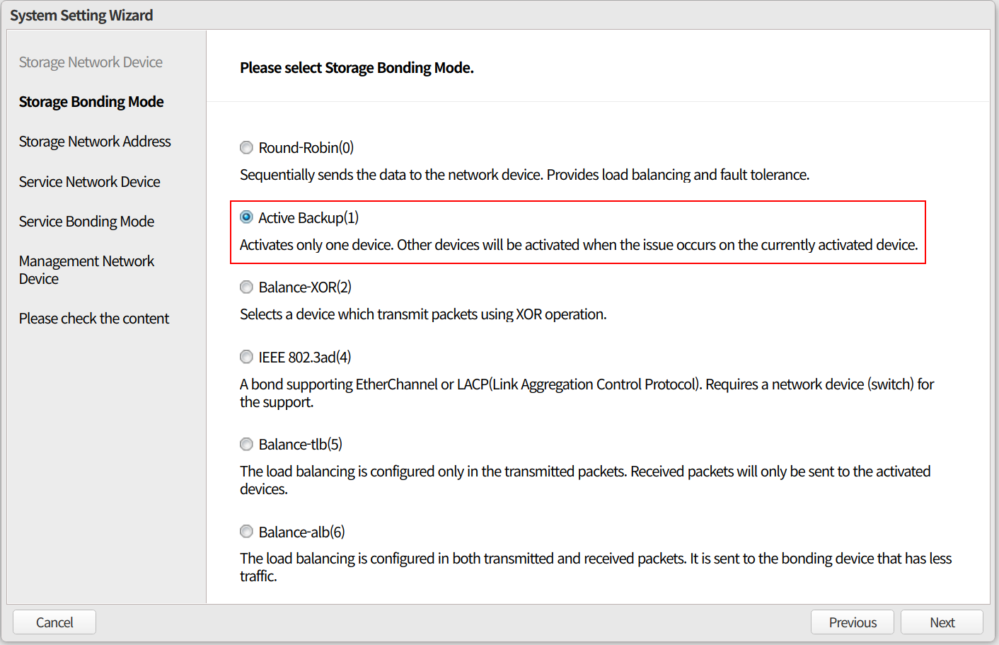
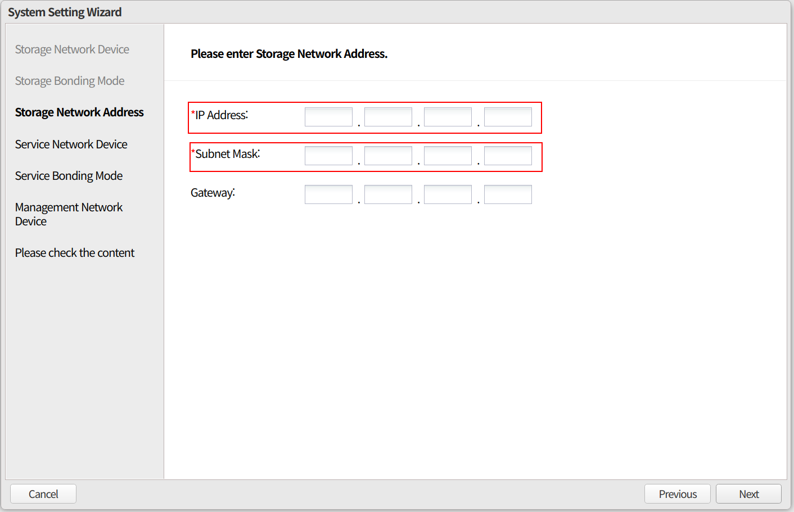
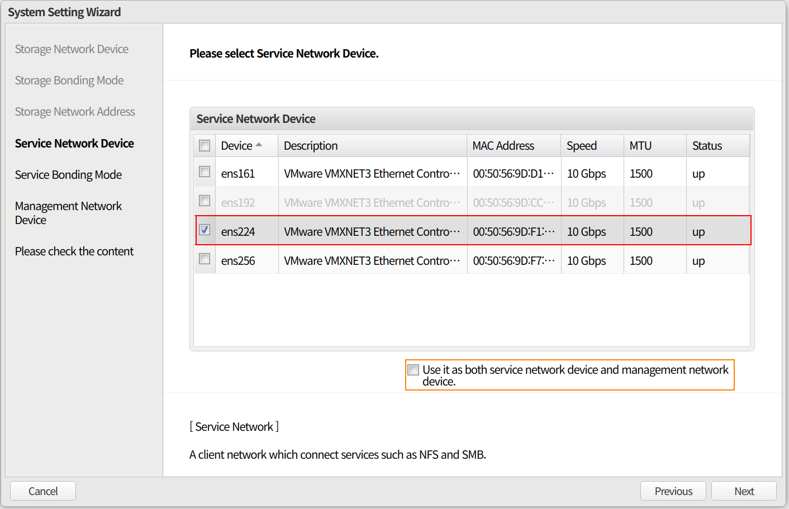
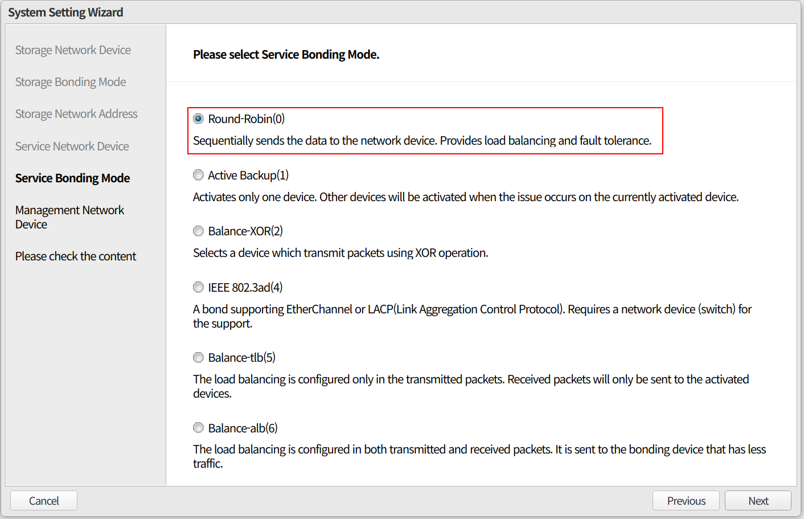
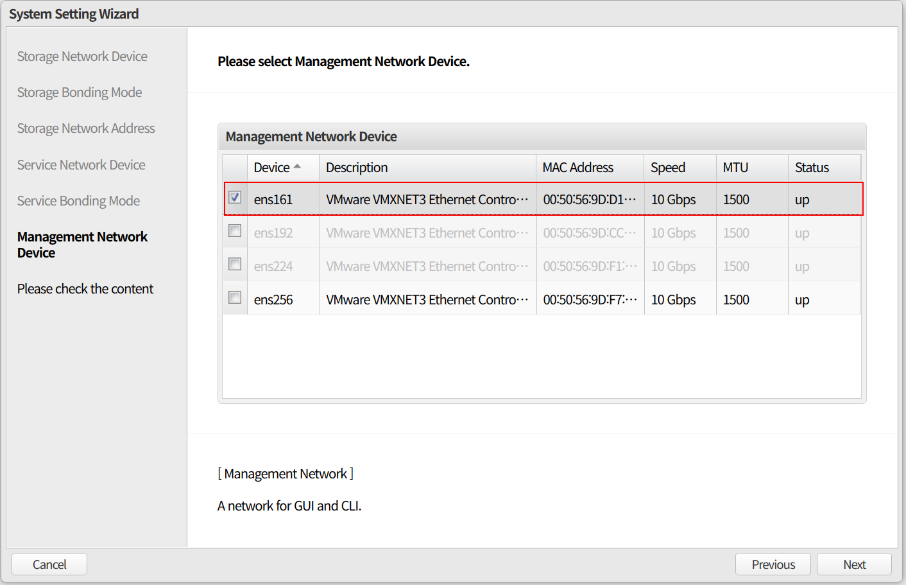
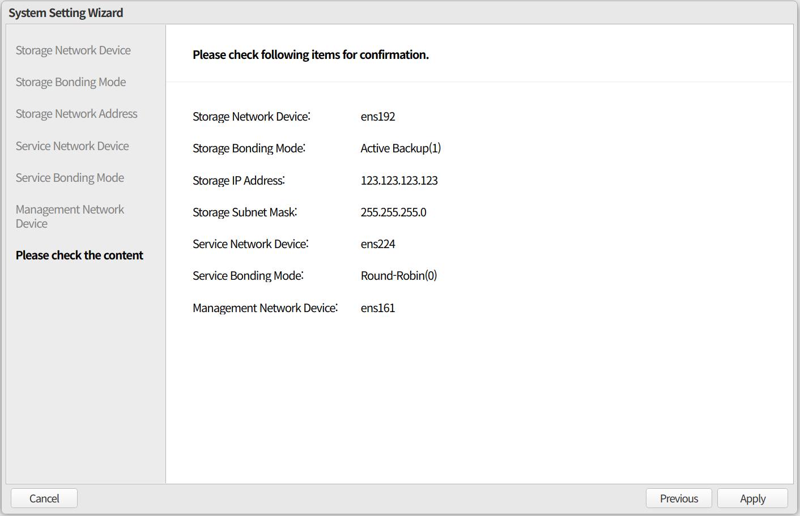
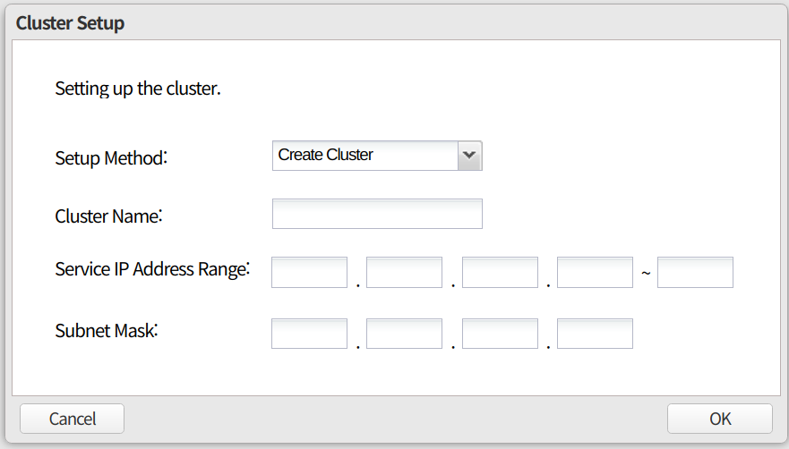
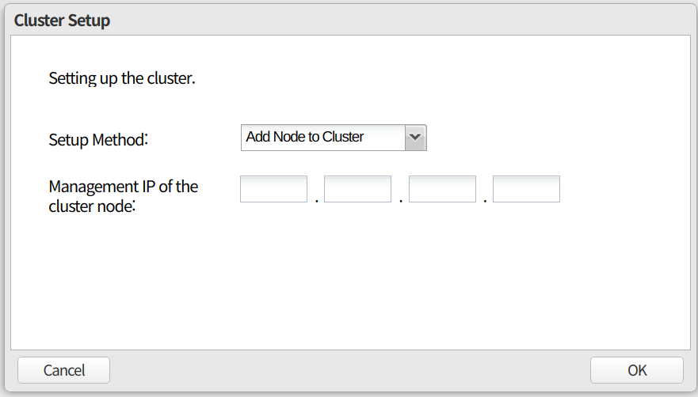

Configuration
====

### Setting administrator

##### Add user

    /usr/gms/script/gms useradd -n <USER> -p <PASSWORD>

##### Delegate account as web administrator

    /usr/gms/script/gms admin -n <USER>

### Node configuration

**Node configuration is the step of setting basic information for each node**

1.  IP setting  
     **vim /etc/sysconfig/network-scripts/ifcfg-<Interface>** (you can use another IP setting command)  
    
2.  Access <IP Address> on the web  
3.  System Setting Wizard, Click **Next**  
    
3.  Select Storage Network Device  
    
4.  Select bonding mode, Usually select 'Active Backup'  
    
5.  Input the storage Network address  
    
6.  Select Service Network Device  
    (If you want to use service network and management network as one, check the 'Use it as both service network device and management network device')  
    
7.  Select bonding mode, Usually select 'Round-Robin'  
    
8.  Select Management Network Device  
    
9.  Check configuration information and click 'Apply'  
    

### Cluster Setup

**Cluster initialization is performed on the first node in the cluster**

-   After completing the node configuration, Select **Create Cluster** on the wizard page  
    -   Click 'OK' after input clustername, service IP range, netmask  
    -   you can check the initialization process by checking the **`/var/log/gms/procedure_gms.log`**  

### Cluster Expand

**It is executed by accessing the node to be included in the clsuter**

-   After completing the node configuration, Select **Add Node to Cluster** on the wizard page  
    -   Input Management IP of the Cluster Node(First Node) and Click 'OK'  
    -   When pop-up the **"Would you like to expand after adding the node?"**  
        Click **"Expand"**  
    -   you can check the initialization process by checking the **`/var/log/gms/procedure_gms.log`**  

### Configuring the Cluster

**Caution**   

-   Problems occur when adding clusters at the same time  
-   If you click 'OK' multiple times during the initializtion, the API is called multiple times, which may cause problems.  

