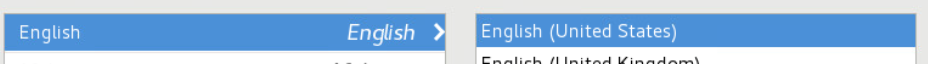
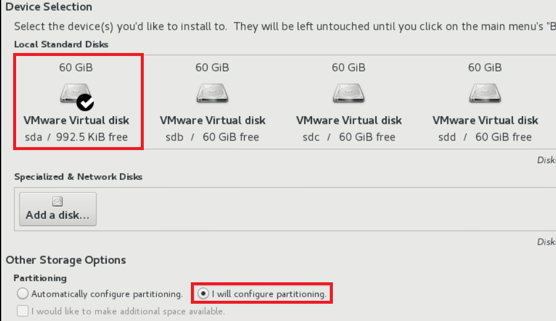
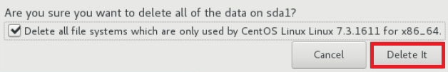

ISO Installation
====

**This installation is based on VM**

2.  Boot by using AnyStor-E ISO  
3.  Select 'Install AnyStor-E X.X'  
    
4.  Select Language and Next  
    
5.  Select DATE & TIME   
    
6.  Select City and Next  
    
7.  Click INSTALLATION DESTINATION   
    
8.  Select OS disk, check the **I will configure partitioning** in 'Partitioning' and Next  
    
9.  (If the OS was previously installed) Select previously OS and click **ㅡ** for delete  
      
    
10. Click the **Click here to create them automatically** for basic configuration
11. **/ = 50GB**, **/home = 30GB**, **/var = all empty space**\  
    
12. Accept Changes  
    

