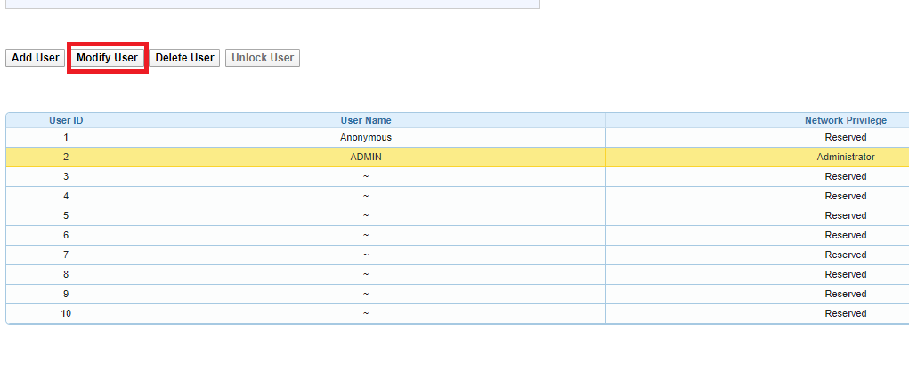
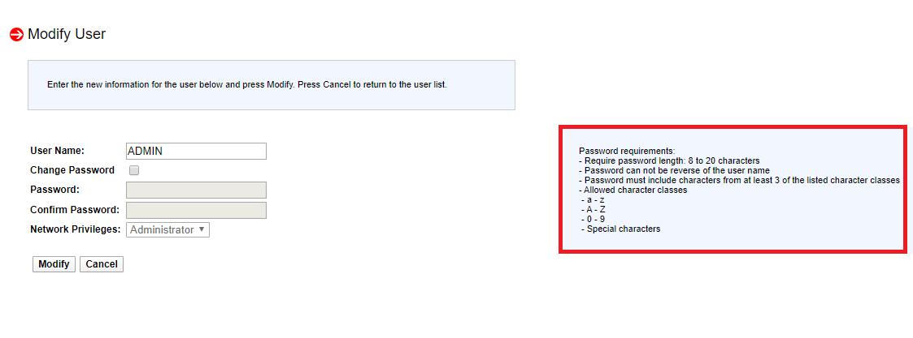
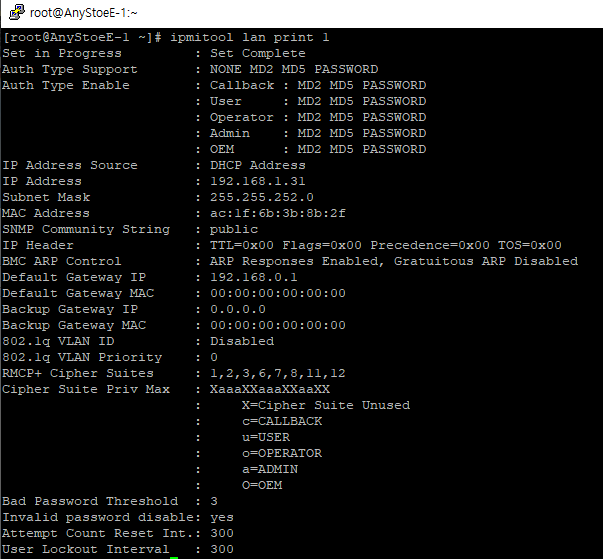
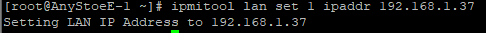
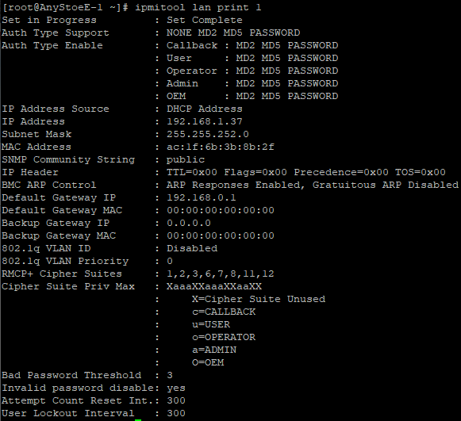
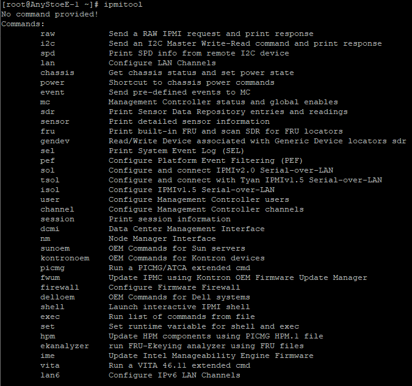

Installation guide
====

<span style="color:#0000BB">Prepare for installation</span>
====

### Configure network

Anystor-E cluster storage manager defines the network types as below, which are the default recommendations.

|  Network Typs             |  Description                                                               |
| --------------------------|----------------------------------------------------------------------------|
|   **Management Network**  | Network for cluster configuration and web management (**Need to enable access http**) |
|   **Storage Network**     | Network for connect between internal storage                               |
|   **Service Network**     | Network for clients to mount to storage                                    |

### Setting for network

Edit the file '/etc/sysconfig/network-scripts/ifcfg-\<INTERFACE\>' for setting IP  
or setting IP using a different way

    ONBOOT=YES
    NM_CONTROLLED=no
    BOOTPROTO=static
    IPADDR= <IP Address>
    NETMASK= <Netmask>
    GATEWAY= <Gateway>

Edit the file '/etc/resolv.conf'

    nameserver 8.8.8.8
    nameserver <nameserver>

### [Option] Setting for disk

1.  Choose partition layout **Use All Space**
2.  Check **Review and modify partitioning layout**
3. **Next** 


-   /root= 50GB, /HOME = 30GB, /var= all empty space
    - This is to prepare for a lot of logs (It is ok, if you are customize)

### [Option] Setting for Infiniband Network(RDMA) 

RDMA installation

    # yum -y groupinstall "InfiniBand Support"
    # yum -y install perftest infiniband-diags
    # dracut --add-drivers "mlx4_en mlx4_ib mlx5_ib" -f
    # systemctl enable rdma

opensm enable

    # systemctl enable opensm.service
    # systemctl start opensm.service

### [Option] Setting for RAID Card

In some cases, this process can be set using a manufacturer-specific setting tool after performing the package installation process.

-   Upgrade to recently firmware that matches the model
    -   MegaRAID : https://www.broadcom.com/products/storage/raid-controllers/
-   If storage does not have BBU, you need to check wtie cache is disble 
-   If you use all of SSD
    -   Write Policy : if have BBU 'Write-back', else 'write-through'
    -   ReadAhead : disable
    -   I/O Type : Direct
    -   Stripe Size : 256K

### [Option] Setting for IPMI

#### Change password in web environment

**This is based on Supermicro**  
**For equipment of other manufacturers, please refer to the manufacturer manual.**

1.  Login to IPMI web  
2.  Enter the 'Users' in 'Configuration'  
     
3.  When a list of users appears, click 'ADMIN' and click 'Modify User' button  
     
4.  click `Change Password` textbox and change password  
     
     **Precautions**  
     check the password requirments

#### Change password in text environment

1.  Install the ipmitool package

```..
    # yum -y install ipmitool
```
2.  check user list using `ipmitool user list` (In this example, ADMIN is ID 2)  
     
3.  change password using `ipmitool user set password 2`  
     

#### Setting IPMI IP

1.  Install the ipmitool package

```..
    # yum -y install ipmitool
```
2.  check IP address using `ipmitool lan print 1`  
     
3.  change IP address using `ipmitool lan set 1 ipaddr <CHANGE IP>`  
     
4.  check if the IP address has been changed by using `ipmitool lan print 1`  
     
5.  For option using `ipmitool`  
     

### [Option] Storcli Installation 

- Need to installation for S.M.A.R.T information and some disk information 

```
    # yum -y install storcli
```

<!-- TODO: 21/05/18 Multipath
### [Option] Setting for multipath (수정 중)

SAN 환경인 경우, 멀티패스 등을 설정해야 하는 경우가 있다.

    # mpathconf --enable
    # systemctl restart multipath
-->

