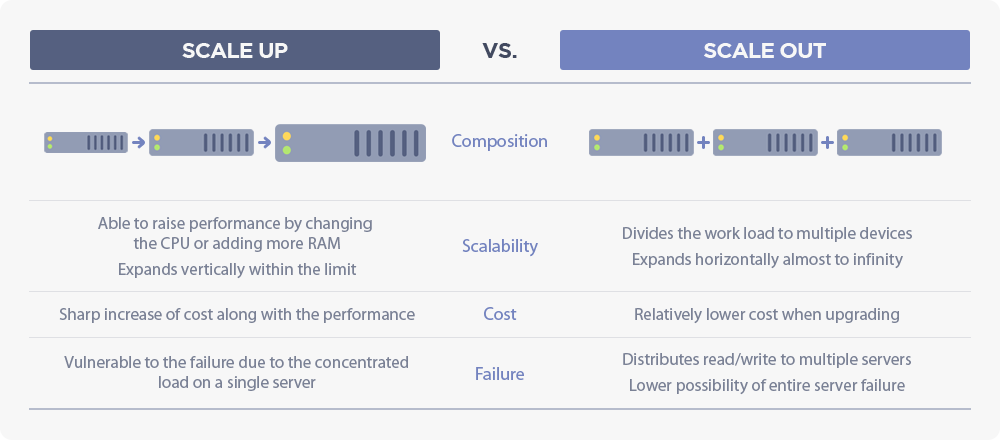
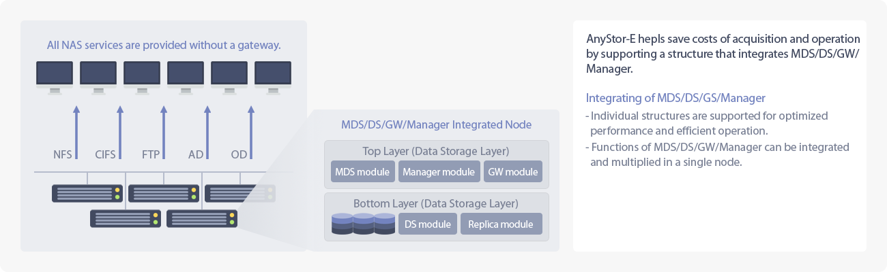

# AnyStor-E Administrator Manual

## Preface

* Version : 3.0.3
* This manual provides the functionalities and instructions of **AnyStor Enterprise** that is based on GUI configuration.
* For any questions or opinions on the manual, please make an inquiry to the email below.
 * ac2@gluesys.com support@gluesys.com

## Introduction to AnyStor-E Cluster Storage

> AnyStor-E is a **Scale-Out Storage Appliance Software**.  
> As a **Software-Defined Storage**, it is free to install and manage without any restrictions on the hardware.  
> Build a system starting from **a single node** and install extra node seamlessly with **zero downtime**.  
> You can prepare your storage followed by the service needs by the **linear improvement** on the performance.

| AnyStor-E Product Introduction |
| :------------------:|  
|    **AnyStor-E Administrator** integrates scattered resources around the cluster to **simplify the administration and fault handling procedure**.  AnyStor-E provides standard network protocol services, which are **NFS** and **CIFS**, to support diverse OS clients and suggests storage services in virtual environments such as OpenStack through **Native API**.  |

## AnyStor-E Software Operating Environment

**Hardware Requirements**

| Component          | Minimum     | Recommended             | Notes                  |
| :------------:    | :--------     | :--------             | :---------------      |
| **CPU**           | 4 cores        | 8 cores or above           | 16 cores if requiring bandwidth above 1 GB/s. |
| **Memory**        | 4 GB          | 16 GB                  | Extension required due to clients. |
| **NIC**           | 2             | 5                     | Due to management/service/storage network configurations. |
| **Storage**       |               | LSI RAID Controller   | The storage configuration depends on the type of service. |

**Network Requirements**

| Component          | Specification           | Number of Ports       | Necessity       | Description                  |
| :------------:    | :--------      | :--------    | :--------       | :---------------      |
| Service Network   | 1G / 10G       | 1 - 4        | Essential            | Connect NFS/CIFS services through client network. |
| Storage Network | 1G / 10G  / IB | 1 - 4        | Essential            | For exchanging cluster status and replicating data between nodes. |
| Management Network     | 100M / 1G      | 1            | Optional            | For accessing the CLI or GUI. If not present, the service network will take the place. |

> Basically, **Service Network** and **Storage Network** will be configured as a bond to secure the availability, and can be extended from a single port to 4 ports.  
> **Service Network** and **Management Network** can be used for the same purpose.  
> The **Service Network** provides service continuity by allocating IP pools for the failover.  

## AnyStor-E Architecture

| AnyStor-E Basic Architecture |
| :------------------:|  
|     AnyStor-E **integrates all the software component to a single node** to manage the service. |

| Component        | Description           |
| :-----:         | :--------           |
| **Top Layer**   | The layer controls MDS/Manager/GW modules which **manages the hardware and software of your cluster and node and provides file and block services**. |
| --> MDS         | As a module that loads up to three nodes, it synchronizes the configuration and status of a cluster and configures a quorum to check the stability of a cluster.  |
| --> Manager     | Selects and manages a node from one of the first three nodes and manages time server and event history database for cluster synchronization.  |
| --> GW          | It is loaded on every node, providing the NFS/CIFS service along with HA clustering.  |
| **Bottom Layer**| The layer which loads the back end cluster file system, which can hold file systems such as **GlusterFS, Ceph, and MAHA-FS**. |
| --> DS          | A module which can be loaded in every node, managing the connection between back end file system and GW module.   |

## RedHat GlusterFS Adaptation

| GlusterFS for On-Premise Architecture |
| :------------------:|  
|      **GlusterFS** is a type of cluster file system. |

| Feature |  Purpose           |
| :-----:             | :--------       |
| Linear Extension Architecture    | An architecture for distributed metadata provides exceptional performance and stability by avoiding the centralized bottleneck.  |
| Assuring Localization 	      | The legacy file system architecture built in every node guarantees superior performance predictability and data integrity.  |
| Hash-based File Distribution Architecture | Data will be accessed by using a hash to filenames and gives high performance on large data processes.   It might show performance loss when processing data lower than 10 KB.  |
