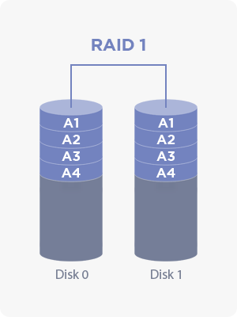
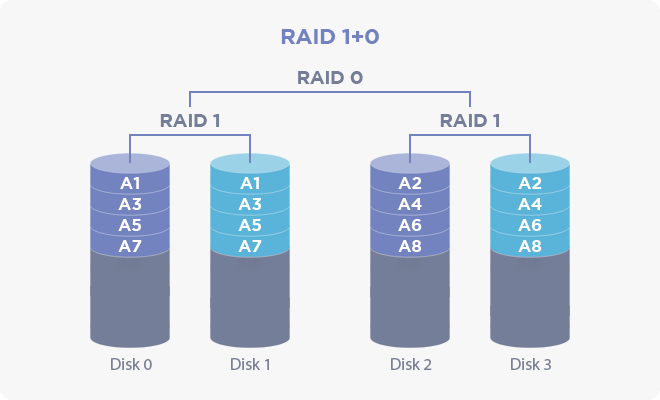
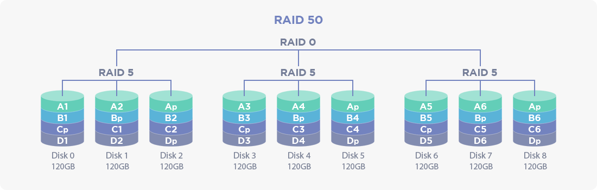
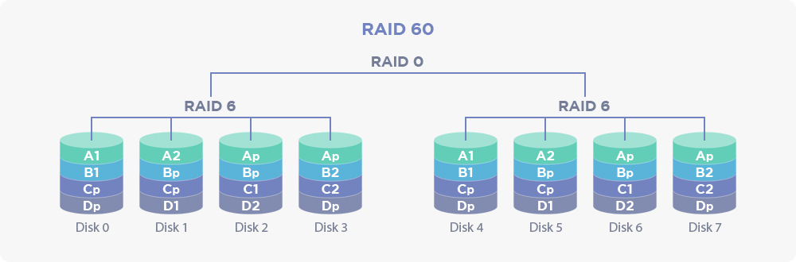

## 5.6 RAID Information

### 5.6.1 What is RAID?

**RAID(Redundant Array of Independent Disks)** is a technique of distributing data to several hard disks, and a device managing it is called RAID controller.
Generally, due to its characteristics, a storage or storage server mounts multiple hard disks. To efficiently utilize these hard disks, RAID controllers are commonly embedded to these servers.

### 5.6.2 RAID in AnyStor-E

AnyStor-E provides the information on the composition and status of a connected RAID controller and these information helps when a flexible and immediate response is required on a situation when a failure such as hard disk failure or disconnection occurs.

### 5.6.3 Contents of RAID Information Menu

Navigate to **Node Management >> RAID Information** from the left **Administrator** menu and select a node from the drop-down list on the top left corner of the page.

The page will be refreshed with the overall summary of the RAID controller. You will be able to find the details from the following table.

#### 5.6.3.1 RAID Information

| **Category** | **Description** |
| :--: | :------------------------- |
| **Adapter ID** | View the adapter ID of a RAID controller adapter. |
| **Logical Disk(s)**   | View the total number of logical disks and their normal and abnormal disks. |
| **Physical Disk(s)**   | View the total number of physical disks and their normal and abnormal disks. |
| **Disk Information**   | Press the button to open a pop-up screen showing details on the connected logical and physical disk.   For more information, please refer to [5.6.3.2 Details on Physical Disk](#node.xhtml#5.6.3.2 Details on Physical Disk) and [5.6.3.3 Details on Logical Disk](#node.xhtml#5.6.3.3 Details on Logical Disk). |
| **Adapter Information**     | Press the button to open a pop-up screen showing the firmware and configuration of a controller or adapter.  For more information, please refer to [5.6.3.4 Adapter Information](#node.xhtml#5.6.3.4 Adapter Information). |

#### 5.6.3.2 Details on Physical Disk

Press **View** button from **Disk Information** header in [5.6.3.1 RAID Information](#node.xhtml#5.6.3.1 RAID Information) to see the details on the physical disk embedded to the adapter.

| **Category** | **Description** |
| :--: | :------------------------- |
| **Logical Disk ID** | View the ID of a logical disk composed by the physical disk. |
| **Physical Disk ID** | View the ID of a physical disk. |
| **Physical Disk Size** | View the size of a physical disk. |
| **Status** | View the current status of a physical disk. For more information on the status, please refer to [5.6.3.2.1 Physical Disk Status](#node.xhtml#5.6.3.2.1 Physical Disk Status). |
| **Slot Number** | View the number of controller slot connected to the physical disk. |
| **Interface Type** | View the type of protocol of the controller slot connected to the physical disk. |
| **Disk Type** | View the type of physical disk which will be either HDD or SSD. |

##### 5.6.3.2.1 Physical Disk Status

| **Status** | **Description** |
| :--: | :------------------------- |
| **Online** | Indicates that it is fully operative for composing a logical disk. |
| **Offline** | Indicates that the I/O process is unavailable for reasons such as disk failures. |
| **Foreign** | The status of saving the configuration from another adapter. |
| **Missing** | Indicates which the media is not recognized through the port for reasons such as dismounted media.|
| **Unconfigured Good** | The status that it is ready for configurations such as composing a new logical disk or adding a hot spare. |
| **Unconfigured Bad** | The status that the configuration is no longer available due to errors. |
| **Dedicated Hot Spare** | Indicates that the disk is dedicated as a spare for a specific logical disk.|
| **Global Hot Spare** | Indicates that the disk is used as a spare for all logical disks. |

#### 5.6.3.3 Details on Logical Disk

Press **View** button from **Disk Information** header in [5.6.3.1 RAID Information](#node.xhtml#5.6.3.1 RAID Information) to see the details on the logical disk allocated to the adapter.

| **Category** | **Description** |
| :--: | :------------------------- |
| **Logical Disk ID** | View the ID of a logical disk managed by the adapter. |
| **Logical Disk Name** | View the name of a logical disk. This may not be visible due to configurations. |
| **RAID Level** | View the RAID level of a logical disk. Please check [5.6.4 RAID Levels](#node.xhtml#5.6.4 RAID Levels) for more information. |
| **Size** | View the size of a logical disk. The size may differ from the RAID level or the number of physical disks composing the logical disk. |
| **Status** | View the current status of a logical disk. For more information, go to [5.6.3.3.1 Logical Disk Status](#node.xhtml#5.6.3.3.1 Logical Disk Status). |
| **Physical Disk(s)** | View the number of physical disks composing the logical disk. |

##### 5.6.3.3.1 Logical Disk Status

| **Status** | **Description** |
| :--: | :------------------------- |
| **Optimal** | Shows that the state is normal. |
| **Partially Degraded** | Indicates that the I/O speed is degraded due to the damage from one of the physical disks composing the logical disk. |
| **Degraded** | Indicates that it no longer guarantees the integrity due to the damage from one of the physical disks composing the logical disk. |
| **Rebuilding** | The status that the logical disk is currently recovering/reconfiguring from the state of **Partially Degraded** or **Degraded**. |
| **Migrating** | The status which the composition of the physical disk is in modification for the reasons such as changing the RAID level of a logical disk. |

#### 5.6.3.4 Adapter Information

Press **View** button from the **Adapter Information** header in [5.6.3.1 RAID Information](#node.xhtml#5.6.3.1 RAID Information) to see the details on the adapter.

The feature includes the information on the firmware and configurations of the controller/adapter.

| **Category** | **Description** |
| :--: | :------------------------- |
| **Manufacturer** | View the model name and ID of a RAID controller. |
| **Firmware** | View the firmware version of a RAID controller. |
| **Input/Output** | View the information on the I/O such as the stripe size, data transfer size, a number of parallel processing, and a length of SGE queues. |
| **Reconfiguration** | View the information on reconfiguration settings such as the allocation rate of RAID controller processing for fault recovery when the logical disk fails. |

#### 5.6.4 RAID Levels

There is a series of RAID levels and this manual is focused on levels that are being used the most.

For the additional information on RAID levels, please refer to [5.6.5 References](#node.xhtml#5.6.5 References).

##### 5.6.4.1 RAID 0

| **RAID 0 Diagram** |
| :------: |
|  |
| Reference: https://en.wikipedia.org/wiki/Standard_RAID_levels |

**RAID 0** has a structure of distributing and storing the data sequentially in **at least two** physical disks forming a logical disk. This technique is called striping.

The capacity of a logical disk expands as the number of physical disk increases. Moreover, since the I/O speed will multiply by the number of physical disks, the I/O speed will escalate as the number of physical disk increases.

However, as it does not use any parity, the integrity of logical disk will be damaged when one of the physical disks fails.

##### 5.6.4.2 RAID 1

| **RAID 1 Diagram** |
| :------: |
|  |
| Reference: https://en.wikipedia.org/wiki/Standard_RAID_levels |

**RAID 1** has a structure of replicating and storing the data in **at least two** physical disk forming a logical disk. This technique is called mirroring.

The capacity of logical disk will not expand as the number of physical disk increases, although the write speed will rather slow down.

##### 5.6.4.3 RAID 5

| **RAID 5 Diagram** |
| :------: |
|  |
| Reference: https://en.wikipedia.org/wiki/Standard_RAID_levels |

**RAID 5** has a structure of distributing and storing the data along with parity blocks for integrity in **at least three** physical disk forming a logical disk, ensuring the stability.

The available size of RAID 5 will be **(number of physical disks - 1) * size of a physical disk. Although the write performance will be slightly lower than RAID 0 since there is an extra processing on the parity block.

Additionally, the integrity is only guaranteed for the single disk failure because there is only a single parity block written.

##### 5.6.4.4 RAID 6

| **RAID 6 Diagram** |
| :------: |
|  |
| Reference: https://en.wikipedia.org/wiki/Standard_RAID_levels |

**RAID 6** has a similar structure with [RAID 5](#node.xhtml#5.6.4.3 RAID 5), yet it stripes additional parity for P and Q method using the parity and Reed-Solomon error correction.

Therefore, **at least four** physical disk is required for adding another parity, and the available size will be **(number of physical disks - 2) * size of physical disk**.

Moreover, although it has better fault tolerance than RAID 5 since it can recover two disk failures, the installation cost is higher due to the minimum disk requirement, and the write speed will be relatively slow as there is an additional parity block.

##### 5.6.4.5 RAID 0+1

| **RAID 0+1 Diagram** |
| :------: |
|  |
| Reference: https://en.wikipedia.org/wiki/Nested_RAID_levels |

**RAID 0+1** consists of [5.6.4.1 RAID 0](#node.xhtml#5.6.4.1 RAID 0) striping and [5.6.4.2 RAID 1](#node.xhtml#5.6.4.2 RAID 1) mirroring combined, forming a structure of two levels.

**At least two** physical disk is used for striping, and are mirrored which will be eventually having **at least four** physical disk.

The purpose is to have speed from striping and fault tolerance from mirroring.

However, if the striped logical disk on the lower level is failed, the logical disk has to be fully replaced.

##### 5.6.4.6 RAID 1+0

| **RAID 1+0 Diagram** |
| :------: |
|  |
| Reference: https://en.wikipedia.org/wiki/Nested_RAID_levels |

**RAID 1+0** is similar to the previous [5.6.4.5 RAID 0+1](#node.xhtml#5.6.4.5 RAID 0+1), but has a reverse structure level.

**At least two** physical disk is used for mirroring, and are striped which will be eventually having **at least four** physical disk.

Unlike RAID 0+1, it can be recovered by only replacing the failed disk on the mirrored logical disk from the lower level, which is relatively cheaper.

##### 5.6.4.7 RAID 5+0

| **RAID 5+0 Diagram** |
| :------: |
|  |
| Reference: https://en.wikipedia.org/wiki/Nested_RAID_levels |

**RAID 5+0** consists of [5.6.4.6 RAID 1+0](#node.xhtml#5.6.4.6 RAID 1+0) having the lower level in structure with [5.6.4.3 RAID 5](#node.xhtml#5.6.4.3 RAID 5).

Therefore, it has higher performance and fault tolerance on the lower level compared to RAID 1+0.

##### 5.6.4.8 RAID 6+0

| **RAID 6+0 Diagram** |
| :------: |
|  |
| Reference: https://en.wikipedia.org/wiki/Nested_RAID_levels |

**RAID 6+0** consist of [5.6.4.6 RAID 1+0](#node.xhtml#5.6.4.6 RAID 1+0) having the lower level in structure with [5.6.4.4 RAID 6](#node.xhtml#5.6.4.4 RAID 6).

Therefore, it has higher performance and fault tolerance on the lower level compared to RAID 1+0.

### 5.6.5 References

* [RAID - Wikipedia](https://en.wikipedia.org/wiki/RAID)
* [Standard RAID levels - Wikipedia](https://en.wikipedia.org/wiki/Standard_RAID_levels)
