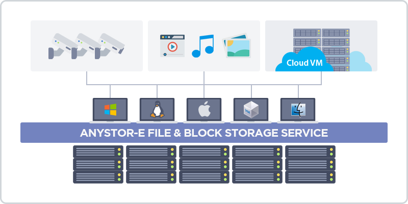

# 4 Service Protocol

> AnyStor-E supports the standard file and block service protocols along with the Filesystem in Userspace (FUSE).  
> File service is supported through **NFS v3, CIFS/SMB v2, and CIFS/SMB v3**.   
> As for the block service, it is supported through **LIO-based iSCSI and iSER**, and FC and FCoE as an optional extension.  
> As it fundamentally uses GlusterFS, the main connection will be done through **FUSE and gfapi**.  

| **Compatibility and Utilization of AnyStor-E** |
| :------: |
|  |

+ **Limitations of GUI**

    AnyStor-E management GUI can only configure **NFS and CIFS** and the rest of the functions are done manually through CLI.    
    This manual only described the configuration done in GUI. For the manual configuration, please refer to other documents.   

---

* The supported configurations in GUI are as follows.

    | Category              | Description                                                |
    | :------------:    | :----------------                                   |
    | **Protocol Settings** | The menu for enabling/disabling share protocols. |
    | **Share Settings**     | You can configure share for each volume and set access control list with its detailed configuration. |
