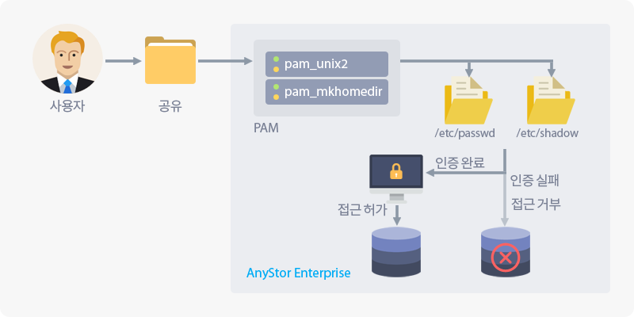
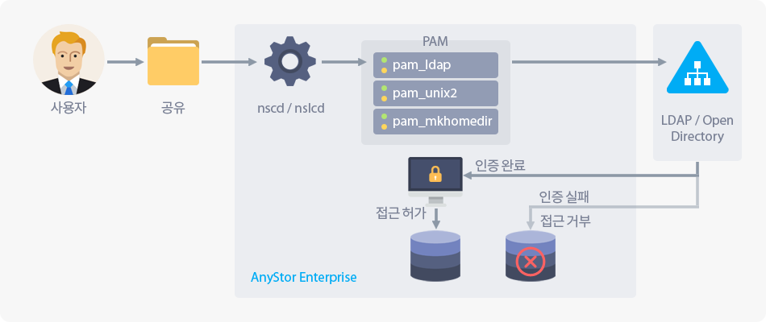

## 3.4 외부 인증

### 3.4.1 개요

> 클러스터 볼륨에 접근하기 위한 사용자/그룹 관리를 네트워크 상의 다른 서버에게 위임하기 위한 기능입니다.
>
> AnyStor-E는 **LDAP** 서버, 마이크로소프트사의 **Active Directory**, 애플사의 **Open Directory**를 지원합니다.

### 3.4.2 정의

> 많은 조직에서는 조직 내의 구성원을 유연하게 관리하기 위해 디렉터리 서비스와 같은 중앙집중형 조직 관리 서비스를 사용합니다.
>
> AnyStor-E는 네트워크를 통하여 이러한 조직 관리 서비스에서 관리되는 사용자/그룹 정보를 이용할 수 있으며,
>
> 이 정보들은 주로 개별 사용자 혹은 그룹에 대한 저장소 자원으로의 접근 권한을 제어하는 등의 조직 관리에 특화된 연동 기능을 제공하기 위해 이용됩니다.
>
> 이러한 기능은 관리자가 중복된 사용자/그룹 관리를 하지 않을 수 있도록 도우며, 조직 관리 서비스의 기능 제공 여부에 따라 향상된 인증을 통해 자원에 대한 높은 보안 수준을 유지할 수 있습니다.

### 3.4.3 상세 설명 및 설정

<ul>
    <li>현재 AnyStor-E는 SMB, AFP, FTP 파일링 프로토콜에 한하여 외부 인증을 지원합니다. 따라서 NFS 파일링 프로토콜을 사용하려는 경우에는 로컬 시스템의 인증 정보를 사용해야만 합니다.</li>
    <li>또한 AFP, FTP 파일링 프로토콜에 대한 외부 인증은 기술 지원을 통해 설정이 가능합니다.</li>
</ul>

#### 3.4.3.1 로컬 인증

**로컬 인증**은 별도의 외부 인증 서비스를 사용하지 않고 AnyStor-E 로컬 시스템에서 관리되는 계정 정보와 PAM 서브시스템을 통하여 사용자/그룹 인증을 수행합니다.

| **AnyStor-E의 로컬 인증** |
| :------: |
|  |

AnyStor-E의 웹 관리자 화면 좌측 메뉴의 **계정 >> 외부 인증**을 선택한 후, **로컬 인증** 옵션 단추를 선택한 후에 **설정 저장**을 하면 설정이 반영됩니다.

<ul>
    <li>이 경우 이전 외부 인증 설정이 적용되지 않게 되며, 공유별 사용자/그룹 접근 제어가 모두 무효하게 될 수도 있음을 유의하시기 바랍니다!</li>
</ul>

#### 3.4.3.2 LDAP/Open Directory

<ul>
    <li>LDAP 혹은 Open Directory를 통한 외부 인증을 활성화하여도 로컬 인증 정보는 유효합니다.</li>
</ul>

**LDAP(Lightweight Directory Access Protocol, 이하 LDAP)**은 디렉터리 서비스를 조회/수정하는 응용 프로토콜을 말하며, 대표적인 구현으로는 [OpenLDAP](https://www.openldap.org), [389 디렉터리 서버](https://directory.fedoraproject.org/) 등이 있습니다.

AnyStor-E는 PAM 서브시스템을 통해 LDAP 서버로부터의 사용자/그룹 인증을 수행하며, Open Directory의 설정도 이와 동일합니다.

| **AnyStor-E의 LDAP/OD 인증** |
| :------: |
|  |

AnyStor-E의 웹 관리자 화면 좌측 메뉴의 **계정 >> 외부 인증**을 선택한 후, **LDAP** 옵션 단추를 선택하면 다음과 같은 항목들을 포함하는 설정 화면이 나타납니다.

| **항목** | **설명** |
| :---: | :--- |
| URI | LDAP 서버의 URI를 표준에 부합하게 입력합니다. (<code>ldap://192.168.0.1</code>, <code>ldaps://192.168.0.1</code>) |
| 기준 고유 식별명(BaseDN) | LDAP 서버에 대한 조회 기준이 되는 고유 식별명을 입력합니다. |
| 조회 고유 식별명(BindDN)| LDAP 서버의 조회 권한이 있는 사용자의 고유 식별명을 입력합니다. |
| 조회 암호(BindPw) | LDAP 서버의 조회 권한이 있는 사용자의 암호를 입력합니다. |
| 수정 고유 식별명(RootBindDN) | LDAP 서버의 수정 권한이 있는 사용자의 고유 식별명을 입력합니다. |
| 수정 암호(RootBindPw) | LDAP 서버의 수정 권한이 있는 사용자의 암호를 입력합니다. |
| 사용자 고유 식별명(PasswdDN) | 사용자 정보를 포함하는 고유 식별명을 입력합니다. |
| 보안 고유 식별명(ShadowDN) | 사용자 보안 정보를 포함하는 고유 식별명을 입력합니다. |
| 그룹 고유 식별명(GroupDN) | 그룹 정보를 포함하는 고유 식별명을 입력합니다. |
| SSL | SSL을 통한 보안 통신 활성화 방법을 선택합니다. |

**LDAP 활성화** 체크 상자를 선택한 후 설정을 저장해야 외부 인증이 활성화 됩니다.

<ul>
    <li>LDAP을 통한 SMB 파일링 프로토콜은 보안 문제를 야기할 수 있으므로 이에 유의하시길 바랍니다.</li>
</ul>

#### 3.4.3.3 Active Directory

<ul>
    <li>액티브 디렉터리를 통한 외부 인증을 활성화하여도 로컬 인증 정보는 유효합니다.</li>
</ul>

**액티브 디렉터리(Active Directory, 이하 AD)**는 마이크로소프트 사에서 제공하는 대표적인 윈도우즈 시스템 기반의 조직/인증 관리 통합 서비스이며, AnyStor-E는 Winbind, PAM 서브시스템을 통해 ADS로부터의 사용자/그룹 인증을 수행합니다.

| **AnyStor-E의 액티브 디렉터리 인증** |
| :------: |
|  |

AnyStor-E의 웹 관리자 화면 좌측 메뉴의 **계정 >> 외부 인증**을 선택한 후, **Active Directory** 옵션 단추를 선택하면 다음과 같은 항목들을 포함하는 설정 화면이 나타납니다.

| **항목** | **설명** |
| :---: | :--- |
| **도메인 이름** | ADS 도메인 주소를 FQDN(Fully Qulified Domain Name, 이하 FQDN)에 따라 입력합니다. |
| **도메인 컨트롤러** | 해당 ADS 도메인 서비스를 제공하는 도메인 컨트롤러(Domain Controller, 이하 DC)의 FQDN을 입력합니다. |
| **ADS 계정 이름** | 해당 DC에 접근하기 위한 사용자 이름을 입력합니다. |
| **ADS 계정 비밀번호** | 해당 사용자 이름에 대한 비밀번호를 입력합니다. |

**Active Directory 활성화** 체크 상자를 선택한 후 설정을 저장해야 외부 인증이 활성화 됩니다.

### 3.4.4 확인하기

#### 3.4.4.1 사용자 생성

[3.2.2 사용자 생성](#account.xhtml#3.2.2 사용자 생성)을 참고하여 새로운 사용자를 추가합니다.

#### 3.4.4.2 볼륨 생성

[2.3.3.2 볼륨 생성](#clusterVolume.xhtml#2.3.3.2 볼륨 생성)을 참고하여 새로운 볼륨을 생성합니다.

#### 3.4.4.3 공유 생성 및 설정

1. [4.3.3.2 공유 생성](#share.xhtml#4.3.3.2 공유 객체 생성)을 참고하여 새로운 공유를 생성합니다.

2. 공유가 생성되면 [4.3.4.2.2 SMB 접근 사용자](#share.xhtml#4.3.4.2.2 SMB 접근 사용자)를 참고하여 [3.4.4.1 사용자 생성](#account.xhtml#3.4.4.1 사용자 생성) 과정을 통해 추가된 사용자에 대한 접근 권한을 적절히 설정합니다.

#### 3.4.4.4 인증 확인

<ul>
    <li>현재 AnyStor-E는 SMB 파일링 프로토콜에 한하여 외부 인증을 지원합니다.</li>
</ul>

1. **Windows**
  * LDAP을 통한 외부 인증을 사용하는 경우, 연결에 앞서 아래와 같은 절차를 거쳐 보안 수준을 하향 설정해야만 접근이 가능합니다.
      1. __시작 >> 실행(R)__ 혹은 __윈도우키 + R__을 눌러 실행 창을 엽니다.
      2. `gpedit.msc`를 입력한 뒤 확인 단추를 눌러서 그룹 정책 편집기를 실행합니다.
      3. 좌측의 계단식 메뉴에서 __컴퓨터 구성 >> Windows 설정 >> 보안 설정 >> 로컬 정책 >> 보안 옵션__ 항목을 선택합니다.
      4. __Microsoft 네트워크 클라이언트: 타사 SMB 서버에 암호화되지 않은 암호 보내기__ 항목을 두번 클릭하여 설정 창을 엽니다.
      5. __사용(E)__을 선택한 후에 확인 단추를 눌러서 설정을 변경합니다.
      6. __시작 >> 실행(R)__ 혹은 __윈도우키 + R__을 눌러 실행 창을 열고, `gpupdate`를 입력한 뒤 확인 단추를 눌러 그룹 정책을 반영합니다.
  * __시작 >> 실행(R)__ 혹은 __윈도우키 + R__을 눌러 실행 창을 엽니다.
  * `\\<AnyStor-E 서비스 IP>\<공유명>`을 입력한 뒤 확인 단추를 눌러서 [3.4.4.3 공유 생성 및 설정](#account.xhtml#3.4.4.3 공유 생성 및 설정) 과정을 통해 생성된 공유에 접근합니다.
  * 사용자 이름과 비밀번호를 입력하는 창이 나타나면 해당 사용자 정보를 입력하여 접근을 시도합니다.
  * 윈도우 탐색기가 열리면 인증이 잘된 것이며, 해당 경로에서 설정한 바와 같이 파일/디렉터리 접근이 가능한지 확인합니다.

2. **Linux**
  * SMB 클라이언트를 설치합니다.
      * **Arch** : `pacman -Sy cifs-utils`
      * **CentOS** : `yum install -y cifs-utils`
      * **OpenSuse** : `zypper -n install samba-client`
      * **Ubuntu/Mint** : `sudo apt-get install -y cifs-utils`
  * LDAP을 통한 외부 인증을 사용하는 경우, 연결에 앞서 다음과 같은 명령을 통해 보안 수준을 하향 설정해야만 접근이 가능합니다.
      * `echo "0x30" > /proc/fs/cifs/SecurityFlags`
  * 다음과 같이 마운트 명령을 수행합니다.
      * `mount -t cifs //<AnyStor-E 서비스 IP/<공유명> <마운트 경로> -ouser=<사용자명>,password=<비밀번호>,uid=<사용자명>,gid=<그룹명>,iocharset=utf8`

<ul>
    <li>이 명령의 옵션은 리눅스 배포판 혹은 패키지 버전에 따라 조금씩 다를 수 있습니다. 이러한 경우에는 <code>man mount.cifs</code>를 참고하시길 바랍니다. 또한 클라이언트 환경에 따라 AnyStor-E와 호환되지 않는 보안 프로토콜 혹은 프로토콜 버전을 사용하는지 확인이 필요할 수도 있습니다. 자세한 사항은 <code>man mount.cifs</code>에서 설명하는 <code>sec=</code> 옵션과 <code>vers=</code> 옵션을 확인하시길 바랍니다.</li>
</ul>

> 명령이 오류 출력 없이 수행 되었다면 `mount` 명령을 수행한 출력 결과에서 해당 마운트 경로가 나타나는지 확인합니다. 나타난다면 인증이 잘된 것이며, 해당 경로로 이동(`cd <마운트 경로>`)하여 파일/디렉터리 접근이 가능한지 확인합니다.

3. **Mac OS X**
  * [3.4.3 참고](#account.xhtml#3.4.3 참고)의 Mac에서 파일 공유를 사용하여 연결하는 방법을 참고하여 연결을 시도하고 접근이 가능한지 확인합니다.

### 3.4.3 참고

* [OpenLDAP](https://www.openldap.org)
* [389 디렉터리 서버](https://directory.fedoraproject.org/)
* [Active Directory Architecture - Microsoft Docs](https://docs.microsoft.com/en-us/previous-versions/windows/it-pro/windows-2000-server/bb727030(v=technet.10))
* [Mac에서 파일 공유를 사용하여 연결하는 방법 - Apple 지원](https://support.apple.com/ko-kr/HT204445)
* [mount.cifs - mount using the Common Internet File System (CIFS)](https://www.samba.org/samba/docs/3.5/man-html/mount.cifs.8.html)
