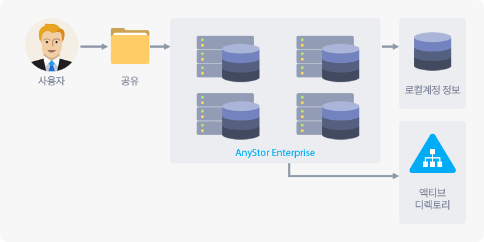

# 3 인증 및 계정

## 3.1 인증 및 계정 소개

> AnyStor-E는 클러스터 보안을 위해 로컬 및 Active Directy(이하 AD) 인증 시스템을 제공합니다.
>
> UNIX/Linux의 POSIX 접근 제어와 확장 ACL을 제공하며, AD 인증 사용 시 Windows 형식의 접근 제어가 가능합니다.
>
> 로컬 인증을 통해 모든 클러스터 노드에서 동일한 사용자/그룹 접근 제어 기능을 사용할 수 있습니다.

| **AnyStor-E의 인증 개요** |
| :------: |
|  |

* **보안 접근 계층**
  * 관리자 : AnyStor-E 클러스터 매니저에 접근하여 클러스터를 관리할 수 있습니다.
  * 사용자 : Windows 사용자가 주로 접근할 수 있으며, SMB 프로토콜 서비스 사용을 할수 있습니다.
  * 보안존 : 볼륨에 접근 가능한 IP 대역으로 NFS/SMB 접근 시 사용되며, 자세한 내용은 [1.5.4 네트워크 영역 설정](#cluster.xhtml#1.5.4 네트워크 영역 설정)을 참고하세요.

* **기능 구성 개요**

    | 구분                        | 설명                                                              |
    | :------------:              | :----------------                                                 |
    | **사용자**                  | 사용자 계정 조회와 생성, 수정, 삭제 및 그룹 추가 기능          |
    | **그룹**                    | 사용자 그룹 조회와 생성, 수정, 삭제 기능                       |
    | **외부 인증**               | 디렉토리 서비스(LDAP/AD) 설정 기능                       |
    | **관리자**                  | 클러스터 관리자 정보 등록 및 비밀번호 변경                      |

---

+ **데이터 접근 제어**

    사용자 및 그룹 ACL을 지원하며, 최대 엔트리수는 64개입니다.
    `ls, chmod, chown`과 같은 표준 UNIX 파일 권한 도구와 호환됩니다.
    POSIX와 Windows 형식의 접근 권한 제어는 동일 볼륨에서 사용할 수 없으며, 이기종 클라이언트 사이에서 동일한 파일을 잠금 처리하는 기능은 지원하지 않습니다.
