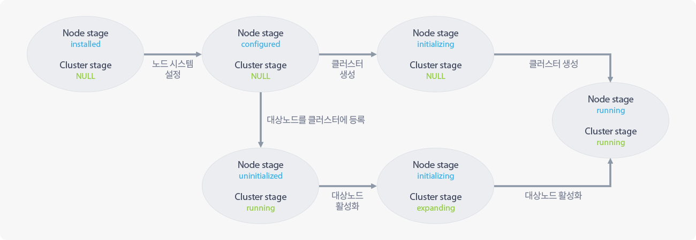

## 1.3 클러스터 노드 관리

### 1.3.1 클러스터 노드 관리 개요

클러스터 노드 관리 기능은 클러스터 노드를 관리하는데 필요한 정보를 취합하여 보여주고 스테이지를 변경하는 기능입니다.

스테이지는 클러스터/노드의 상태를 대표하는 값으로 클러스터 관리 소프트웨어나 사용자가 필요에 의해 지정합니다.

클러스터/노드 스테이지를 support로 변경하면 클러스터는 읽기 전용으로 변경됩니다. (생성, 수정, 삭제 등의 작업 불가능)

### 1.3.2 클러스터 노드 관리 페이지 구성 요소

#### 1.3.2.1 클러스터 관리

* 클러스터 노드 관리 페이지 상단에 위치합니다.
* 클러스터 관리 정보를 출력합니다.
* 클러스터 관리 정보는 클러스터의 이름, 스테이지, 상태 메시지, 클러스터의 전체 볼륨의 크기, 클러스터 볼륨으로 사용하는 용량, 스테이지에 따른 동작을 포함합니다.

#### 1.3.2.2 노드 관리

* 클러스터 노드 관리 페이지 하단에 위치합니다.
* 각 노드의 관리 정보를 모아서 한 줄에 출력합니다.
* 노드 관리 정보는 노드의 고유 식별자, 스테이지, 상태, 관리 소프트웨어 버전, 관리/서비스 IP 할당 현황, 스테이지에 따라 가능한 동작을 포함합니다.

### 1.3.3 클러스터 관리

#### 1.3.3.1 클러스터 관리 구성 요소

클러스터 관리에는 클러스터 관리 정보를 모아 한 줄로 출력합니다.

클러스터 관리 정보는 클러스터 식별자, 스테이지, 상태 메시지, 전체 크기, 사용량, 동작 항목이 있습니다.

| 구분            | 내용 |
| :---:           | :---  |
| **식별자**      | 클러스터 관리 소프트웨어가 관리하는 대상 클러스터의 식별자를 의미합니다.|
| **스테이지**    | 클러스터 관리 소프트웨어나 사용자가 필요에 의해 지정하는 값입니다. (더 자세한 내용은 "[1.3.5.1 클러스터 스테이지](#cluster.xhtml#1.3.5.1 클러스터 스테이지)" 항목에서 찾을 수 있습니다.)|
| **상태 메시지** | 클러스터의 상태를 나타냅니다.|
| **전체 크기**   | 클러스터가 쓸 수 있는 전체 볼륨 총량을 의미합니다.|
| **사용량**      | 클러스터가 클러스터 볼륨으로 쓰고 있는 볼륨의 양을 나타냅니다.|
| **동작**        | 클릭하면 수행 가능한 클러스터 관리 명령을 나열하여 보여줍니다.  수행 가능한 명령은 클러스터 스테이지에 따라 다르며 자세한 내용은 "[1.3.5.1 클러스터 스테이지](#cluster.xhtml#1.3.5.1 클러스터 스테이지)" 항목에서 확인할 수 있습니다.|

### 1.3.4 노드 관리

#### 1.3.4.1 노드 관리 구성 요소

노드 관리에는 노드 관리 정보를 모아 각 노드당 한 줄로 출력합니다.

노드 관리 정보는 식별자, 스테이지, 상태, 버전, 관리/서비스 IP 할당 현황, 동작 항목이 있습니다.

| 구분          | 내용 |
| :---:         |:-----                         |
| **식별자**        |대상 노드의 이름을 의미하며 "{클러스터 명}-{숫자}"의 형태로 나타납니다. |
| **스테이지**  |클러스터 관리 소프트웨어나 사용자가 필요에 의해 노드마다 지정하는 값입니다. (더 자세한 내용은 "[1.3.5.2 노드 스테이지](#cluster.xhtml#1.3.5.2 노드 스테이지)" 항목에서 찾을 수 있습니다.) |
| **상태**      |대상 노드의 상태를 나타냅니다. |
| **버전**      |대상 노드의 클러스터 관리 소프트웨어의 버전을 나타냅니다. |
| **관리 IP**   |관리 IP는 각 노드에 고정 할당됩니다. |
| **서비스 IP** |노드에 할당된 서비스 IP입니다.  서비스 IP는 클러스터 관리 > 네트워크 설정 페이지의 서비스 네트워크 설정 탭에 나열된 서비스 네트워크 풀에 속한 IP들을 나누어 할당한 것으로 노드 상황에 따라 유동적으로 할당됩니다.  따라서 서비스 IP로 클라이언트를 연결하면 서비스 중인 노드가 서비스 불가 상태가 되었을 때 클라이언트가 클러스터 내의 다른 노드로 자동으로 연결됩니다.  서비스 IP는 클러스터 노드 상태에 따라 한 노드에 하나 이상 존재할 수 있고, 아무 IP도 없을 수 있습니다. |
| **동작**      |클릭하면 수행 가능한 노드 관리 명령을 나열하여 보여줍니다.  수행 가능한 명령은 노드 스테이지에 따라 다르며 자세한 내용은 "[1.3.5.2 노드 스테이지](#cluster.xhtml#1.3.5.2 노드 스테이지)" 항목에서 확인할 수 있습니다. |

### 1.3.5 스테이지

#### 1.3.5.1 클러스터 스테이지

<table>
<caption>클러스터 스테이지 표</caption>
<thead>
    <tr>
        <th style="text-align: center;">스테이지</th>
        <th style="text-align: center;">상태 조건</th>
        <th style="text-align: center;">클러스터 상태</th>
        <th style="text-align: center;">기능 제한</th>
        <th style="text-align: center;">가능한 동작</th>
    </tr>
</thead>
<tbody>
    <tr>
        <th>running</th>
        <td>모든 노드의 스테이지가 running</td>
        <td>OK</td>
        <td>없음</td>
        <td>support</td>
    </tr>
    <tr>
        <th>support</th>
        <td>한 노드 이상의 스테이지가 support일 때</td>
        <td>WARN</td>
        <td>Get API만 가능</td>
        <td>running</td>
    </tr>
    <tr>
        <th>upgrading</th>
        <td>한 노드 이상의 스테이지가 upgrading일 때</td>
        <td>WARN</td>
        <td>upgrading 웹 표기</td>
        <td>없음</td>
    </tr>
    <tr>
        <th>booting</th>
        <td>한 노드 이상의 스테이지가 booting일 때</td>
        <td>ERR</td>
        <td>booting 웹 표기</td>
        <td>없음</td>
    </tr>
    <tr>
        <th>initializing</th>
        <td>클러스터가 생성 중일 때</td>
        <td>WARN</td>
        <td>클러스터 생성 과정 표시</td>
        <td>없음</td>
    </tr>
    <tr>
        <th>expanding</th>
        <td>클러스터 확장 중일 때</td>
        <td>WARN</td>
        <td>클러스터 확장 과정 표시</td>
        <td>없음</td>
    </tr>
</tbody>
</table>

* **[Get API]**: 정보를 읽어오는 종류의 요청을 의미합니다.
* **[클러스터 생성 과정 표시]**: 클러스터 생성 프로세스를 표시하는 페이지를 표시합니다.
* **[support 동작]**: 클러스터와 모든 노드의 스테이지 값을 기술 지원(support) 스테이지로 변경합니다.
* **[running 동작]**: 클러스터와 모든 노드의 스테이지 값을 가동중(running) 스테이지로 변경합니다.

#### 1.3.5.2 노드 스테이지

<table>
<caption>노드 스테이지 표</caption>
<thead>
    <tr>
        <th style="text-align: center;">스테이지</th>
        <th style="text-align: center;">상태 조건</th>
        <th style="text-align: center;">노드 상태</th>
        <th style="text-align: center;">기능 제한</th>
        <th style="text-align: center;">가능한 동작</th>
    </tr>
</thead>
<tbody>
    <tr>
        <th>running</th>
        <td>클러스터 관리에 필요한 모든 서비스가 정상</td>
        <td>OK</td>
        <td>없음</td>
        <td>support</td>
    </tr>
    <tr>
        <th>support</th>
        <td>관리자가 대상 노드를 기술 지원 모드로 변경한 경우</td>
        <td>WARN</td>
        <td>support 웹 표기</td>
        <td>running</td>
    </tr>
    <tr>
        <th>upgrading</th>
        <td>대상 노드가 업그레이드 중인 경우</td>
        <td>WARN</td>
        <td>upgrading 웹 표기</td>
        <td>없음</td>
    </tr>
    <tr>
        <th>booting</th>
        <td>클러스터 관리 소프트웨어가 동작을 준비 중인 경우</td>
        <td>ERR</td>
        <td>booting 웹 표기</td>
        <td>없음</td>
    </tr>
    <tr>
        <th>installed</th>
        <td>노드에 클러스터 관리 소프트웨어를 설치한 직후</td>
        <td>미정</td>
        <td>노드 기본 시스템 설정 웹 표기</td>
        <td>없음</td>
    </tr>
    <tr>
        <th>configured</th>
        <td>노드의 기본 시스템 설정이 완료된 후</td>
        <td>미정</td>
        <td>초기화/확장 웹 표기</td>
        <td>없음</td>
    </tr>
    <tr>
        <th>uninitialized</th>
        <td>노드가 클러스터에 등록만 되어 있고 정상 동작 준비가 되지 않은 경우</td>
        <td>미정</td>
        <td>uninitialized 웹 표기</td>
        <td>activate</td>
    </tr>
    <tr>
        <th>initializing</th>
        <td>노드가 초기화 중인 경우</td>
        <td>WARN</td>
        <td>노드 초기화 과정 표시</td>
        <td>없음</td>
    </tr>
</tbody>
</table>

* **[Get API]**: 정보를 읽어오는 종류의 요청을 의미합니다.
* **[노드 초기화 과정 표시]**: 노드 초기화 프로세스를 표시하는 페이지를 표시합니다.
* **[support 동작]**: 노드와 모든 노드의 스테이지 값을 기술 지원(`support`) 스테이지로 변경합니다.
* **[running 동작]**: 노드와 모든 노드의 스테이지 값을 가동 중(`running`) 스테이지로 변경합니다.
* **[activate 동작]**: 클러스터에 동작만 되어있지만 정상 동작을 위한 준비가 되지 않은 노드를 활성화 합니다.

### 1.3.5.3 클러스터 초기화에 따른 스테이지 변화

| 클러스터와 노드의 상태 변화도 |
| :--------------------------: |
|  |

#### 1.3.5.3.1 클러스터 관리 소프트웨어 설치 직후

* 클러스터 노드에 클러스터 관리 소프트웨어와 의존성 있는 패키지를 모두 설치한 상태입니다.
* 클러스터 스테이지는 없고, 노드 스테이지는 `installed`가 됩니다.

#### 1.3.5.3.2 클러스터 노드 시스템 설정

* 클러스터 노드를 클러스터 관리 소프트웨어가 사용할 수 있도록 시스템 설정을 맞추는 과정입니다.
* 클러스터 노드 시스템 설정 과정에서는 서비스/스토리지/관리 인터페이스, 클러스터 볼륨을 구성할 디스크, 설정 노드의 관리/스토리지 IP를 결정합니다.
* 노드 시스템 설정이 끝나면 클러스터 스테이지는 없고, 노드 스테이지는 `configured`가 됩니다.
* 이후 과정은 "[1.3.5.3.3 클러스터 생성](#cluster.xhtml#1.3.5.3.3 클러스터 생성)"과 "[1.3.5.3.4 클러스터 확장](#cluster.xhtml#1.3.5.3.4 클러스터 확장)"으로 나뉩니다.

#### 1.3.5.3.3 클러스터 생성

* 대상 노드를 포함하는 새로운 클러스터를 구축하는 과정입니다.
* 클라이언트가 클러스터에 접근할 때 사용할 서비스 IP 풀의 범위를 결정합니다.
* 클러스터 생성 도중의 클러스터 스테이지는 없고, 노드 스테이지는 `initializing`입니다.
* 클러스터 생성 과정이 끝나면 클러스터 스테이지와 노드 스테이지가 모두 `running`이 됩니다.
* 클러스터 생성 과정이 끝나면 대상 노드만을 포함한 한노드 클러스터가 구축됩니다.

#### 1.3.5.3.4 클러스터 확장

* 대상 노드를 기존의 클러스터에 포함하는 과정입니다.
* 클러스터 확장 과정은 "대상 노드를 클러스터에 등록", "대상 노드를 활성화"의 세부 과정으로 나뉩니다.
* **대상 노드를 클러스터에 틍록**
  * 기존의 클러스터에 새로운 노드의 존재를 알리는 작업을 수행합니다.
  * 해당 과정이 완료되면 대상 노드가 `uninitialized` 노드 스테이지를 가진 노드로 클러스터에 인식됩니다.
* **대상 노드를 활성화**
  * 대상 노드를 클러스터에서 사용할 수 있도록 초기화하는 작업을 수행합니다.
  * 해당 과정 도중의 클러스터 스테이지는 `expanding`이고 노드 스테이지는 `initializing`입니다.
  * 해당 과정이 완료되면 대상 노드가 `running` 스테이지를 가진 클러스터에서 사용할 수 있는 노드가 됩니다.
