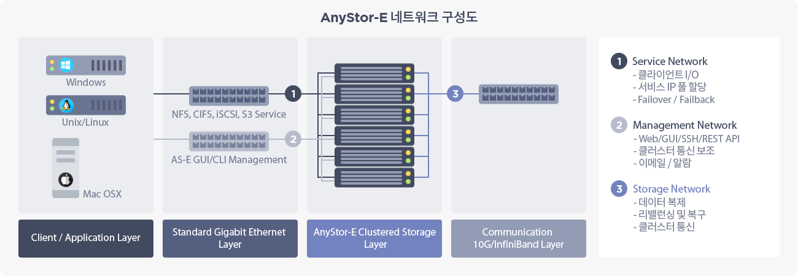

## 1.5 네트워크 설정

클러스터 전반에 적용되는 네트워크 설정을 관리하는 기능입니다.

클러스터에서 사용할 서비스 주소 풀 정보, 클러스터 노드 전체에 적용되는 라우팅 정보와 DNS, 그리고 보안 설정 등에 사용되는 네트워크 영역을 설정하고 조회할 수 있습니다.

| 클러스터 네트워크 구성도 |
| :----------------------: |
|  |

<strong>스토리지 네트워크</strong>

<ul>
    <li>클러스터 노드간 통신망으로 데이터 복제 및 클러스터 모니터링을 위한 연결망입니다.</li>
    <li>이중화를 통해 가용성을 높이고 고성능을 위해 10G 또는 인피니밴드(Infiniband) 연결 사용을 권장합니다.</li>
</ul>

<strong>서비스 네트워크</strong>

<ul>
    <li>클라이언트 서비스에 사용되며 여기서 설정된 서비스 IP 네트워크 주소가 각 노드에게 할당됩니다.</li>
    <li>노드 장애 시 정상 노드로 IP 이관을 통해 장애 극복(Fail-over)이 이루어지며, 장애 유형에 따라 5초에서 30초 정도가 걸립니다.</li>
</ul>

<strong>관리 네트워크</strong>

<ul>
    <li>서비스 네트워크와 함께 사용이 가능하며 클러스터 설정 및 모니터링을 위한 용도로 사용합니다.</li>
    <li>관리 네트워크의 주소는 클러스터 노드 각각에 고정 할당합니다.</li>
</ul>

* **네트워크 설정 기능 구성 요소**

    | 메뉴명        | 위치      |  내용        |
    | :---          | ---       | ---          |
    | 서비스 IP 설정 | 1번 탭    | 서비스 주소 풀을 설정, 적어도 하나 이상 설정 필요 |
    | 라우팅 설정   | 2번 탭    | 라우팅 정보를 설정 |
    | DNS 설정      | 3번 탭    | DNS 서버 설정 및 클러스터 명 확인 |
    | 보안 설정     | 4번 탭    | 공유 서비스에 대한 IP 기반 접근 제어 설정 "[4.3 공유 설정](#share.xhtml#4.3 공유 설정)"|

### 1.5.1 서비스 네트워크 설정

* 서비스 IP 설정탭 구성 요소
  * 서비스 IP 그룹 목록은 그룹을 구성하는 노드의 식별자와 사용되는 네트워크 장치를 포함합니다.

    | 구분  | 내용 |
    | :---: | :--- |
    | **호스트** | 서비스 IP를 할당할 각 노드의 네트워크 식별자입니다. |
    | **장치** | 서비스 IP를 할당할 각 노드의 네트워크 장치 이름입니다. |

  * 서비스 IP 목록은 시작 IP, 마지막 IP, 넷마스크를 포함합니다.
  * 서비스 IP 목록은 시작 IP와 마지막 IP 사이의 모든 IP를 포함합니다.

    |  구분  |  내용  |
    |  :---:  |  :---  |
    | **시작 IP**   | 서비스 IP 풀 범위의 가장 앞서는 IP를 의미합니다. |
    | **마지막 IP** | 서비스 IP 풀 범위의 가장 끝에 있는 IP를 의미합니다. |
    | **넷마스크** | 서비스 IP 풀에 속한 주소 전체에 사용할 넷마스크를 의미합니다. |

#### 1.5.1.1 서비스 IP 풀 생성

<strong>설정 시 참고사항</strong>

<ul>
    <li>하나의 IP 풀은 일련의 연속된 IP 범위이며, 각 노드에 자동 할당됩니다.</li>
    <li>IP 풀이 노드 수보다 많은 경우, 일부 노드들에서 하나 이상의 IP가 자동 할당됩니다.</li>
    <li>서비스 IP 풀을 할당하지 않으면 클라이언트 서비스가 불가능합니다.</li>
</ul>

* **[인터페이스]**
  * 서비스 IP 풀에 속한 각 IP를 할당할 네트워크 장치를 의미합니다.
  * 클러스터 관리 소프트웨어 정책상 bond1로 고정합니다.
* **[IP 주소 범위]**
  * 서비스 IP 풀의 범위를 <code>xx.xx.xx.xx ~ yy</code> 형태로 입력합니다.
  * 위 형태에서 <code>xx</code>는 <code>yy</code> 보다 작거나 같은 값이어야 하며 <code>xx, yy</code> 모두 0~255 사이의 자연수를 사용합니다.
* **[넷마스크]**
  * 서비스 IP 풀에 속한 주소 전체에 사용할 넷마스크를 입력합니다.

#### 1.5.1.2 서비스 IP 풀 수정

<strong>설정 시 주의사항</strong>

<ul>
    <li>기존 서비스 IP 풀을 변경 시 서비스 중인 클라이언트의 접속이 일시적으로 끊길 수 있습니다.</li>
</ul>

* **[인터페이스]**
  * 서비스 IP 풀에 속한 각 IP를 할당할 네트워크 장치를 의미합니다.
  * 클러스터 관리 소프트웨어 정책 상 bond1로 고정합니다.
* **[IP 주소 범위]**
  * 서비스 IP 풀의 범위를 <code>xx.xx.xx.xx ~ yy</code> 형태로 입력합니다.
  * 위 형태에서 <code>xx</code>는 <code>yy</code>보다 작거나 같은 값이어야 하며 <code>xx, yy</code> 모두 0~255 사이의 자연수를 사용합니다.
* **[넷마스크]**
  * 서비스 IP 풀에 속한 주소 전체에 사용할 넷마스크를 입력합니다.

#### 1.5.1.3 서비스 IP 풀 삭제

**네트워크 설정 페이지** **서비스 IP 설정** 탭의 **삭제** 버튼을 클릭하여 기존 서비스 IP 풀을 삭제할 수 있습니다.

서비스 IP 풀을 여러개 선택한 후 **삭제** 버튼을 클릭하면 여러 서비스 IP 풀을 한꺼번에 삭제할 수 있습니다.

<strong>설정 시 주의사항</strong>

<ul>
    <li>기존 서비스 IP 풀을 삭제 시 서비스 중인 클라이언트의 접속을 모두 해제합니다.</li>
    <li>연결된 클라이언트에서는 마운트 포인트로의 접근이 봉쇄됩니다.</li>
</ul>

### 1.5.2 라우팅 설정

<strong>라우팅 항목의 대상 장치는 모든 노드가 동일</strong>

<ul>
    <li>이 기능으로 생성한 라우팅 항목의 대상 장치는 모든 노드에 동일한 이름으로 존재해야 합니다.</li>
    <li>예를 들어, 라우팅 항목의 대상 네트워크 장치가 eth1이라면 클러스터에 속한 모든 노드에 eth1 장치가 있어야 합니다.</li>
</ul>

<strong>기본 게이트웨이는 한개로 제한</strong>

<ul>
    <li>기본 게이트웨이로 설정된 라우팅 항목은 최대 하나로 제한됩니다.</li>
</ul>

* 라우팅 설정탭 구성 요소
  * 라우팅 정보를 한 줄씩 모아서 출력합니다.
  * 클러스터 노드에 들어오는 패킷의 목적지와 서브넷 마스크를 라우팅 설정탭에서 설정한 목적지와 서브넷 마스크를 비교해서 해당되는 라우팅 항목이 있으면 패킷을 그 라우팅 항목의 장치로 내보내는 방식으로 동작합니다.
  * 라우팅 정보를 참조하여 패킷을 송신할 때 게이트웨이가 설정되어 있으면 게이트웨이에도 같은 패킷을 보냅니다.
  * 노드에 전송된 패킷에 맞는 라우팅 정보가 없으면 기본 게이트웨이로 해당 패킷을 보냅니다.
  * 라우팅 정보는 목적지, 서브넷 마스크, 게이트웨이, 속성, 장치를 포함합니다.

    |  구분  |  내용  |
    |  :---:  |  :---  |
    | **목적지**   | 라우팅 항목을 적용해야 하는 패킷의 목적지 주소를 의미합니다. 라우팅 항목이 기본 게이트웨이라면 "<code>Default GW</code>" 문자열을 출력합니다. |
    | **서브넷 마스크** | 라우팅 항목을 적용해야 하는 패킷을 검사할 때 사용하는 서브넷 마스크를 의미합니다. |
    | **게이트웨이** | 조건에 맞는 패킷을 보낼 네트워크 주소를 의미합니다. |
    | **속성** | <dl><li>**U**: 경로가 유효한 상태</li> <li>**G**: 경로가 게이트웨이를 향함</li> <li>**H**: 경로가 호스트를 향함</li> </ul> |
    | **장치** | 조건에 맞는 패킷을 내보낼 네트워크 장치를 의미합니다. |

#### 1.5.2.1 라우팅 항목 생성

**네트워크 설정 페이지** **라우팅 설정** 탭의 **생성** 버튼을 클릭하여 새로운 라우팅 항목을 생성할 수 있습니다.

* **[라우팅 목적지]**
  * 노드로 들어오는 패킷의 목적지와 대조할 네트워크 주소를 의미합니다.
  * <code>xx.xx.xx.xx</code>의 형태로 입력하고 각 서브셋은 0~255 사이의 자연수입니다.
* **[기본 게이트웨이]**
  * 새로 생성하는 라우팅 항목이 기본 게이트웨이인지 아닌지를 입력합니다.
  * 기본 게이트웨이를 선택하면 [라우팅 목적지]와 [서브넷 마스크]는 <code>0.0.0.0</code>으로 고정됩니다.
  * 기본 게이트웨이로 설정된 라우팅 항목은 최대 하나로 제한됩니다.
* **[네트워크 장치]**
  * 대조 조건에 맞는 패킷을 내보낼 네트워크 장치를 선택합니다.
  * 본딩에 속하지 않은 네트워크 장치만 나열합니다.
  * 루프백 장치(<code>lo</code>)는 선택 대상에서 제외됩니다.
* **[서브넷 마스크]**
  * 노드로 들어오는 패킷의 목적지와 [라우팅 목적지]를 대조할때 사용하는 서브넷 마스크를 입력합니다.
  * <code>xx.xx.xx.xx</code>의 형태로 입력하고 각 서브셋은 0~255 사이의 자연수 값입니다.
* **[게이트웨이]**
  * 대조 조건에 맞는 패킷을 전달할 노드의 IP를 입력합니다.
  * 게이트웨이를 설정하지 않으면 [네트워크 장치]에 연결된 모든 노드에 해당 패킷을 보냅니다.
  * [기본 게이트웨이]를 선택한 경우에는 필수로 입력해야 합니다.

#### 1.5.2.2 라우팅 항목 수정

**네트워크 설정 페이지** **라우팅 설정** 탭의 **수정** 버튼을 클릭하여 기존 라우팅 항목을 수정할 수 있습니다.

* **[라우팅 목적지]**
  * 노드로 들어오는 패킷의 목적지와 대조할 네트워크 주소를 의미합니다.
  * <code>xx.xx.xx.xx</code>의 형태로 입력하고 각 서브셋은 0~255 사이의 자연수입니다.
* **[기본 게이트웨이]**
  * 새로 생성하는 라우팅 항목이 기본 게이트웨이인지 아닌지를 입력합니다.
  * 기본 게이트웨이를 선택하면 [라우팅 목적지]와 [서브넷 마스크]는 <code>0.0.0.0</code>으로 고정됩니다.
  * 기본 게이트웨이로 설정된 라우팅 항목은 최대 하나로 제한됩니다.
* **[네트워크 장치]**
  * 대조 조건에 맞는 패킷을 내보낼 네트워크 장치를 선택합니다.
  * 본딩에 속하지 않은 네트워크 장치만 나열합니다.
  * 루프백 장치(<code>lo</code>)는 선택 대상에서 제외됩니다.
* **[서브넷 마스크]**
  * 노드로 들어오는 패킷의 목적지와 [라우팅 목적지]를 대조할때 사용하는 서브넷 마스크를 입력합니다.
  * <code>xx.xx.xx.xx</code>의 형태로 입력하고 각 서브셋은 0~255 사이의 자연수입니다.
* **[게이트웨이]**
  * 대조 조건에 맞는 패킷을 전달할 노드의 IP를 입력합니다.
  * 게이트웨이를 설정하지 않으면 [네트워크 장치]에 연결된 모든 노드에 해당 패킷을 보냅니다.
  * [기본 게이트웨이]를 선택한 경우에는 필수로 입력해야 합니다.

#### 1.5.2.3 라우팅 항목 삭제

**네트워크 설정 페이지** **라우팅 설정** 탭의 **삭제** 버튼을 클릭하여 기존 라우팅 항목을 삭제할 수 있습니다.

라우팅 항목을 여러개 선택 한 후 **삭제** 버튼을 클릭하면 여러 라우팅 항목을 한꺼번에 삭제할 수 있습니다.

### 1.5.3 DNS 설정

DNS 설정 탭은 DNS 정보 하나로 이루어지며, 클러스터 이름, 기본 DNS 주소, 보조 DNS 주소가 표시됩니다.

<strong>설정 시 주의사항</strong>

<ul>
    <li>DNS 설정 탭에 클러스터의 이름은 표기되지만 변경은 불가합니다.</li>
    <li> DNS를 설정하지 않으면 알림 전자우편이 전송되지 않을 수 있습니다.</li>
</ul>

* **[네트워크 설정 페이지]**
  * <b>DNS 설정</b> 탭에 정보를 입력하고 <b>설정 적용</b> 버튼을 클릭하여 DNS를 설정할 수 있습니다.

    |  구분             |  내용  |
    | :---:             | :---   |
    | **클러스터 이름** | 클러스터 관리 소프트웨어가 관리하는 클러스터의 이름을 의미합니다. |
    | **기본 DNS 주소** | DNS의 주소를 의미합니다. |
    | **보조 DNS 주소** | 기본 DNS 주소 외에 추가로 등록된 DNS 주소를 의미합니다. |

  * **[기본 DNS 주소]**
      * DNS의 주소를 입력합니다.
      * <code>xx.xx.xx.xx</code> 형태의 네트워크 주소값이 들어갑니다.
      * 아무 값도 입력하지 않으면 DNS가 제거됩니다.
  * **[보조 DNS 주소]**
      * [기본 DNS 주소] 외에 추가로 등록할 DNS 주소를 의미합니다.
      * [기본 DNS 주소]가 접근이 불가할 때 [보조 DNS 주소]를 DNS로 사용합니다.
      * <code>xx.xx.xx.xx</code> 형태의 네트워크 주소값이 들어갑니다.
      * 아무 값도 입력하지 않으면 보조 DNS가 제거됩니다.

### 1.5.4 네트워크 영역 설정

**네트워크 영역**은 IP 주소나 도메인 이름을 정의하여 특정 네트워크에 대한 파일링 프로토콜/웹 관리자/SSH 등의 AnyStor-E로의 접근을 제어하기 위해 사용됩니다.

<strong>설정 시 주의사항</strong>

<ul>
    <li><strong>보안 강화</strong>를 위해 설정하는 것을 권장합니다.</li>
    <li>IP 주소 혹은 도메인 이름을 기반으로 공유별 접근 호스트를 제어할 수 있습니다.</li>
    <li>파일링 프로토콜/웹 관리자/SSH 등의 AnyStor-E로의 접근 제어에 적용이 가능합니다.</li>
</ul>

* **네트워크 영역 목록**
  * 네트워크 영역 탭의 상단에 위치하며, 한 줄씩 모아서 네트워크 영역 목록에 출력합니다.
  * 네트워크 영역은 보안 정책을 적용할 대상이 되는 서비스 접근 통로를 의미합니다.
  * 각 네트워크 영역에 대한 접근 제어는 "[4.3 공유 설정](#share.xhtml#4.3 공유 설정)"에서 설정합니다.
  * 네트워크 영역 정보는 이름, 설명, 지정 방식, 주소/도메인을 포함합니다.

    |  구분  |  내용  |
    |  :---:  |  :---  |
    | **이름** | 영역 정보를 식별하는 문자열로 사용자가 임의로 지정합니다. |
    | **설명** | 영역에 대한 설명으로 사용자가 임의로 지정할 수 있습니다. |
    | **방식** | 영역의 종류를 나타냅니다. 영역 종류에는 "IP 주소", "IP 주소 범위", "사이더(CIDR)", "도메인"이 있습니다. |
    | **주소** | 영역의 주소/도메인을 나타냅니다. 영역 방식에 따라 형태를 다르게 표시합니다. |

* **공유 정보 목록**
  * 네트워크 영역 탭의 하단에 위치하며, 공유 서비스에서 사용하는 영역에 대한 정보를 출력합니다.
  * 공유 정보는 영역 이름, 영역 주소, 사용 정보, 구분, 권한으로 구성됩니다.

    | 구분 | 내용 |
    | :---: | :--- |
    | **영역 이름** | 공유 서비스에서 사용하는 영역의 이름을 나타냅니다. |
    | **영역 주소** | 공유 서비스에서 사용하는 영역의 범위를 나타냅니다. |
    | **사용 정보** | 해당 영역을 어떤 공유 항목에서 사용하는지를 나타냅니다. |
    | **구분** | 영역을 사용하는 주체입니다. 'share' 값만을 가집니다. |
    | **권한** | 해당 영역에 부여된 공유 서비스에 대한 접근 권한을 나타냅니다. |

#### 1.5.4.1 네트워크 영역 생성

**네트워크 설정 페이지** **네트워크 영역** 탭을 클릭하면 나타나는 네트워크 영역 목록의 **생성** 버튼을 클릭하여 새로운 네트워크 영역을 생성할 수 있습니다.

* **[영역 이름]**
  * 새로 추가할 영역의 이름을 지정합니다.
* **[영역 설명]**
  * 새로 추가할 영역에 대한 설명을 입력합니다.
  * 사용자가 임의로 지정하는 문자열입니다.
* **[IP 주소]**
  * [IP 주소]를 선택하면 IP 주소 한 개만을 영역으로 정의합니다.
  * <code>xx.xx.xx.xx</code>의 형태로 입력하고 각 서브셋은 0~255 사이의 자연수입니다.
* **[IP 주소 범위]**
  * [IP 주소 범위]를 선택하면 연속된 여러 개의 IP 주소를 네트워크 영역으로 정의합니다.
  * 서비스 IP 풀의 범위를 <code>xx.xx.xx.xx ~ yy</code> 형태로 입력합니다.
  * 위 형태에서 맨 뒤 옥텟의 <code>xx</code>는 <code>yy</code>보다 작거나 같은 값이어야 하며 <code>xx, yy</code> 모두 0~255 사이의 자연수를 사용합니다.
* **[서브넷 마스크]**
  * [서브넷 마스크]를 선택하면 넷마스크와 IP 주소를 조합하여 나오는 모든 IP 대역을 네트워크 영역으로 정의합니다.
  * <code>xx.xx.xx.xx/yy.yy.yy.yy</code>의 형태로 입력하고 각 서브셋은 0~255 사이의 자연수입니다.
  * <code>0.0.0.0/0.0.0.0</code> 값을 입력하면 모든 IP가 네트워크 영역으로 포함됩니다.
* **[도메인]**
  * [도메인]을 선택하면 도메인 이름을 네트워크 영역으로 정의합니다.
  * 도메인 이름을 나타내는 문자열을 입력합니다.

#### 1.5.4.2 네트워크 영역 삭제

**네트워크 설정 페이지** **네트워크 영역** 탭의 **삭제** 버튼을 클릭하여 네트워크 영역을 삭제할 수 있습니다.

네트워크 영역들을 선택한 후, **삭제** 버튼을 클릭함으로써 다수의 네트워크 영역을 한꺼번에 삭제할 수 있습니다.
