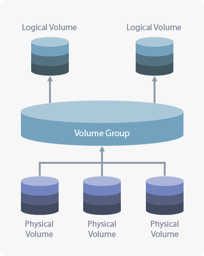
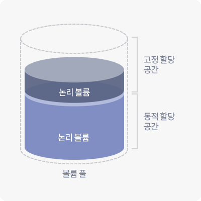
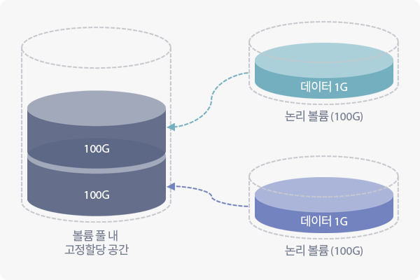
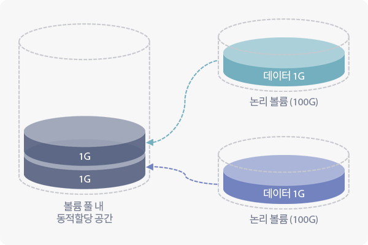

## 2.1 볼륨 풀 관리 소개

볼륨 풀 관리 기능은 클러스터 내 각 노드 별 LVM 기반의 물리 볼륨/볼륨 그룹/논리 볼륨을 통합 관리하는 기능입니다.

볼륨 풀은 노드 별로 선택된 디스크들로 이루어진 볼륨 그룹이며, 동적 할당 공간도 설정할 수 있습니다.

동적 할당 공간은 동적 할당 클러스터 볼륨의 가용량을 충당하기 위해 사용됩니다.

### 2.1.1 LVM 개요

<table>
<caption><strong>볼륨 매니저의 기본 요소</strong></caption>
<thead>
    <tr>
        <th>구분</th>
        <th>설명</th>
    </tr>
</thead>
<tbody>
    <tr>
        <th>물리 볼륨 (Physical Volume, PV)</th>
        <td>HDD, SSD와 같은 물리 블록 디이스는 LVM에 사용되기 위해 물리 볼륨으로 등록되어야 합니다. 물리 볼륨으로 등록된 디스크 장치들은 하나의 볼륨 그룹으로 통합되어 보다 큰 블록 디바이스를 구성할 수 있습니다.</td>
    </tr>
    <tr>
        <th>볼륨 그룹 (Volume Group, VG)</th>
        <td>볼륨 그룹의 공간을 사용하기 위해서 볼륨 그룹의 일정 공간을 할당 받은 논리 볼륨을 생성해야 합니다. 볼륨 그룹은 하나 이상의 논리 볼륨으로 나뉘어질 수 있습니다.</td>
    </tr>
    <tr>
        <th>논리 볼륨 (Logical Volume, LV)</th>
        <td>실제 사용자가 데이터를 읽고 쓰기 위해 사용되며 클러스터 볼륨을 생성하기 위한 기저 자원으로 사용됩니다. 논리 볼륨에 쓰여진 데이터는 볼륨 그룹을 통해 맵핑된 물리 볼륨에 쓰여지게 됩니다. 논리 볼륨 종류는 일반 논리 볼륨과 씬 논리 볼륨(Thin-provisioned Logical Volume)들이 있습니다.</td>
    </tr>
</tbody>
</table>

<table>
<caption><strong>논리 볼륨 종류</strong></caption>
<thead>
    <tr>
        <th>구분</th>
        <th>설명</th>
    </tr>
</thead>
<tbody>
    <tr>
        <th>논리 볼륨 (Logical Volume, LV)</th>
        <td>일반적인 사용되는 논리 볼륨이며 논리 볼륨 내 쓰여진 데이터 크기와 상관없이 볼륨 그룹의 일정 공간을 고정적으로 차지합니다.</td>
    </tr>
    <tr>
        <th>씬 풀 논리 볼륨 (Thin-Pool LV)</th>
        <td>논리 볼륨과 같이 볼륨 그룹의 일정 공간을 고정적으로 차지합니다. 씬 논리 볼륨(Thin-provisioned LV, Thin LV)을 생성하기 위해 미리 생성되어야 되며 씬 논리 볼륨에 쓰여진 데이터만큼 저장 공간을 제공해 줍니다.</td>
    </tr>
    <tr>
        <th>씬 논리 볼륨 (Thin-LV)</th>
        <td>씬 프로비저닝을 위한 논리 볼륨이며, 생성 시 크기에 대한 제약이 없습니다. 논리 볼륨이 볼륨 그룹으로부터 공간을 할당 받는 것과 마찬가지로 씬 볼륨 풀(Thin-provisioned Volume Pool, Thin Volume Pool)로부터 저장 공간을 할당 받습니다. 씬 논리 볼륨 제거 또는 가용 데이터 크기가 줄어든 경우, 씬 볼륨 풀로부터 할당받은 공간을 반환합니다.</td>
    </tr>
</tbody>
</table>

### 2.1.2 정적/동적 할당

볼륨 풀은 정적/동적 할당 공간으로 두가지로 구분됩니다.

* 정적(고정) 할당 공간: 정적(고정) 볼륨 및 동적 할당 공간 생성이 가능합니다.
* 동적 할당 공간: 씬 프로비저닝 및 스냅샷 볼륨을 위한 **동적 볼륨** 생성이 가능 합니다.

**정적 할당 공간**

AnyStor-E는 각 노드의 로컬 볼륨 그룹 공간을 모두 통합 관리하여 정적 할당 공간(풀)을 생성합니다.

내부에 쓰여진 데이터의 크기와 상관없이 논리 볼륨의 크기만큼 정적 할당 공간을 차지합니다.

<strong>정적 할당은 언제 사용할까요?</strong>

<ul>
    <li>스냅샷을 사용이 불필요하며 파일 트랜잭션의 속도가 보장되어야 하는 서비스에 적합합니다.</li>
    <li>파일 크기가 작은 경우 삭제가 빈번하게 발생하는 서비스에 좋은 선택입니다.</li>
</ul>

**동적 할당 공간**

동적 할당 공간에 생성된 논리 볼륨은 내부에 쓰여진 데이터의 크기만큼 동적 할당 공간을 차지합니다.

실제 쓰여진 데이터만큼의 공간을 사용하기 때문에 정적 할당보다 효율적으로 사용할 수 있습니다.

<strong>동적 할당은 언제 사용할까요?</strong>

<ul>
    <li>스냅샷 기능을 활용하여 데이터 보호를 강화하는 경우에 권장합니다.</li>
    <li>사용자 및 볼륨 수가 많아서 씬 프로비저닝 기능을 사용하는 경우에 적합합니다.</li>
</ul>

## 2.2 볼륨 풀 관리

생성된 볼륨 풀의 현황과 상태를 확인할 수 있습니다.

**볼륨 풀 정보**

|  구분          |  설명  |
| -----          | ------ |
| 이름           | 생성된 볼륨 풀의 이름입니다. |
| 유형           | 볼륨 풀의 유형 입니다. (Gluster, Local, External) |
| 노드           | 볼륨 풀을 구성하고 있는 노드들의 목록입니다. |
| 상태           | 볼륨 풀의 상태 값으로는 **OK**, **WARN**이 있습니다. <ul><li>**OK** - 정상 상태입니다.</li><li>**WARN** - 한 노드 이상의 볼륨 그룹 사용률이 95%를 초과한 상태입니다.</li></ul> |
| 크기           | 볼륨 풀을 구성하고 있는 노드별 볼륨 그룹 크기의 총합입니다. |
| 동적 할당 크기 | 씬 프로비저닝 볼륨 생성을 위해 설정된 동적 할당 볼륨 풀의 크기입니다. |
| 사용률         | 볼륨 풀을 구성하고 있는 노드별 볼륨 그룹 사용률의 총합입니다. |
| 볼륨 개수      | 볼륨 풀을 사용하고 있는 클러스터 볼륨의 수입니다. |
| 동작           | 볼륨 풀에 대한 추가적인 작업을 처리합니다. <ul><li>**씬 프로비저닝** - 볼륨 풀의 동적 할당 볼륨 풀 설정/제거할 수 있습니다.</li><li>**수정** - 노드별 디스크 장치를 선택하여 볼륨 풀 확장/축소할 수 있습니다.</li></ul> |

### 2.2.1 볼륨 풀 생성

볼륨 풀 목록의 **생성** 버튼을 클릭하여 볼륨 풀을 생성할 수 있습니다.

#### 2.2.1.1 볼륨 풀 유형 선택

AnyStor-E에서 지원하는 볼륨 풀 유형은 Gluster, Local 또는 External이 있습니다.

<strong>Gluster</strong>

<ul>
    <li>AnyStor-E의 기본 볼륨 풀로서 분산/복제/네트워크 RAID 등의 스케일-아웃 확장에 최적화된 볼륨 풀입니다.</li>
</ul>

<strong>Local</strong>

<ul>
    <li>단일 노드를 기반으로 하는 전통적인 네트워크 스토리지를 위한 볼륨 풀입니다.</li>
    <li>물리적으로 단일 노드 상에서 서비스가 제공되기 때문에 스케일-아웃 확장을 지원하지 않습니다.</li>
</ul>

<strong>External</strong>

<ul>
    <li>다른 스토리지 혹은 파일시스템을 중개하여 서비스를 제공하는 일종의 프록시 스토리지를 위한 볼륨 풀입니다.</li>
    <li>현재까지 지원되는 백엔드는 NFS와 SNFS가 있습니다.</li>
</ul>

#### 2.2.1.2 볼륨 풀 기본 정보 입력

##### Gluster/Local

Gluster/Local 볼륨 풀을 만들기 위한 정보를 입력합니다.

| 구분  |  설명  |
| ----- | ------ |
| 이름  | 볼륨 풀의 이름을 설정합니다. |
| 크기  | 만들어질 볼륨 풀의 크기를 나타내며, 선택한 노드/디스크에 따라 자동으로 계산됩니다. |
| 노드별 장치 목록 | 각 노드에 연결되어 있는 블록 장치를 나타냅니다. |

**노드별 장치 목록**

|  구분  |  설명  |
| ------ | ------ |
| 일련번호 | 디스크 장치의 일련번호입니다. |
| 노드 식별자 | 노드의 식별자입니다. |
| 물리 디스크 | 디스크 장치의 식별자입니다. |
| 미디어 종류 | 디스크 장치의 종류입니다. |
| 인터페이스 | 디스크 장치가 사용하는 인터페이스입니다. |
| 장치 크기 | 디스크 장치의 전체 크기입니다. |
| 사용 상태 | 디스크 장치가 이미 사용 중인지를 나타냅니다. |

##### External

External 볼륨 풀을 만들기 위한 정보를 입력합니다.

| 구분      |  설명  |
| -----     | ------ |
| 이름      | 외부 볼륨 풀의 이름을 설정합니다. |
| 유형      | 외부 볼륨 풀을 사용할 프로토콜 유형을 설정합니다. (NFS, SNFS) |
| IP        | 외부 장비의 IP를 설정합니다. |
| 노드 목록 | 외부 장비의 볼륨을 마운트할 노드를 선택합니다. |

### 2.2.2 동적 할당 풀 생성

볼륨 풀 목록의 오른쪽에 있는 **동작**의 **씬 프로비저닝** 버튼을 클릭하여 동적 할당 풀을 생성할 수 있습니다.

<strong>동적 할당 풀 주의사항</strong>

<ul>
    <li>동적 할당은 <strong>Gluster/Local</strong> 볼륨 풀에 대해서만 지원됩니다.</strong>
    <li>동적 할당 풀은 정적 할당 풀 위에 만들어지므로, 동적 할당 풀을 만들기에 앞서 정적 할당 풀이 미리 생성되어 있어야 합니다.</li>
</ul>

<strong>동적 할당 풀 용량 고갈 시 주의사항</strong>

<ul>
    <li>동적 할당 풀은 기반 풀의 용량이 남는 만큼 확장이 가능하며, 한번 설정한 풀의 크기는 축소할 수 없습니다.</li>
    <li>동적 할당 풀이 여유 공간이 없는 경우, <strong>성능이 급격히 하락</strong>될 수 있으며, 파일 시스템 <strong>메타데이터 할당에 실패</strong>할 수 있습니다.</li>
    <li>이러한 이유로 AnyStor-E 는 동적 할당 풀이 95% 이상이 되면 쓰기작업을 방지하여 <strong>Read-Only</strong> 볼륨으로 전환합니다.</li>
    <li>파일을 삭제 또는 이동하여 볼륨 풀에 여유 공간이 할당시 <strong>Read-Write</strong> 볼륨으로 전환됩니다.</li>
</ul>

| 구분  |  설명  |
| ----- | ------|
| 노드별 최대 동적 할당 가능한 크기 | 선택된 노드 내 동적 할당이 가능한 최솟값이 출력됩니다. |
| 노드별 동적 할당 크기 | 입력된 값만큼 노드별 볼륨 풀에 동적 할당을 설정합니다. |
| 노드 목록 | 동적 할당 설정이 가능한 노드의 현황이 출력됩니다. |

**노드별 장치 목록**

|  구분  |  설명  |
| ------ | ------ |
| 일련번호 | 디스크 장치의 일련번호입니다. |
| 노드 식별자 | 디스크가 장착된 노드의 식별자입니다. |
| 물리 디스크 | 디스크 장치의 식별자입니다. |
| 미디어 종류 | 디스크 장치의 종류를 구분하기 위해 출력됩니다.  <ul><li>**hdd** - HDD 장치입니다.</li><li>**ssd** - SSD 장치입니다.</li></ul> |
| 인터페이스 | 디스크 장치가 사용하는 인터페이스입니다. |
| 장치 크기 | 디스크 장치의 전체 크기입니다. |
| 사용 상태 | 디스크 장치가 이미 사용 중인지를 나타냅니다. |

### 2.2.3 볼륨 풀 설정

생성된 볼륨 풀의 크기를 변경/제거할 수 있습니다.

볼륨 풀 목록에서 **동작**의 **수정** 버튼을 클릭하여 볼륨 풀의 설정 값을 변경할 수 있습니다.

#### 2.2.3.1 Gluster/Local 볼륨 풀 설정

|  구분  |  설명  |
| ------ | ------ |
| 이름   | 설정을 변경하고자 하는 볼륨 풀의 이름입니다. |
| 크기   | 설정 적용 이후 예상되는 볼륨 풀 크기입니다. |
| 노드별 장치 목록 | 노드별 디스크 장치들을 선택하여 볼륨 풀 크기를 변경할 수 있습니다. |

**노드별 장치 목록**

|  구분  |  설명  |
| ------ | ------ |
| 일련번호 | 디스크 장치의 일련번호입니다. |
| 노드 식별자 | 디스크가 장착된 노드의 식별자입니다. |
| 물리 디스크 | 디스크 장치의 식별자입니다. |
| 미디어 종류 | 디스크 장치의 종류를 구분하기 위해 출력됩니다.  <ul><li>**hdd** - HDD 장치입니다.</li><li>**ssd** - SSD 장치입니다.</li></ul> |
| 인터페이스 | 디스크 장치가 사용하는 인터페이스입니다. |
| 장치 크기 | 디스크 장치의 전체 크기입니다. |
| 사용 상태 | 디스크 장치가 이미 사용 중인지를 나타냅니다. |

<strong>논리 볼륨이 생성되어 있는 디스크는 목록에서 제거할 수 없습니다.</strong>

<ul>
    <li>노드별 디스크 장치들을 선택하여 볼륨 풀 크기를 변경할 수 있습니다. 해당 볼륨 풀에 포함되거나, 사용되지 않는 디스크만 출력이 됩니다.</li>
</ul>

##### 2.2.3.2 External 볼륨 풀 설정

**노드 목록**

| 구분             |  설명  |
| -----            | ------ |
| 이름             | 외부 볼륨 풀의 이름은 변경할 수 없습니다. |
| 유형             | 외부 볼륨 풀의 유형은 변경할 수 없습니다. |
| IP               | 외부 장비의 IP를 변경합니다. 단, 동일한 공유 경로를 사용해야 합니다. |
| 노드별 장치 목록 | 외부 장비의 볼륨을 마운트할 노드 목록을 변경할 수 있습니다. |

### 2.2.4 동적 할당 풀 설정

<strong>동적 할당 풀 주의사항</strong>

<ul>
    <li>동적 할당은 <strong>Gluster/Local</strong> 볼륨 풀에 대해서만 지원됩니다.</strong>
</ul>

동적 할당이 설정된 경우, 볼륨 풀 목록의 **동작** > **씬 프로비저닝** 버튼을 클릭하여 동적 할당 설정을 변경할 수 있습니다.

|  구분  |  설명  |
| ------ | ------ |
| 노드별 최대 동적 할당 가능한 크기 | 선택된 노드 내 동적 할당이 가능한 최솟값이 출력됩니다. |
| 노드별 동적 할당 크기 | 입력된 값만큼 노드 별 볼륨 풀에 동적 할당을 설정합니다. 기존에 설정된 값보다 작게 설정할 수 없습니다. |
| 노드 목록 | 동적 할당 설정이 가능한 노드의 현황이 출력됩니다. |

**노드 목록**

|  구분 |  설명  |
| ----- | ------ |
| 이름 | 노드의 호스트 명이 출력됩니다. |
| 장비 상태 | 해당 노드의 상태가 출력됩니다. |
| 서비스 상태 | 해당 노드의 볼륨 풀 서비스 가능 여부가 출력됩니다. |
| 사용률 | 볼륨 풀의 사용률이 출력됩니다. |
| 남은 크기 | 볼륨의 가용량이 출력됩니다. |

### 2.2.3 볼륨 풀 제거

<strong>볼륨이 있거나 동적 할당 설정되어 있는 볼륨 풀은 제거할 수 없습니다.</strong>

#### 2.2.3.1 동적 할당 풀 제거

볼륨 풀 선택 후 **동작** > **씬 프로비저닝** 버튼을 클릭하여 동적 할당 설정을 제거할 수 있습니다.
