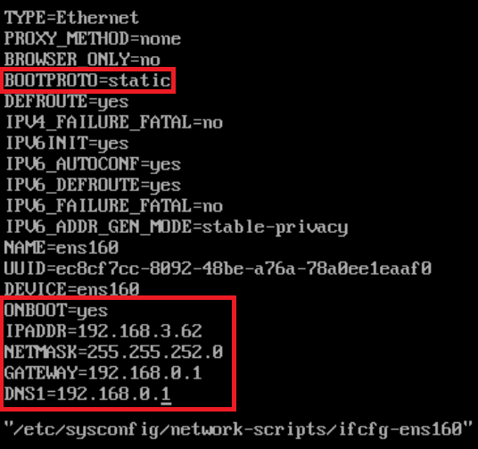
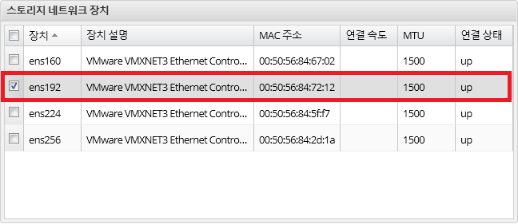
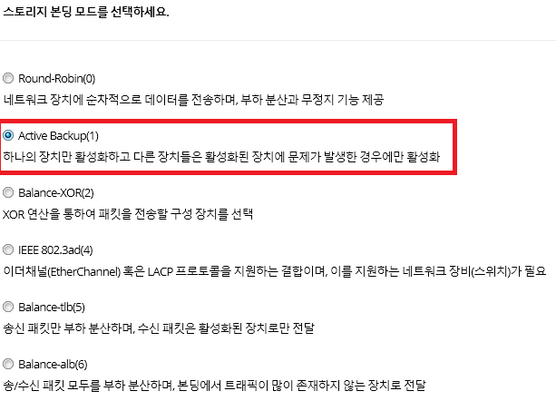
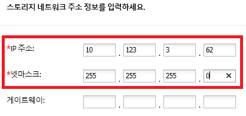
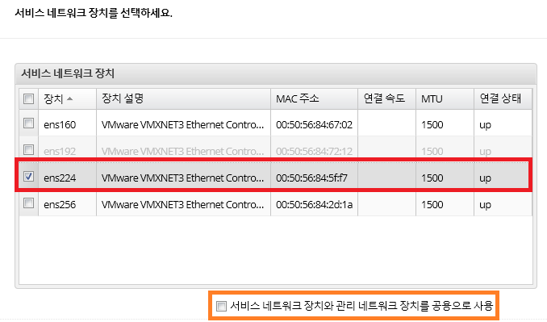
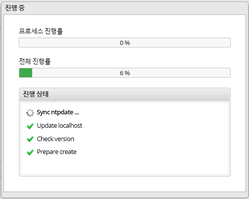

구성 작업
====

### 관리자 계정 설정

##### 사용자 계정 추가

    /usr/gms/script/gms useradd -n <USER> -p <PASSWORD>

##### 사용자 계정을 웹 관리자로 위임

    /usr/gms/script/gms admin -n <USER>

### 노드 구성

**노드 구성은 각각의 노드에 대한 정보를 설정하는 단계입니다.**

1.  부팅 후 IP 설정 **vim
    /etc/sysconfig/network-scripts/ifcfg-<인터페이스명>** (다른 IP 설정 명령을 사용하여도 무방)  
    
2.  노드 기반 시스템 설정 마법사, 다음  
    
3.  스토리지 네트워크 장치 선택 (사이트에 따라서 IB, 혹은 10G 이더넷을 선택)  
    
4.  스토리지 네트워크는 보통 Active Backup 모드를 사용(네트워크 구성에 적합한 모드 선택)  
    
5.  스토리지 네트워크 주소 정보 입력  
    
6.  서비스 네트워크 장치 선택 (스토리지 네트워크와 마찬가지로 사이트에
    따라 해당 인터페이스 선택)\
     관리와 서비스 네트워크를 같이 사용할 경우 하단의 **서비스
    네트워크 장치와 관리 네트워크 장치를 공용으로 사용** 체크  
    
7.  서비스 네트워크는 보통 Round-Robin 모드를 사용 (네트워크 구성에 적합한 모드 선택)  
    
8.  관리 네트워크 장치 선택  
    
9.  설정 정보 확인 후 설정 적용하면 초기화 완료  
    

### 클러스터 초기화

**클러스터 초기화는 그 클러스터를 구성하는 첫 노드에서 수행됩니다.**

-   노드 기반 시스템 구축 완료 후 마법사 페이지에서 **클러스터 생성**을 선택
    -   클러스터명, 서비스 IP 주소 범위(시작부터 마지막 서비스 IP 주소까지), 넷마스크를 입력 후 확인
    -   ssh로 접근하여 **`/var/log/gms/procedure_gms.log`** 파일에서 초기화 과정을 확인할 수 있습니다.

### 클러스터 확장

**클러스터에 포함시키고자 하는 노드의 웹 관리자로 접근하여 수행합니다.**

-   노드 기반 시스템 구축 완료 후 **노드 등록**을 선택
    -   클러스터 노드의 관리
        IP (초기화된 노드 혹은 클러스터에 이미 속한 노드의 관리 IP)를 입력 후 확인
    -   **노드를 등록 후 바로 확장하시겠습니까?** 팝업창 출력 시
        **확장하기** 버튼을 클릭하여 확장
    -   ssh로 접근하여 **`/var/log/gms/procedure_gms.log`** 파일에서 초기화 과정을 확인할 수 있습니다.

### 클러스터 구성 중

**주의 사항**   

-   클러스터 추가를 동시에 할 경우 문제가 발생합니다.  
-   초기화, 클러스터 생성, 클러스터 추가 단계에서 확인을 여러 번 누를 경우 API가 여러 번 호출되어 문제가 발생할 수 있습니다.

