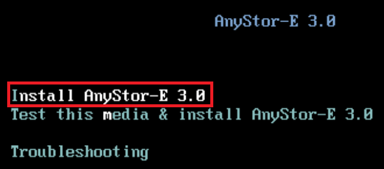
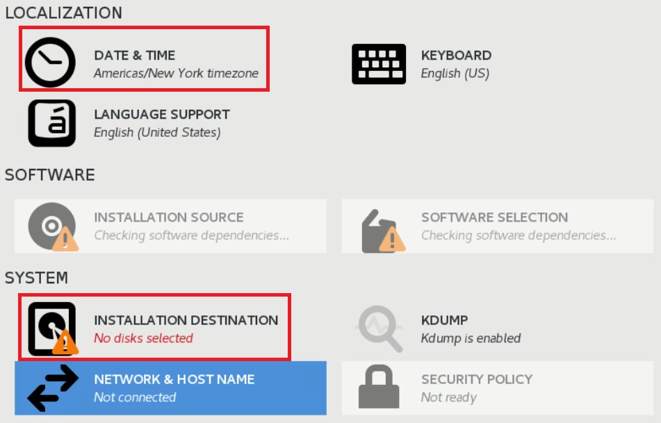
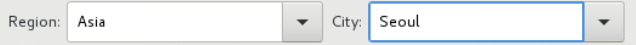
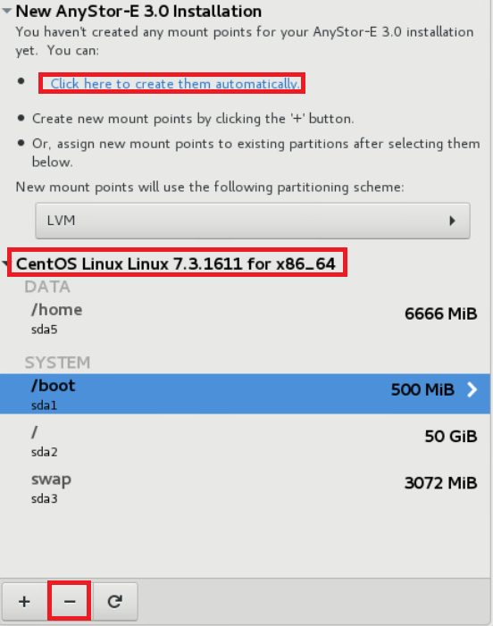
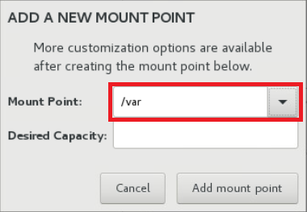
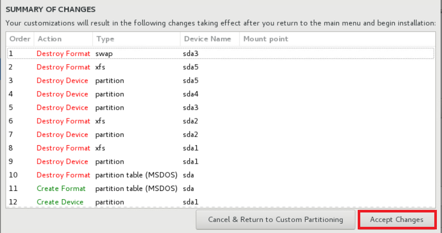

ISO 설치
====

**설치 절차는 VM을 기준으로 작성**

1.  OS 및 Data Disk RAID 구성합니다  
2.  ISO를 사용하여 부팅합니다  
3.  **Install AnyStor-E** 선택합니다  
    
4.  언어 선택 후 **Next** 버튼을 클릭합니다  
    
5.  **DATE & TIME** 선택하여 원하는 시간대로 설정합니다  
    
6.  한국이라면 **Seoul** 선택합니다  
    
7.  **INSTALLATION DESTINATION** 선택합니다  
    
8.  설치할 OS 선택, Partitioning에서 **I will configure partitioning**
    선택 후 **Done** 을 클릭합니다  
    - OS도 RAID 구성을 해야할 경우가 있습니다  
    - RAID로 구성할 경우 이름이 RAID 카드 이름으로 나오기 때문에 구분에 주의해야 합니다  
    
9.  (기존에 설치되어있다면) 설치된 OS 선택 후, 하단의 **ㅡ** 버튼으로
    삭제합니다  
    \
    
10. **Click here to create them automatically** 를 클릭하여 기본 구성을 합니다.  
11. **/ = 50GB**, **/home = 30GB**, **/var = 남은 용량**\  
    
12. **Accept Changes** 버튼을 클릭합니다.  
    

**이후 작업은 [구성 작업](#install.xhtml#구성 작업)부터 수행합니다.**

