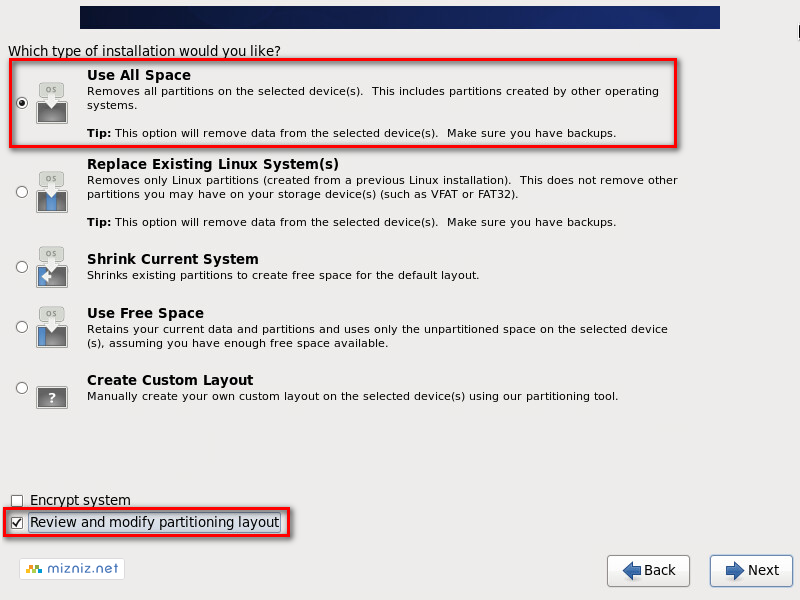
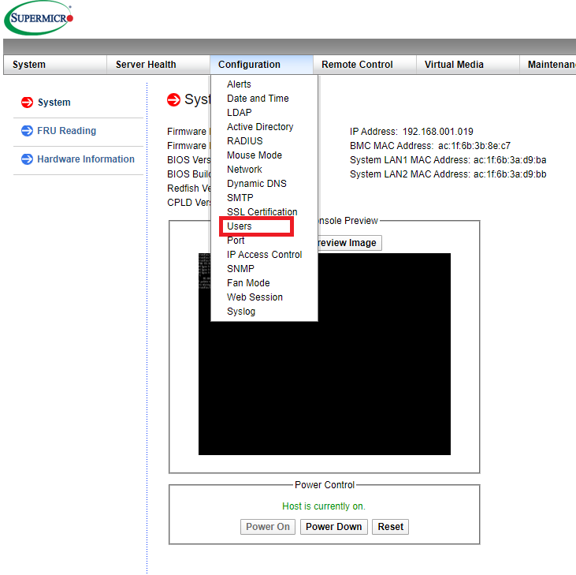
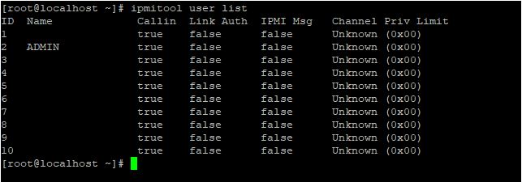
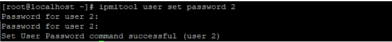

설치 가이드
====

<span style="color:#0000BB">사전 작업</span>
====

### 네트워크 구성

AnyStor-E 클러스터 스토리지 관리자는 아래와 같은 네트워크 유형을 정의하며, 이를 기본 권장 사항으로 합니다.

|  네트워크 유형            |  설명                                                                      |
| --------------------------|----------------------------------------------------------------------------|
|   **관리 네트워크**       | 클러스터 구성과 웹 관리자 접근을 위한 인터페이스 (**HTTP 접근 필요**) |
|   **스토리지 네트워크**   | 내부 스토리지간 통신을 위한 네트워크                                       |
|   **서비스 네트워크**     | 클라이언트가 스토리지로 마운트 하는 주소                                   |

### 네트워크 설정

vim 등의 편집기를 통해 `/etc/sysconfig/network-scripts/ifcfg-<인터페이스명>` 파일을 수정하여 IP를 설정합니다.  
기타 방법으로 IP를 설정하여도 됩니다.

    ONBOOT=YES
    NM_CONTROLLED=no
    BOOTPROTO=static
    IPADDR= <IP Address>
    NETMASK= <Netmask>
    GATEWAY= <Gateway>

마찬가지로 `/etc/resolv.conf` 파일을 아래와 같이 편집합니다.

    nameserver 8.8.8.8
    nameserver <nameserver>

### [선택] 디스크 설정

-   파티션 레이아웃 방식을 **Use All Space** 로 선택 후 최하단에 있는
    **Review and modify partitioning layout** 체크박스를 선택한 후
    **Next**를 선택합니다.



-   LVM Volume Groups에 '/root= 50GB', '/HOME = 30GB', '/var= 나머지 용량'
    모두 할당 등으로 설정해야 합니다. 
    - 많은 양의 로그를 대비하기 위한 것으로 개인 시스템에 맞게 설정하여도 무관합니다.

### [선택] RDMA 네트워크 설정하기

RDMA 설치

    # yum -y groupinstall "InfiniBand Support"
    # yum -y install perftest infiniband-diags
    # dracut --add-drivers "mlx4_en mlx4_ib mlx5_ib" -f
    # systemctl enable rdma

opensm 활성화

    # systemctl enable opensm.service
    # systemctl start opensm.service

### [선택] RAID 카드 설정

해당 과정은 패키지 설치과정을 수행한 후에 제조사별 설정 도구를 통해서도 설정 가능합니다.  

-   해당 모델에 맞는 최신 펌웨어로 업그레이드
    -   MegaRAID : https://www.broadcom.com/products/storage/raid-controllers/
-   배터리 백업 유닛(BBU)이 없는 경우, 쓰기 캐시(Write Cache)가
    비활성화된 상태인지 확인
-   Full SSD 사용 시
    -   쓰기 정책 : BBU가 있다면 후기록(Write-back), 없다면 동시 기록(Write-through)
    -   미리 읽기(ReadAhead) : 비활성화
    -   입출력 방식 : Direct
    -   스트라이프 크기 : 256K

### [선택] IPMI 설정

#### 웹 환경에서 암호 변경

**슈퍼마이크로 장비 기준이며, 다른 제조사의 장비는 해당 장비를 다룬
경험이 있는 담당자 혹은 제조사 매뉴얼을 참고하시길 바랍니다.** 

1.  해당 장비 IPMI 웹에 로그인 합니다.  
2.  상단 메뉴의 `Configuration` 탭에서 `Users`를 선택합니다.  
     
3.  사용자 목록이 나타나면 `ADMIN` 계정을 클릭한 후에 `Modify User` 버튼을 클릭합니다.  
     
4.  `Change Password` 텍스트 박스 클릭 후 해당 암호를 변경할 수 있습니다.  
     
     주의할 점 -&gt; 암호 요구사항 확인 후 진행합니다.  

#### 텍스트 환경에서 암호 변경

1.  ipmitool 패키지를 설치합니다.

```..
    # yum -y install ipmitool
```
2.  `ipmitool user list` 명령어 입력하여 사용자 목록을 확인합니다.(이 예시의 경우, 2번에서 ADMIN 계정을 확인 할 수 있다.)  
     
3.  `ipmitool user set password 2` 명령어를 입력하여 변경합니다.  
     

#### IP 설정

1.  ipmitool 패키지를 설치합니다.

```..
    # yum -y install ipmitool
```
2.  `ipmitool lan print 1` 명령어 입력하여 LAN channels를 확인한다.(IP address 확인)   
     
3.  `ipmitool lan set 1 ipaddr <변경할 IP>` 명령어를 입력하여 변경합니다.  
     
4.  `ipmitool lan print 1` 명령어를 입력하여 변경이 됐는지 확인합니다.  
     
5.  `ipmitool` 명령어를 입력하여 제공하는 옵션 확인합니다.  
     

### [선택] Storcli 설치 

#### storcli 설치

- S.M.A.R.T 정보 및 기타 디스크 정보 표시를 위해 설치가 필요합니다. 

```
    # yum -y install storcli
```


<!-- TODO: 21/05/18 Multipath
### [선택] 멀티패스 설정하기 (수정 중)

SAN 환경인 경우, 멀티패스 등을 설정해야 하는 경우가 있다.

    # mpathconf --enable
    # systemctl restart multipath
-->
