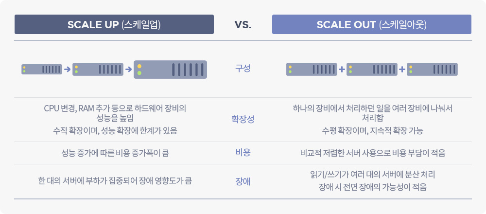
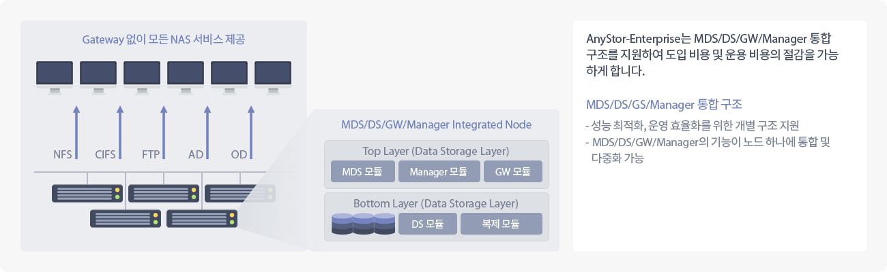
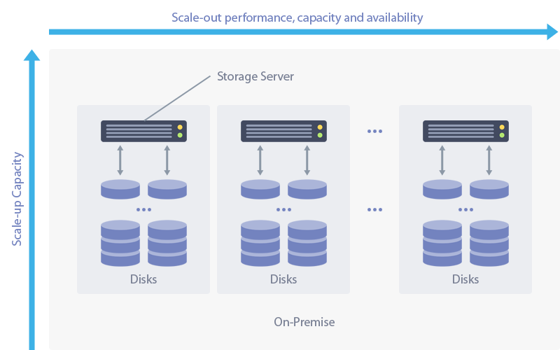

# AnyStor-E 관리자 매뉴얼

## 매뉴얼 개요

* 본 매뉴얼은 웹 관리자 메뉴 구성을 기반으로 AnyStor-E의 기능과 사용법을 설명하였습니다.
* 궁금한 사항이나 의견이 있으신 분들은 아래로 전자우편 주소로 문의 바랍니다.
  * support@gluesys.com

## AnyStor-E 클러스터 스토리지 제품 개요

> AnyStor-E는 **스케일 아웃 스토리지 어플라이언스 소프트웨어**입니다.
> 특정 하드웨어의 제약이 없이 설치 및 운영이 자유로운 **소프트웨어 정의 스토리지**입니다.
> 최소 **단일 노드부터 도입**이 가능하며 노드 추가 시 서비스 유휴 시간이 없는 **온라인 확장**이 가능합니다.
> **선형적인 성능 증가**로 서비스 요구에 따른 스토리지 구성을 계획하실 수 있습니다.

| AnyStor-E 제품 소개 |
| :------------------:|
|    **AnyStor-E 관리자**는 클러스터의 분산된 자원을 통합 관리하여 **운영 및 장애 처리 프로세스를 단순화**합니다.  AnyStor-E 는 **NFS/SMB**와 같은 표준 네트워크 파일링 프로토콜 서비스를 제공하여 다양한 OS 클라이언트 환경을 지원하며  **네이티브 API**를 통해 오픈스택과 같은 가상화 환경의 백엔드 스토리지 서비스로서의 역할을 제공할 수 있습니다.  |

## AnyStor-E S/W 운영 환경

**하드웨어 구성**

| 컴포넌트   | 최소 사양 | 권장 사양         | 기타                  |
| :--------: | :-------- | :--------         | :---------------      |
| **CPU**        | 4 코어    | 8 코어 이상       | 1GB/s 이상의 대역폭 요구 시 16 코어 이상 권장 |
| **Memory**     | 4 GB      | 16GB              | 클라이언트에 따라 증가 필요 |
| **NIC**        | 2         | 5                 | 관리/서비스/스토리지 네트워크 구성에 따라 다름 |
| **Storage**    |           | LSI RAID 컨트롤러 | 스토리지 구성은 서비스 용도에 따라 다름 |

**네트워크 구성**

| 컴포넌트          | 사양          | 포트수    | 필수 여부 | 기타             |
| :------------:    | :--------     | :-------- | :-------- | :--------------- |
| 서비스 네트워크   | 1G / 10G      | 1 - 4     | 필수      | 클라이언트 접속 네트워크로 NFS/SMB 등 서비스 연결 |
| 스토리지 네트워크 | 1G / 10G / IB | 1 - 4     | 필수      | 노드간 데이터 복제, 클러스터 상태 정보 교환용 |
| 관리 네트워크     | 100M / 1G     | 1         | 선택      | GUI 및 콘솔 접근용, 없을 시 서비스 네트워크 공통 사용 |

> 서비스 및 스토리지 네트워크는 가용성 향상을 위하여 기본적으로 본딩 구성되어 있습니다.
> 서비스와 관리 네트워크는 함께 사용이 가능합니다.
> 서비스 네트워크는 가상 IP 풀이 할당되어 서비스 연속성을 제공합니다.

## AnyStor-E 아키텍쳐

| AnyStor-E 기본 아키텍처 |
| :------------------: |
|     AnyStor-E 는 **단일 노드 내에 모든 소프트웨어 컴포넌트가 통합**되어 있어, 한 노드 부터 서비스 운영이 가능합니다. |

| 컴포넌트        | 주요 역할           |
| :-----:         | :--------           |
| **Top Layer**   | MDS/Manager/GW 모듈을 관장하는 영역으로 클러스터 및 노드의 **H/W 및 S/W 상태를 관리하고 파일 및 블록 서비스를 처리**하는 영역입니다. |
| **Bottom Layer**| 백엔드 클러스터 파일시스템이 탑재되는 영역으로 **GlusterFS 및 Ceph, Maha-FS**와 같은 파일시스템이 탑재될 수 있는 영역입니다. |

### Top Layer

| 컴포넌트 | 주요 역할 |
| :------: | :-------- |
| **MDS**      | 3노드까지 탑재되는 모듈로서, 클러스터의 구성 및 상태 정보를 동기화하고 쿼럼을 구성하여 클러스터 안정성을 보장합니다.  |
| **Manager**  | 처음 3노드 중 한 노드를 선정하여 운영되며, 클러스터 동기화를 위한 NTP 시간 서버 및 이벤트/태스크 데이터베이스를 운영합니다.  |
| **GW**       | 모든 노드에 탑재되어, NFS/SMB 서비스를 제공하며, 한 노드 장애 시 다른 노드에서 서비스가 지속됩니다.  |

### Bottom Layer

| 컴포넌트 | 주요 역할 |
| :------: | :-------- |
| **DS**       | 모든 노드에 탑재되며, 백엔드 파일시스템과 GW 모듈을 연결을 관리해 주는 모듈입니다. |

## GlusterFS 기본 탑재

| GlusterFS 온-프레미스 탑재 시 볼륨 확장 구조 |
| :------------------:|
|      **GlusterFS**는 클러스터 파일시스템을 제공합니다. |

| GlusterFS 주요 특징		|  용도     |
| :-----:			| :-------- |
| 스케일-아웃 확장		| 스케일-아웃 확장을 통해 선형적으로 증가하는 뛰어난 성능과 안정성을 제공합니다. |
| 지역성 보장			| 각 노드마다 구축된 레거시 파일시스템 구조는 보다 나은 성능 예측성 및 데이터 무결성을 보장합니다. |
| 해시 기반 파일 분산 구조	| 파일명에 대한 해시로 데이터 접근이 이루어지므로 대용량 데이터 처리에 뛰어난 성능을 보장합니다.   10KB 미만 데이터 처리는 성능이 떨어질 수 있습니다. |
