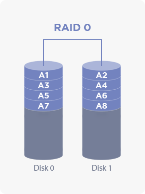
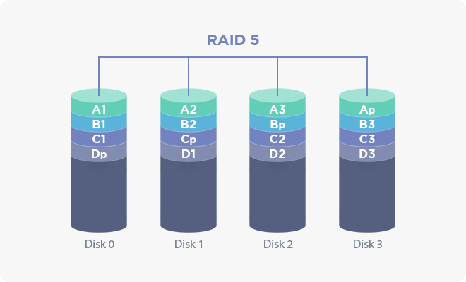
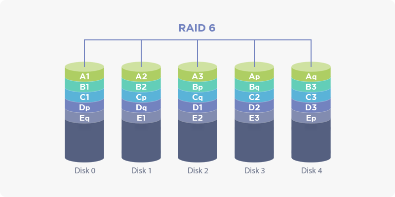

## 5.6 RAID 정보

### 5.6.1 개요

**RAID(Redundent Array of Independent Disks, 이하 RAID)**는 데이터를 나눠서 여러 개의 하드 디스크에 분산하여 저장하는 기술을 말하며, 이러한 RAID 기술을 제어하는 장치를 RAID 컨트롤러라고 부릅니다.
스토리지 혹은 스토리지 서버는 그 특성상 여러 개의 하드 디스크를 장착하게 되는 경우가 일반적이며, 이때 여러 개의 하드 디스크를 효율적으로 사용하기 위해 RAID 컨트롤러를 장착하여 사용하게 됩니다.

### 5.6.2 정의

AnyStor-E는 RAID 컨트롤러(이하 컨트롤러)의 구성 정보와 상태 정보를 사용자에게 제공할 수 있으며, 이러한 정보는 단일 노드의 하드 디스크 결함/탈착 등의 장애 상황에 대해 유연하고 신속하게 대처할 수 있도록 돕습니다.

### 5.6.3 상세 설명

AnyStor-E의 웹 관리자 화면 좌측 메뉴의 **노드 관리 >> RAID 정보**를 선택한 후, 메뉴 상단의 목록 상자에서 RAID 정보를 확인하고자 하는 노드를 선택합니다.

잠시 뒤 화면이 갱신되면서 RAID 전체 요약 정보가 출력되며, 각 항목에 대한 상세한 설명은 아래에서 확인할 수 있습니다.

#### 5.6.3.1 전체 요약

| **항목** | **설명** |
| :--: | :--- |
| **어댑터 식별자** | 해당 노드에 설치된 RAID 컨트롤러에 포함된 각각의 RAID 컨트롤러 어댑터(이하 어댑터)의 식별자를 나타냅니다. |
| **논리 디스크**   | 각각 전체 논리 디스크 개수와 정상/비정상인 논리 디스크 개수를 나타냅니다. |
| **물리 디스크**   | 각각 전체 물리 디스크 개수와 정상/비정상인 물리 디스크 개수를 나타냅니다. |
| **디스크 정보**   | 이 단추를 누르면 해당 어댑터에 장착된 논리/물리 디스크의 상세한 정보를 출력하는 창을 보여줍니다.   이 창에 대한 자세한 정보는 [5.6.3.2 물리 디스크](#node.xhtml#5.6.3.2 물리 디스크)와 [5.6.3.3 논리 디스크](#node.xhtml#5.6.3.3 논리 디스크)를 참고하실 수 있습니다. |
| **상세 정보**     | 이 단추를 누르면 해당 컨트롤러/어댑터의 펌웨어/설정 정보 등을 포함하는 상세한 정보를 출력하는 창을 보여줍니다.   이 창에 대한 자세한 정보는 [5.6.3.4 상세 정보](#node.xhtml#5.6.3.4 상세 정보)을 참고하실 수 있습니다. |

#### 5.6.3.2 물리 디스크

[5.6.3.1 전체 요약](#node.xhtml#5.6.3.1 전체 요약) 화면에서 **디스크 정보** 단추를 누르면 나타나는 창에서 보여지는 정보이며, 어댑터에 장착된 물리 디스크의 상세한 정보를 나타냅니다.

| **항목** | **설명** |
| :--: | :--- |
| **논리 디스크 식별자** | 해당 물리 디스크가 구성하고 있는 논리 디스크의 고유 식별자를 나타냅니다. |
| **물리 디스크 식별자** | 해당 물리 디스크의 고유 식별자를 나타냅니다. |
| **물리 디스크 크기** | 물리 디스크의 크기를 나타냅니다. |
| **상태** | 물리 디스크의 현재 상태를 나타냅니다. 이 상태에 대한 더 많은 정보를 원하시는 경우에는 [5.6.3.2.1 물리 디스크 상태표](#node.xhtml#5.6.3.2.1 물리 디스크 상태표)를 참고하실 수 있습니다. |
| **슬롯 번호** | 물리 디스크가 연결된 컨트롤러 슬롯의 번호를 나타냅니다. |
| **인터페이스 종류** | 물리 디스크가 연결된 컨트롤러 슬롯의 송/수신 프로토콜을 나타냅니다. |
| **디스크 종류** | 물리 디스크의 종류를 나타냅니다. 대표적인 종류로는 HDD, SSD가 있습니다. |

##### 5.6.3.2.1 물리 디스크 상태표

| **상태** | **설명** |
| :--: | :--- |
| **Online** | 정상적으로 논리 디스크를 구성하도록 설정되어 작동 중인 상태를 나타냅니다. |
| **Offline** | 디스크 오류 등으로 인해 입출력이 불가능한 상태를 나타냅니다. |
| **Foreign** | 다른 어댑터에서 설정한 설정 정보를 저장하고 있는 상태를 나타냅니다. |
| **Missing** | 미디어 탈착 등으로 인하여 해당 포트를 통해 미디어를 인식할 수 없는 상태를 나타냅니다.|
| **Unconfigured Good** | 새로운 논리 디스크를 구성하거나 핫 스페어로 추가하는 등의 설정을 할 수 있는 상태를 나타냅니다. |
| **Unconfigured Bad** | 기존에 오류가 발생하는 등의 이유로 인해 설정을 할 수 없는 상태를 나타냅니다. |
| **Dedicated Hot Spare** | 특정 논리 디스크를 위한 대체용 디스크로 설정된 상태를 나타냅니다.|
| **Global Hot Spare** | 해당 어댑터에 설정된 모든 논리 디스크를 위한 대체용 디스크로 설정된 상태를 나타냅니다. |

#### 5.6.3.3 논리 디스크

[5.6.3.1 전체 요약](#node.xhtml#5.6.3.1 전체 요약) 화면에서 **디스크 정보** 단추를 누르면 나타나는 창에서 보여지는 정보이며, 어댑터에 할당된 논리 디스크의 상세한 정보를 나타냅니다.

| **항목** | **설명** |
| :--: | :--- |
| **논리 디스크 식별자** | 어댑터가 관리하고 있는 논리 디스크의 고유 식별자를 나타냅니다. |
| **논리 디스크 이름** | 논리 디스크의 이름을 나타냅니다. 이 정보는 설정 여부에 따라 없을 수도 있습니다. |
| **RAID 레벨** | 논리 디스크가 구성하고 있는 RAID 종류를 나타냅니다. 이에 대한 더 많은 정보를 원하시는 경우에는 [5.6.4 RAID 종류별 설명](#node.xhtml#5.6.4 RAID 종류별 설명)을 참고하실 수 있습니다. |
| **크기** | 논리 디스크의 크기를 나타냅니다. 이 크기는 RAID 종류에 따라 논리 디스크를 구성하고 있는 물리 디스크 개수와 다를 수도 있습니다. |
| **상태** | 논리 디스크의 현재 상태를 나타냅니다. 이 상태에 대한 더 많은 정보를 원하시는 경우에는 [5.6.3.3.1 논리 디스크 상태표](#node.xhtml#5.6.3.3.1 논리 디스크 상태표)를 참고하실 수 있습니다. |
| **물리 디스크 개수** | 논리 디스크를 구성하고 있는 물리 디스크의 개수를 나타냅니다. |

##### 5.6.3.3.1 논리 디스크 상태표

| **상태** | **설명** |
| :--: | :--- |
| **Optimal** | 정상 상태를 나타냅니다. |
| **Partially Degraded** | 논리 디스크를 구성하는 물리 디스크 중의 일부가 손상되어 입출력 속도가 저하될 수 있는 상태를 나타냅니다. |
| **Degraded** | 논리 디스크를 구성하는 물리 디스크 중의 일부가 손상되어 더 이상 무결성을 보장할 수 없는 상태를 나타냅니다. |
| **Rebuilding** | Partially Degraded 혹은 Degraded 상태인 논리 디스크의 손상된 물리 디스크를 교체함으로써 논리 디스크 복구/재구성 중인 상태를 나타냅니다. |
| **Migrating** | 논리 디스크의 RAID 종류를 변환하는 등의 물리 디스크 구성이 변화되는 작업을 하는 중인 상태를 나타냅니다. |

#### 5.6.3.4 상세 정보

[5.6.3.1 전체 요약](#node.xhtml#5.6.3.1 전체 요약) 화면에서 **상세 정보** 단추를 누르면 나타나는 창에서 보여지는 정보입니다.

여기에는 주로 컨트롤러/어댑터의 펌웨어/설정 정보 등을 포함하는 상세한 정보들이 포함됩니다.

| **항목** | **설명** |
| :--: | :--- |
| **제조사 정보** | RAID 컨트롤러의 모델명, 식별자 등을 나타냅니다. |
| **펌웨어 정보** | RAID 컨트롤러 펌웨어의 버전 등을 나타냅니다. |
| **입출력 정보** | 스트라이프 크기, 데이터 전송 크기, 병렬 수행 처리 명령 개수, SGE 큐 길이와 같은 입출력 정보를 나타냅니다. |
| **재구성 설정** | 논리 디스크 결함 발생 시, 결함 복구를 위해 RAID 컨트롤러 처리 성능의 할당률과 같은 재구성 설정 정보를 나타냅니다. |

#### 5.6.4 RAID 종류별 설명

표준 RAID 종류에는 여러 가지가 있으며, 본 문서에서는 대표적인 종류 몇 가지만을 간략하게 설명합니다.

더 자세한 설명을 원하시면 [5.6.5 참고](#node.xhtml#5.6.5 참고)의 RAID와 관련된 항목들을 보실 수 있습니다.

##### 5.6.4.1 RAID 0

| **RAID 0 다이어그램** |
| :------: |
|  |
| 출처: https://en.wikipedia.org/wiki/Standard_RAID_levels |

**RAID 0**는 논리 디스크를 구성하는 **최소 2개**의 물리 디스크들에 대해 병렬적으로 데이터를 분산하여 저장하는 구조를 가지며, 이를 스트라이핑(Striping)이라고 합니다.

**구성 물리 디스크 크기 x 개수**만큼의 가용량을 가지며, 이론적으로 물리 디스크의 개수 N에 따라 입출력 속도가 배수로 증가하기 때문에 구성 물리 디스크의 개수가 많을수록 빠른 입출력 속도를 보여줍니다.

허나 오류 검출 기능이 없기 때문에 구성 물리 디스크 중 하나의 디스크라도 결함이 발생하면 논리 디스크의 무결성이 손상되는 문제가 있습니다.

##### 5.6.4.2 RAID 1

| **RAID 1 다이어그램** |
| :------: |
|  |
| 출처: https://en.wikipedia.org/wiki/Standard_RAID_levels |

**RAID 1**은 논리 디스크를 구성하는 **최소 2개**의 물리 디스크들 간에 데이터를 복제하여 저장하는 구조를 가지며, 이를 미러링(Mirroring)이라고 합니다.

논리 디스크의 용량이 구성 물리 디스크의 개수가 늘어나도 증가하지 않으며, 구성 물리 디스크 개수가 많을수록 쓰기 속도가 느려지게 됩니다.

##### 5.6.4.3 RAID 5

| **RAID 5 다이어그램** |
| :------: |
|  |
| 출처: https://en.wikipedia.org/wiki/Standard_RAID_levels |

**RAID 5**는 논리 디스크를 구성하는 **최소 3개**의 물리 디스크들에 대해 벙렬적으로 데이터를 분산하여 저장하되, 오류 검출을 위한 패리티 블록(Parity Block)을 같이 기록함으로써 안정성까지 보장하는 구조입니다.

**(구성 물리 디스크 크기 - 1) * 단일 물리 디스크 용량**만큼의 가용량을 가지며, 패리티 블록을 처리하는 비용으로 인해 RAID 0보다는 약간 낮은 입출력 성능을 보여줍니다.

또한 하나의 패리티 블록이 기록되기 때문에 단일 물리 디스크 결함만을 보장하며, 다수의 물리 디스크 결함이 발생한 경우에는 논리 디스크의 무결성을 보장할 수가 없습니다.

##### 5.6.4.4 RAID 6

| **RAID 6 다이어그램** |
| :------: |
|  |
| 출처: https://en.wikipedia.org/wiki/Standard_RAID_levels |

**RAID 6**는 [RAID 5](#node.xhtml#5.6.4.3 RAID 5)와 동일한 구조를 가지나, 기존 패리티 블록과 리드-솔로몬(Reed-Solomon) 오류 교정 코드를 사용하는 P+Q 기법을 위한 추가 패리티를 각각 다른 물리 디스크에 기록합니다.

따라서 추가 패리티를 기록하기 위한 물리 디스크가 하나 더 늘어나서 최소 4개의 물리 디스크가 필요하며, **(구성 물리 디스크 갯수 - 2) * 단일 물리 디스크 용량**만큼의 가용량을 갖게 됩니다.

또한 2개의 물리 디스크 결함을 보장할 수 있기에 RAID 5보다 내결함성이 높지만, 최소 물리 디스크 개수의 증가로 인해 구축 비용이 증가하게 되며, 증가된 패리티 블록 처리 비용으로 쓰기 속도가 감소하게 됩니다.

##### 5.6.4.5 RAID 0+1

| **RAID 0+1 다이어그램** |
| :------: |
|  |
| 출처: https://en.wikipedia.org/wiki/Nested_RAID_levels |

**RAID 0+1**은 물리 디스크 구성을 두 계층으로 나누어서, [RAID 0](#node.xhtml#5.6.4.1 RAID 0) 스트라이핑 구성과 [RAID 1](#node.xhtml#5.6.4.2 RAID 1) 미러링 구성을 결합한 구조를 갖습니다.

**최소 2개의 물리 디스크**를 스트라이핑으로 구성하고, 이를 다시 미러링함으로써 결과적으로 **최소 4개의 물리 디스크**가 요구됩니다.

이 유형은 스트라이핑 구조의 장점인 속도와 미러링 구조의 장점인 내결함성을 보장하고자 하는 목적을 갖습니다.

다만 하위 계층에 속하는 스트라이핑된 논리 디스크가 결함이 발생하면 해당 논리 디스크를 완전히 새로 구성해야 합니다.

##### 5.6.4.6 RAID 1+0

| **RAID 1+0 다이어그램** |
| :------: |
|  |
| 출처: https://en.wikipedia.org/wiki/Nested_RAID_levels |

**RAID 1+0**는 앞선 [RAID 0+1](#node.xhtml#5.6.4.5 RAID 0+1)과 유사하지만 역순의 계층을 갖습니다.

**최소 2개의 물리 디스크**를 미러링으로 구성하고, 이를 다시 스트라이핑함으로써 결과적으로 **최소 4개의 물리 디스크**가 요구됩니다.

RAID 0+1과는 달리 하위 계층에 속하는 미러링된 논리 디스크가 결함이 발생하더라도 해당 디스크만 교체하여 재구성할 수 있기 때문에 상대적으로 비용이 적습니다.

##### 5.6.4.7 RAID 5+0

| **RAID 5+0 다이어그램** |
| :------: |
|  |
| 출처: https://en.wikipedia.org/wiki/Nested_RAID_levels |

**RAID 5+0**는 [RAID 1+0](#node.xhtml#5.6.4.6 RAID 1+0)의 하위 계층을 [RAID 5](#node.xhtml#5.6.4.3 RAID 5)로 구성한 구조를 갖습니다.

따라서 RAID 1+0보다 더 높은 성능과 하위 계층에 대한 내결함성을 보장할 수 있습니다.

##### 5.6.4.8 RAID 6+0

| **RAID 6+0 다이어그램** |
| :------: |
|  |
| 출처: https://en.wikipedia.org/wiki/Nested_RAID_levels |

**RAID 6+0**는 [RAID 1+0](#node.xhtml#5.6.4.6 RAID 1+0)의 하위 계층을 [RAID 6](#node.xhtml#5.6.4.4 RAID 6)로 구성한 구조를 갖습니다.

따라서 RAID 1+0보다 더 높은 성능과 하위 계층에 대한 내결함성을 보장할 수 있습니다.

### 5.6.5 참고

* [RAID - 위키백과](https://ko.wikipedia.org/wiki/RAID)
* [Standard RAID levels - Wikipedia](https://en.wikipedia.org/wiki/Standard_RAID_levels)
